# **TABLE OF CONTENT**
|Chap   | Title                                            | 
| ----- | ------------------------------------------------ |
| 4     | RAD GRAMMAR GUIDELINES                           |
| 4.1   | General Provisions                               |
| 4.2   | RAD Grammar Design                               |
| 4.2.1 | General Information                              |
| 4.2.2 | Terms Definition                                 |
| 4.2.3 | Syntax Elements                                  |
| 4.2.4 | Lexical Elements                                 |
| 4.2.5 | Indentation and multi-level flow conditions      |
| 4.2.6 | Route and airspace option expression             |
| 4.2.7 | Time and Period expression                       |
| 4.2.8 | Other Rules for Data Expression                  |
| 4.3   | RAD Grammar Rules - Summary                      |
| 4.3.1 | Allowed Syntax elements                          |
| 4.3.2 | Allowed Punctuation                              |
| 4.3.3 | Allowed Logical Operators                        |
| 4.3.4 | Allowed identifiers and their properties         |
| 4.3.5 | Allowed Keywords                                 |
| 4.3.6 | Allowed time/dependent applicability expressions |
| 4.3.7 | Other examples of allowed RAD expression         |
| 5     | RAD DATA CONTENT                                 |
| 5.1   | Common Provisions                                |
| 5.1.1 | Reference                                        |
| 5.1.2 | Change Record Indication                         |
| 5.1.3 | Identification (ID)                              |
| 5.2   | Annex 1                                          |
| 5.2.1 | General Provision                                |
| 5.2.2 | Data Content                                     |
| 5.3   | Annex 2A                                         |
| 5.3.1 | General Provision                                |
| 5.3.2 | Data Content                                     |
| 5.4   | Annex 2B                                         |
| 5.4.1 | General Provision                                |
| 5.4.2 | Data Content                                     |
| 5.5   | Annex 2C                                         |
| 5.5.1 | General Provision                                |
| 5.5.2 | Data Content                                     |
| 5.6   | Annex 3A                                         |
| 5.6.1 | General Provision                                |
| 5.6.2 | Data Content                                     |
| 5.7   | Annex 3B                                         |
| 5.7.1 | General Provision                                |
| 5.7.2 | Data Content                                     |
| 6     | FRA IN THE RAD                                   |
| 6.1   | General Provisions                               |
| 6.2   | RAD description and placeholder                  |
| 6.2.1 | Annex 2B                                         |
| 6.2.2 | Annex 2C                                         |
| 6.2.3 | Annex 3A                                         | 
| 6.2.4 | Annex 3B                                         |

# **4 RAD Grammar Guidelines**

## **4.1 General Provisions**

- (1) The Guidelines in this Chapter are supplementary to provisions described in ERNIP Part 1, Chapter 8 and shall be followed by the NM RAD Team and the NRCs in the entire RAD CDM process.
- (2) These Guidelines contain the definition of terms and RAD grammar rules used in the RAD to allow coherent, harmonised and unique expression.
- (3) These Guidelines do not contain the explanation how the different expression of the traffic flow rules and flight planning facilitation options are being processed by the NM system. This is included in the NM Flight Planning Requirements - Guidelines document.
- (4) Majority of abbreviations used are in accordance with ICAO Doc 8400 PANS-ABC. Any new abbreviations or terms included in these Guidelines are used only and exclusively for RAD purposes.
- (5) All examples used in these guidelines shall be considered as fictitious. The location indicators used are also fictitious based on ICAO Doc 8126 AIS Manual.

# **4.2 RAD Grammar Design**

## **General Information**

### **4.2.1.1 Purpose and Scope**

- (1) The purpose of this section is to describe the set of RAD grammar rules and requirements to be complied with by the NM RAD Team and the NRCs when creating or maintaining the RAD. It also provides the reader with comprehensive information on each term or element of the RAD grammar as well as the expected RAD syntax.
- (2) The scope of the RAD grammar is to harmonise the way in which the RAD is written by the NM RAD Team and the NRCs, eliminating discrepancies, and paving the way towards an automatic/semi-automatic interpretation of the RAD content.
- (3) The RAD will continue to be written in a human readable format following normal language, but at the same time it will be structured in a fixed, pseudo-code like way, with certain allowed syntax, that will eventually make it possible to be interpreted/translated into machine readable formats.
- (4) This section is for the interest of the NM RAD Team and the NRCs as well as for the business analyst/developers that will need to transfer these grammar rules into software requirements and incorporate them into the RAD Application to provide end users with adequate system support.
- (5) The terms used for the purpose of understanding the RAD grammar rules are:

  - a) Flow element.
  - b) Flow condition.
  - c) Reference Object.
- (6) The elements allowed by the RAD grammar in the construct of the traffic flow rules and flight planning facilitation options are:

  - a) Syntax elements.
  - b) Lexical elements.

### **Terms Definition**

### **4.2.2.1 Flow Element**

- (1) A traffic flow rule or flight planning facilitation option shall qualify for inclusion in the RAD if it has a flow element attached to it.
- (2) A flow element is defined as an airspace object containing significant points, ATS route segments, allowed DCTs, airspace volumes (FIR/UIR, AoR of relevant ATC Unit - CTA/UTA, TMA, CTR or individual/collapsed control sector(s) within an ATC unit, Free Route Airspace, area/zone, etc.) and other allowed identifiers.
- (3) A flow element is defined as affecting either:
  - a) Departures from an Aerodrome/Group/Area.
  - b) Arrivals to an Aerodrome/Group/Area.
  - c) Traffic flying between Aerodrome/Groups/Area.
  - d) Overflying traffic.

#### **4.2.2.2 Flow Condition**

- (1) Traffic flow rule or flight planning facilitation option usually includes as utilisation a combination of flow elements, level and/or time/period conditions, which are connected by keywords and logical operators to specify parameters, which flight plan must match to be subject to compliance.
- (2) Such combination is considered as a flow condition.

#### **4.2.2.3 Reference Object**

- (1) The reference object is an airspace object and is used for:
  - a) The applicability of a traffic flow rule and flight planning facilitation option; or
  - b) Validation of specific condition expressions, which do not apply to the complete flight trajectory.
- (2) A reference object is explicitly mentioned if a traffic flow rule and flight planning facilitation option is only applicable within a specific region. Especially for citypair specific limitations, the differentiation of the applicability for different regions has significant influence on the various traffic flows (e.g. city-pair level capping).
- (3) Reference object is also used to specify a flow condition based on level expression.

### **Syntax Elements**

- (1) The syntax elements:
  - a) Represent the structures, allowed in the RAD grammar that supports the users to express meaningful flow conditions.
  - b) Describe the main condition applicable to the traffic flow(s) in respect to the reference object.
- (2) The syntax elements shall be hardcoded in the RAD Application and selectable by the end user. The allowed structures are:
  - a) **NOT AVBL FOR TFC**.
  - b) **ONLY AVBL FOR TFC**.
  - c) **COMPULSORY FOR TFC**.
  - d) **ONLY AVBL AND COMPULSORY FOR TFC**.
- (3) More than one syntax element can be selected for a single traffic flow rule or flight planning facilitation option. This shall be marked by a sequence of 10 (ten) hyphens "--------" delimitating the end of one condition and the beginning of another one.

### **Lexical Elements**

### **4.2.4.1 General Description**

- (1) Lexical elements support the user to define the flow targeted by a specific traffic flow rule or flight planning facilitation option as well as their time applicability.
- (2) The specific items are part of the RAD grammar and are allowed to be used in the construct of the RAD. These items are split into several categories as follows:
  - a) Keywords.
  - b) Identifiers.
  - c) Punctuation.
  - d) Operators.
  - e) Time and period expression.

#### **4.2.4.2 Allowed keywords and expressions**

### **4.2.4.2.1 General Description**

- (1) In RAD grammar, keywords are allowed capitalised abbreviated terms.
- (2) The full list of allowed keywords are summarised in Section 4.3.

### **4.2.4.2.2 Expression of abbreviated words meaning Destination and Departure**

#### **4.2.4.2.2.1 The Terms/Abbreviations used**

- (1) When required the expression of abbreviated words meaning Destination and Departure to/from certain aerodromes or in/outside airspace volumes shall be used as follows:
  - a) **"ARR"** code meaning "Arrive" *or* "Arrival".

b) **"DEP"** - code meaning "Depart" *or* "Departure".

#### **4.2.4.2.2.2 Destination - Arrival Aerodrome(s) - ARR**

- (1) When defining a traffic flow that includes the reference to the arrival aerodrome(s) the following abbreviation shall be used: **ARR**.
- (2) **"ARR"** shall be followed either by a:
  - a) Single aerodrome; and/or
  - b) Sequence of aerodromes; and/or
  - c) Group/area of aerodromes; and/or
  - d) Reference airspace volume such expression includes all aerodromes located within the vertical projection of that airspace to the ground. This shall be used only when aerodrome or group/area expression is not possible (example "arrivals out of IFPS zone" shall be "**ARR \* EXC ARR IFPZ**").
- (3) After the term "ARR", entities in (2) above, except a single entity, shall be placed in round brackets.

#### **4.2.4.2.2.3 Departure - Departure Aerodrome(s) - DEP**

- (1) When defining a traffic flow that includes the reference to the departure aerodrome(s) the following abbreviation shall be used: **DEP**.
- (2) "DEP" shall be followed either by a:
  - a) Single aerodrome; and/or
  - b) Sequence of aerodromes; and/or
  - c) Group/area of aerodromes; and/or
  - d) Reference airspace volume such expression includes all aerodromes located within the vertical projection of that airspace to the ground. Shall be used only when aerodrome or group/area expression is not possible (example "departures out of IFPS zone" shall be "**DEP \* EXC DEP IFPZ**").
- (3) After the term "DEP", entities in (2) above, except a single entity, shall be placed in round brackets.
  - **4.2.4.2.2.4 Destination and Departure - Arrival Aerodrome(s) - ARR / Departure Aerodrome(s) - DEP**
- (1) When defining a traffic flow that includes both the arrivals and departures from the same aerodrome(s) the following abbreviation shall be used: **ARR/DEP**.
- (2) **"ARR/DEP"** shall be followed either by a:
  - a) Single aerodrome; and/or
  - b) Sequence of aerodromes; and/or
  - c) Group/area of aerodromes; and/or
  - d) Reference airspace volume such expression includes all aerodromes located within the vertical projection of that airspace to the ground. This shall be used only when aerodrome or group/area expression is not possible (example "arrivals and departures out of IFPS zone" shall be "**EXC ARR/DEP IFPZ**").

(3) After the term "ARR/DEP", entities in (2) above, except a single entity, shall be placed in round brackets.

#### **4.2.4.2.3 VIA**

- (1) "**VIA**" shall always be used to introduce one or more airspace objects.
- (2) In more complex traffic flow rules or flight planning facilitation options, for better readability, it can also be used to introduce multiple traffic flows written on separate rows.

### **4.2.4.2.4 Direct - DCT**

- (1) "**DCT**" defines the allowed direct flight planning option as segment or distance.
- (2) When used in traffic flow rule or flight planning facilitation option expression it shall always be preceded and followed by a significant point unless:
  - a) It is used as an aggregation together with one or more ATS routes within round brackets (i.e. **AAA (L1, DCT) BBB**).
  - b) It is used to describe FRA options "open to" or "open from" when it can be used together with the wildcard asterisk "\*":
    - i) FRA option "open to": **\* DCT BBBBB**.
    - ii) FRA option "open from": **BBBBB DCT \***.

#### **4.2.4.2.5 Flight Level Expression**

- (1) The vertical limits shall be expressed, in accordance with ICAO Annex 2, Appendix 3a, as follows:
  - a) Above the lower limit or minimum en-route altitude and below FL290 VFR flight levels (e.g. FL035, …, FL285).
    - *Note: This provision is because in RVSM environment the FLs for VFR flights are below FL290.*
  - b) Above FL290 and below FL410 in RVSM areas number representing the layer/intermediate level between IFR flight levels ending on 5 (e.g. FL295, …, FL405).
    - *Note: This provision is because in RVSM environment above FL290 the FLs for IFR flights are separated by 1000FT and are expressed mathematically by ODD and EVEN numbers. ODD FL corresponds to FL310 while EVEN FL corresponds to FL320 and intermediate level is FL315.*
  - c) Above FL410 or above FL290 in non RVSM areas number representing the layer/intermediate level between IFR flight levels ending on 0 (e.g. FL420, …, FL500, etc.).

*Note: This provision is because in RVSM environment above the last RVSM FL410 the FLs for IFR flights are separated by 2000FT and are expressed mathematically only by ODD numbers. ODD FL corresponds to FL450 while EVEN FL corresponds to FL470 and intermediate level is FL460 (mathematically EVEN number).*

- (2) Always:
  - a) Abbreviation FL shall be used followed by 3 digits (**FL095, FL310**).
  - b) When specifying a range (ABV, BLW, BTN) of FLs, it shall end on:
    - i) **5** in the range FL035-FL405.

*Note: The first possible FL under i), in accordance with ICAO Annex 2, Appendix 3a, is FL035 but due to NM system deficiency expression as FL005, FL015 and FL025 might also be used.*

- ii) **0** in the range above FL410 and only EVEN digits shall be used (FL420, FL440, etc.).
- (3) When specifying exact FL, it shall end on **0** (IFR FLs i.e. FL070, FL310, FL450, etc.). Above FL410 only ODD digits shall be used (IFR FLs - i.e. FL450, FL510, etc.).
- (4) The use of IFR FLs can only be done in conjunction with the terms AT or IN to express it more clearly where the FL is checked.

### **4.2.4.2.6 Above - ABV**

- (1) "**ABV**" defines the open level range.
- (2) When used shall always be followed by **FLxxx** (i.e. **ABV FLxxx**) and may or may not be preceded by abbreviation **RFL** (i.e. **RFL ABV FLxxx**).

### **4.2.4.2.7 Below - BLW**

- (1) **"BLW**" defines the open level range.
- (2) When used shall always be followed by **FLxxx** (i.e. **BLW FLxxx**) and may or may not be preceded by abbreviation **RFL** (i.e. **RFL BLW FLxxx**).

#### **4.2.4.2.8 Between - BTN**

- (1) "**BTN**" defines the closed level range.
- (2) When used shall always be followed by **FLxxx-FLyyy** (i.e. **BTN FLxxx-FLyyy**) and may or may not be preceded by abbreviation **RFL** (i.e. **RFL BTN FLxxx-FLyyy**).

### **4.2.4.2.9 Location - AT**

- (1) "**AT**" defines the level or time at a significant point.
- (2) When used shall always be followed by:
  - a) A significant point and preceded by a time or FL expression (i.e. RFL BLW FLxxx **AT** AAAAA, BLW FLxxx **AT** AAAAA).
  - b) An aerodrome and preceded by a time expression (i.e. 04:00-21:00 **AT** EADD).
  - c) An ATS route segment or DCT and preceded by their expression (i.e. RFL BLW FLxxx **AT** (AAAAA L1 or DCT BBBBB), BLW FLxxx **AT** (AAAAA L1 or DCT BBBBB)).
  - d) An airspace boundary (i.e. RFL BLW FLxxx **AT** XNG EA EZ BDRY, BLW FLxxx **AT** XNG EA - EZ BDRY).

#### **4.2.4.2.10 IN**

(1) "**IN**" shall be used only in relation to an airspace volume and a FL/RFL or time expression (i.e. RFL BLW FLxxx **IN** EAAAFIR, 04:00-21:00 **IN** EAAAFIR) and it is meant to offer further clarity upon the reference location where the respective FL/RFL or time is applied/shall be checked.

#### **4.2.4.2.11 AIRAC**

- (1) Abbreviation AIRAC can also be used but only together with the month and/or the words FIRST/LAST when 2 AIRAC cycles fall within the same month.
- (2) Allowed expressions are:
  - a) **AIRAC AUG**.
  - b) **FIRST AIRAC NOV**.
  - c) **LAST AIRAC NOV**.
  - d) **AIRAC MAR - AIRAC NOV**.
- (3) When used the term AIRAC shall always be followed by a month abbreviation.
  - **4.2.4.2.12 Altitude or Height (Measurement units) - FT, M**
- (1) When using altitude or height in RAD, the value shall always be expressed by digits followed by the relevant measurement unit being either FT (feet) or M (metre), (e.g. **3500FT, 650M**).
- (2) When defining the closed level range, mix expression is not allowed (FT M or M - FT).
  - **4.2.4.2.13 Airspace object limit**
  - **4.2.4.2.13.1 Lower limit**
- (1) When expressing the lower limit additionally to level expression, abbreviation **MEA** (Minimum Enroute Altitude) can be used.
- (2) The terms Minimum Sector Altitude (MSA), Ground (GND), Surface (SFC), etc. shall not be used.
  - **4.2.4.2.13.2 Upper limit**
- (1) When expressing the upper limit only FL expression shall be used (e.g. FL660).
- (2) The term Unlimited (UNL) shall not be used.
  - **4.2.4.2.13.3 Vertical limits**
- (1) When expressing the vertical limits, the reference shall be made to the term "vertical level".
- (2) The term shall be expressed by abbreviations **VER LVL**.
  - **4.2.4.2.14 Unidirectional boundary crossing - XNG - BDRY**
- (1) The unidirectional airspace volume boundary crossing shall be expressed as:
  - **XNG … - … BDRY**
- (2) On empty (…) places data shall be as follows:
  - a) State/FAB/ANSP airspace volume represented by the nationality letters (EA) for location indicator(s) assigned to the State in accordance with ICAO Doc 7910 or adopted in accordance with ERNIP Part 1, Chapter 8 (YX - MUAC, DU - DANUBE, etc.).

Expression shall be:

**XNG YX - ED BDRY** or **XNG (EB, EH) - ED BDRY**

b) Identification of relevant airspace volumes (FIRs, CTAs, TMAs, AoRs, ATC sectors, etc.).

Expression shall be:

**XNG EAAACTA - EZZZCTA BDRY** or

**XNG (EAAACTA, EAAAUTA) - EZZZCTA BDRY**

(3) Sequence of crossing of airspace volume boundaries shall be connected by the operator "AND-THEN" as follows:

**XNG YX - ED BDRY AND-THEN XNG ED - EP BDRY**

### **4.2.4.2.15 Aerodromes**

### **4.2.4.2.15.1 Single Aerodrome**

- (1) An aerodrome shall always be expressed by **4 (four) characters**, when defined either:
  - a) As a single airspace object; or
  - b) In sequence of aerodromes; or
  - c) As part of a group/area of aerodromes.
- (2) Expression shall be:

| Code | Composition                                                                         |
| ---- | ----------------------------------------------------------------------------------- |
| EADD | The State ICAO four-letter location indicator in accordance with ICAO Doc 7910 of   |
|      | the relevant aerodrome.                                                             |
|      | The 2 (two) nationality letters for location indicator assigned to the State in     |
| EAD* | accordance with ICAO Doc 7910, followed by 1 (one) letter referenced to the main    |
|      | State centre, followed by 1 (one) asterisk.                                         |
| EA** | The 2 (two) nationality letters for location indicator assigned to the State in     |
|      | accordance with ICAO Doc 7910, followed by 2 (two) asterisks.                       |
| E*** | The area letter in which the location is situated, followed by 3 (three) asterisks. |

**Table 4: Example of expression of aerodrome(s) in RAD**

### **4.2.4.2.15.2 Aerodromes Exclusion**

(1) When required to exclude a single aerodrome from multiple aerodromes the expression shall be:

**DEP (EA\*\* EXC EADD)**

(2) When required to exclude more than one aerodrome from multiple aerodromes the expression shall be:

**ARR (EA\*\*, EZ\*\* EXC EADA, EZAA, EZAB) DEP (EA\*\*, EZ\*\* EXC EAD\*, EZAA)**

(3) Relevant aerodrome(s) shall be placed in round brackets regardless of number of aerodromes.

### **4.2.4.3 Flight Level (FL) and Requested Flight Level (RFL) in the RAD**

#### **4.2.4.3.1 General Provisions**

- (1) In accordance with ICAO Doc 8400 PANS-ABC the only abbreviation with "Flight Level" term used is the FL while in accordance with ICAO Doc 4444 PANS-ATM in the flight plan route description (e.g. ICAO FPL ITEM15) the planned cruising level for the first or the whole portion of the route to be flown shall be inserted. The cruising level is a level maintained during a significant portion of a flight.
- (2) When the planned level in flight plan route description is expressed by flight level and is used for the RAD "Utilisation" purposes the meaning is as follows:
  - a) FL:
    - i) Refers to the IFPS calculated profile and always is associated to the term "calculated FL".
    - ii) Expressed in RAD as (i.e. ABV FLxxx, BLW FLxxx, FLxxx).
  - b) RFL:
    - i) Refers to the actual requested cruising level as specified in the flight plan route description.
    - ii) Expressed in RAD as (i.e. RFL ABV FLxxx, RFL BLW FLxxx, RFL FLxxx).

If RFL is not explicitly mentioned in the RAD "Utilisation", it is considered that the RAD "Utilisation" check is done according to the "calculated FL".

- (3) A flight plan can have:
  - a) A single RFL, which refers to a single requested cruising level that is indicated by the initial speed/level group in route description.
  - b) Several RFLs, which represent different requested cruising levels at different locations during the flight. Each RFL is indicated by a speed/level group in the flight plan route description, which marks the significant point where the transition from the previous RFL to the new RFL is commenced.
- (4) NM system is capable to distinguish if RAD will be checked against the FL or RFL and the NRCs shall select this feature by proper RAD coding using either FL or RFL.

In the climb/descent phase, the FL may not be the same as the RFL in the flight plan (e.g. over a specific point). Therefore, a flight plan could be invalidated, depending on selection of the profile reference used (FL or RFL) for RAD "Utilisation" check.

### **4.2.4.3.2 RFL profile of a flight**

- (1) RFL profile is created based on the cruising level(s) as specified in the flight plan route description over the 2D Track of the flight.
- (2) RFL profile indicates cruising level for the portion of the flight, starting with the point where level change is commenced. This RFL profile does not consider the climb/descend performances of the aircraft and assumes an instant "jump" from previous cruising level to the next cruising level over the point where the change in cruising level is initiated.

#### **4.2.4.3.3 Airspace Objects in FL/RFL check**

- (1) The FL/RFL shall be used regarding to the following airspace objects:
  - a) Significant point.
  - b) Airspace volume.
  - c) ATS route.
  - d) DCT.
- (2) These airspace objects as well as crossing boundary expression are considered as reference location (RL) for the FL/RFL RAD "Utilisation" check.
- (3) The FL/RFL expression requirement shall mandatorily be followed by the relevant airspace object for which the FL/RFL applied/shall be checked.
- (4) For ATS route with several segments, regardless of used syntax element, the meaning is that the checked FL/RFL refers to all possible ATS route segments. Planning to commence any level change above or below relevant FL/RFL along ATS route at any of the significant points shall not be compliant with the RAD.
  - For all examples in this sub-section the ATS route alignment shall be consider as: L1 AAAAA - BBBBB - CCCCC - DDDDD.
- (5) For significant point it shall be considered that the FL/RFL check after passing this significant point might not be applied and flight might initiate/continue climb or descend. Additional traffic flow rule or flight planning facilitation option might be required to ensure that a FL/RFL check is prolonged after passing the significant point - alternative is to use other airspace objects.

### **4.2.4.3.4 Use of FL/RFL - "Vertically"**

### **4.2.4.3.4.1 General Provisions**

(1) The FL represents the IFPS "calculated FL" constraint imposed/desired by a State/FAB/ANSP in/at the reference location. Such FL constraint applies to that portion of the flight intersecting the relevant reference location based on the IFPS "calculated FL" profile of the flight.

To fulfil the imposed/desired FL constraint, a cruising level change may need to be planned before the constrained reference location such that the latest planned cruising level in the FPL before the intersection with the constrained reference location validates the imposed FL constraint.

A planned change of cruising level during the crossing of the reference location is only allowed:

- a) If it does not violate the imposed FL constraint over that reference location; or
- b) Is part of an exception in the RAD definition.

| Point or Airspace | Utilisation                         |
| ----------------- | ----------------------------------- |
| AAAAA             | …ABV FL275 IN EAAACTA EXC ARR EAAA |

**Table 5: Example of "vertical" expression of FL reference exception**

(2) The RFL represents the cruising level(s) constraint imposed/desired by a State/FAB/ANSP in/at the reference location. Such RFL constraint applies to that portion of the flight intersecting the relevant reference location based on the RFL profile of the flight.

To fulfil the imposed/desired RFL constraint, a cruising level change shall be planned before or at the horizontal intersection with the constrained reference location such that the latest planned cruising level in the FPL before/at the intersection with the constrained reference location validates the imposed RFL constraint.

A planned change of cruising level during the crossing of the reference location is only allowed:

- a) If it does not violate the imposed RFL constraint over that reference location; or
- b) Is part of an exception in the RAD definition.

| Point or Airspace | Utilisation                             |
| ----------------- | --------------------------------------- |
| AAAAA             | …RFL ABV FL275 IN EAAACTA EXC ARR EAAA |

**Table 6: Example of "vertical" expression of RFL reference exception**

#### **4.2.4.3.4.2 "Vertical" FL/RFL Reference Object versus Reference Location**

- (1) Significant point Reference Object
  - a) Significant point reference location:

| Point or Airspace | Utilisation                             |
| ----------------- | --------------------------------------- |
| AAAAA             | …`<br>`ABV FL275 AT AAAAA `<br>`… |
|                   | RFL BLW FL275 AT AAAAA                  |

**Table 7: Example of "vertical" expression of FL/RFL at significant point - RL significant point**

b) Airspace volume - Reference Location

| Point or Airspace | Utilisation                               |
| ----------------- | ----------------------------------------- |
| AAAAA             | …`<br>`ABV FL275 IN EAAAFIR `<br>`… |
|                   | RFL BLW FL275 IN EAAAFIR                  |

**Table 8: Example of "vertical" expression of FL/RFL at significant point - RL airspace volume**

Regardless of used syntax element, the meaning is that the airspace volume below or above the checked FL/RFL is considered as unavailable for flight planning (i.e. in expression examples in a) above the airspace volume above/below FL275 is unavailable and planning to commence any FL/RFL change above or below FL275 in EAAAFIR shall not be compliant with the RAD).

Any exemption shall be expressed by using the main not RAD operator term EXC in accordance with (1) and (2) above.

i) The flight profile must be planned in a way that relevant traffic flow rule or flight planning facilitation option is fulfilled when the entry

- boundary of the respective airspace volume is reached (or even earlier).
- ii) While within the airspace volume, relevant traffic flow rule or flight planning facilitation option must be fulfilled until the exit boundary of the airspace volume is reached. After having passed this boundary, the level requirement is not applicable anymore.
- c) All ATS route segments reference location:

| Point or Airspace | Utilisation                                 |
| ----------------- | ------------------------------------------- |
| AAAAA             | …`<br>`ABV FL275 AT (AAAAA L1 DDDDD)     |
|                   | …`<br>`RFL BLW FL275 AT (AAAAA L1 DDDDD) |

**Table 9: Example of "vertical" expression of FL/RFL at significant point - RL all ATS route segments**

d) An ATS route segment - reference location:

| Point or Airspace | Utilisation                                 |
| ----------------- | ------------------------------------------- |
| AAAAA             | …`<br>`ABV FL275 AT (AAAAA L1 BBBBB)     |
|                   | …`<br>`RFL BLW FL275 AT (BBBBB L1 DDDDD) |

**Table 10: Example of "vertical" expression of FL/RFL at significant point - RL an ATS route segment**

e) DCT segment - reference location:

| Point or Airspace | Utilisation                                  |
| ----------------- | -------------------------------------------- |
| AAAAA             | …`<br>`ABV FL275 AT (AAAAA DCT BBBBB)     |
|                   | …`<br>`RFL BLW FL275 AT (AAAAA DCT BBBBB) |

**Table 11: Example of "vertical" expression of FL/RFL at significant point - RL DCT**

f) Crossing boundary - reference location:

| Point or Airspace | Utilisation                                 |
| ----------------- | ------------------------------------------- |
| AAAAA             | …`<br>`ABV FL275 AT XNG EA - EZ BDRY     |
|                   | …`<br>`RFL BLW FL275 AT XNG EA - EZ BDRY |

**Table 12: Example of "vertical" expression of FL/RFL at significant point - RL XNG BDRY**

This is the only example with crossing boundary as referenced location but with other referenced objects expression shall be similar.

- (2) Airspace volume Reference Object
  - a) Significant point reference location:

| Point or Airspace | Utilisation                      |
| ----------------- | -------------------------------- |
| NETWORK FRA       | …`<br>`ABV FL275 AT AAAAA     |
|                   | …`<br>`RFL BLW FL275 AT AAAAA |

**Table 13: Example of "vertical" expression of FL/RFL at significant point - RL airspace volume**

b) Airspace volume - reference location:

| Point or Airspace | Utilisation                            |
| ----------------- | -------------------------------------- |
| NETWORK FRA       | …`<br>`ABV FL275 IN NETWORK FRA     |
|                   | …`<br>`RFL BLW FL275 IN NETWORK FRA |

**Table 14: Example of "vertical" expression of FL/RFL in airspace volume - RL airspace volume**

c) All ATS route segments - reference location:

| Point or Airspace | Utilisation                                 |
| ----------------- | ------------------------------------------- |
| NETWORK FRA       | …`<br>`ABV FL275 AT (AAAAA L1 DDDDD)     |
|                   | …`<br>`RFL BLW FL275 AT (AAAAA L1 DDDDD) |

**Table 15: Example of "vertical" expression of FL/RFL in airspace volume – RL all ATS route segments**

d) An ATS route segment - reference location:

| Point or Airspace | Utilisation                                 |
| ----------------- | ------------------------------------------- |
| NETWORK FRA       | …`<br>`ABV FL275 AT (AAAAA L1 BBBBB)     |
|                   | …`<br>`RFL BLW FL275 AT (BBBBB L1 CCCCC) |

**Table 16: Example of "vertical" expression of FL/RFL in airspace volume - RL an ATS route segment**

e) DCT segment - reference location:

| Point or Airspace | Utilisation                                  |
| ----------------- | -------------------------------------------- |
| NETWORK FRA       | …`<br>`ABV FL275 AT (AAAAA DCT BBBBB)     |
|                   | …`<br>`RFL BLW FL275 AT (AAAAA DCT BBBBB) |

**Table 17: Example of "vertical" expression of FL/RFL in airspace volume - RL DCT**

- (3) ATS route - Reference Object
  - a) ATS route significant point reference location:

| Airway | From  | To    | Utilisation                             |
| ------ | ----- | ----- | --------------------------------------- |
| L1     | AAAAA | DDDDD | …`<br>`ABV FL275 AT BBBBB `<br>`… |
|        |       |       | RFL BLW FL275 AT CCCCC                  |

**Table 18: Example of "vertical" expression of FL/RFL at ATS route - RL significant point**

b) All ATS route segments - reference location:

| Airway | From  | To    | Utilisation                                                                                |
| ------ | ----- | ----- | ------------------------------------------------------------------------------------------ |
| L1     | AAAAA | DDDDD | …`<br>`ABV FL275 AT (AAAAA L1 DDDDD)`<br>`…`<br>`RFL BLW FL275 AT (AAAAA L1 DDDDD) |

**Table 19: Example of "vertical" expression of FL at ATS route - RL all ATS route segments**

c) An ATS route segment - reference location:

| Airway | From  | To    | Utilisation                                                                                |
| ------ | ----- | ----- | ------------------------------------------------------------------------------------------ |
| L1     | AAAAA | DDDDD | …`<br>`ABV FL275 AT (AAAAA L1 BBBBB)`<br>`…`<br>`RFL BLW FL275 AT (BBBBB L1 CCCCC) |

**Table 20: Example of "vertical" expression of FL/RFL at ATS route - RL an ATS route segment**

- (4) DCT Reference Object
  - a) DCT significant point reference location:

| From  | To    | Utilisation                                                           |
| ----- | ----- | --------------------------------------------------------------------- |
| AAAAA | BBBBB | …`<br>`ABV FL275 AT AAAAA `<br>`…`<br>`RFL BLW FL275 AT BBBBB |

**Table 21: Example of "vertical" expression of FL/RFL at DCT - RL significant point**

b) DCT segment - reference location:

| From  | To    | Utilisation                                                                                  |
| ----- | ----- | -------------------------------------------------------------------------------------------- |
| AAAAA | BBBBB | …`<br>`ABV FL275 AT (AAAAA DCT BBBBB)`<br>`…`<br>`RFL BLW FL275 AT (AAAAA DCT BBBBB) |

**Table 22: Example of "vertical" expression of FL at DCT - RL DCT**

#### **4.2.4.3.5 Use of FL/RFL - "Horizontally"**

#### **4.2.4.3.5.1 General Provisions**

- (1) The FL/RFL might be used for:
  - a) FLOS compliance correct assignment of EVEN and ODD directions of cruising levels.
  - b) Unavailability of exact IFR FL(s) (i.e. FL070, FL310, FL450, etc.).

#### **4.2.4.3.5.2 "Horizontal" FL/RFL Reference Object versus Reference Location**

- (1) Significant point Reference Object
  - a) Significant point reference location:

| Point or Airspace | Utilisation                                                             |
| ----------------- | ----------------------------------------------------------------------- |
|                   | …`<br>`FL270 AT AAAAA `<br>`(FL270, FL290, FL310) AT AAAAA         |
| AAAAA             | …`<br>`RFL FL280 AT AAAAA `<br>`RFL (FL280, FL300, FL320) AT AAAAA |

**Table 23: Example of "horizontal" expression of FL/RFL at significant point - RL significant point**

b) All ATS route segments - reference location:

| Point or Airspace | Utilisation                                                                                  |
| ----------------- | -------------------------------------------------------------------------------------------- |
| AAAAA             | …`<br>`FL270 AT (AAAAA L1 DDDDD)`<br>`(FL270, FL290, FL310) AT (AAAAA L1 DDDDD)         |
|                   | …`<br>`RFL FL280 AT (AAAAA L1 DDDDD)`<br>`RFL (FL280, FL300, FL320) AT (AAAAA L1 DDDDD) |

**Table 24: Example of "horizontal" expression of FL/RFL at significant point - RL all ATS route segments**

c) An ATS route segment - reference location:

| Point or Airspace | Utilisation                                                                                  |
| ----------------- | -------------------------------------------------------------------------------------------- |
| AAAAA             | …`<br>`FL270 AT (AAAAA L1 BBBBB)`<br>`(FL270, FL290, FL310) AT (AAAAA L1 BBBBB)         |
|                   | …`<br>`RFL FL280 AT (AAAAA L1 BBBBB)`<br>`RFL (FL280, FL300, FL320) AT (AAAAA L1 BBBBB) |

**Table 25: Example of "horizontal" expression of FL/RFL at significant point - RL an ATS route segment**

d) DCT segment - reference location:

| Point or Airspace | Utilisation                                                                                    |
| ----------------- | ---------------------------------------------------------------------------------------------- |
| AAAAA             | …`<br>`FL270 AT (AAAAA DCT BBBBB)`<br>`(FL270, FL290, FL310) AT (AAAAA DCT BBBBB)         |
|                   | …`<br>`RFL FL280 AT (AAAAA DCT BBBBB)`<br>`RFL (FL280, FL300, FL320) AT (AAAAA DCT BBBBB) |

**Table 26: Example of "horizontal" expression of FL/RFL at significant point - RL DCT**

- (2) Airspace volume - Reference Object
  - a) Significant point reference location:

| Point or Airspace | Utilisation                                                             |
| ----------------- | ----------------------------------------------------------------------- |
| AAAAA             | …`<br>`FL270 AT AAAAA `<br>`(FL270, FL290, FL310) AT AAAAA         |
|                   | …`<br>`RFL FL280 AT AAAAA `<br>`RFL (FL280, FL300, FL320) AT AAAAA |

**Table 27: Example of "horizontal" expression of FL/RFL at airspace volume - RL significant point**

b) Airspace volume - reference location:

| Point or Airspace | Utilisation                                                                          |
| ----------------- | ------------------------------------------------------------------------------------ |
| NETWORK FRA       | …`<br>`FL270 IN NETWORK FRA `<br>`(FL270, FL290, FL310) IN NETWORK FRA          |
|                   | …`<br>`RFL FL280 IN NETWORK FRA `<br>`RFL (FL280, FL300, FL 320) IN NETWORK FRA |

**Table 28: Example of "horizontal" expression of FL/RFL at airspace volume - RL airspace volume**

c) All ATS route segments - reference location:

| Point or Airspace | Utilisation                                                                                   |
| ----------------- | --------------------------------------------------------------------------------------------- |
| NETWORK FRA       | …`<br>`FL270 AT (AAAAA L1 DDDDD)`<br>`(FL270, FL290, FL310) AT (AAAAA L1 DDDDD)          |
|                   | …`<br>`RFL FL280 AT (AAAAA L1 DDDDD)`<br>`RFL (FL280, FL300, FL 320) AT (AAAAA L1 DDDDD) |

**Table 29: Example of "horizontal" expression of FL/RFL at airspace volume - RL all ATS route segments**

d) An ATS route segment - reference location:

| Point or Airspace | Utilisation                                                                                   |
| ----------------- | --------------------------------------------------------------------------------------------- |
| NETWORK FRA       | …`<br>`FL270 AT (AAAAA L1 BBBBB)`<br>`(FL270, FL290, FL310) AT (AAAAA L1 BBBBB)          |
|                   | …`<br>`RFL FL280 AT (AAAAA L1 BBBBB)`<br>`RFL (FL280, FL300, FL 320) AT (AAAAA L1 BBBBB) |

**Table 30: Example of "horizontal" expression of FL/RFL at airspace volume - RL an ATS route segment**

e) DCT segment - reference location:

| Point or Airspace | Utilisation                                                                                     |
| ----------------- | ----------------------------------------------------------------------------------------------- |
| NETWORK FRA       | …`<br>`FL270 AT (AAAAA DCT BBBBB)`<br>`(FL270, FL290, FL310) AT (AAAAA DCT BBBBB)          |
|                   | …`<br>`RFL FL280 AT (AAAAA DCT BBBBB)`<br>`RFL (FL280, FL300, FL 320) AT (AAAAA DCT BBBBB) |

**Table 31: Example of "horizontal" expression of FL/RFL at airspace volume - RL DCT**

- (3) ATS route - Reference Object
  - a) All ATS route segments reference location:

| Airway | From  | To    | Utilisation                                                                                                                                                                               |
| ------ | ----- | ----- | ----------------------------------------------------------------------------------------------------------------------------------------------------------------------------------------- |
| L1     | AAAAA | DDDDD | …`<br>`FL270 AT (AAAAA L1 DDDDD)`<br>`(FL270, FL290, FL310) AT (AAAAA L1 DDDDD)`<br>`…`<br>`RFL FL280 AT (AAAAA L1 DDDDD)`<br>`RFL (FL280, FL300, FL 320) AT (AAAAA L1 DDDDD) |

**Table 32: Example of "horizontal" expression of FL/RFL at ATS route - RL all ATS route segments**

b) An ATS route segment - reference location:

| Airway | From  | To    | Utilisation                                                                                   |
| ------ | ----- | ----- | --------------------------------------------------------------------------------------------- |
| L1     | AAAAA | DDDDD | …`<br>`FL270 AT (AAAAA L1 BBBBB)`<br>`(FL270, FL290, FL310) AT (AAAAA L1 BBBBB)          |
|        |       |       | …`<br>`RFL FL280 AT (BBBBB L1 CCCCC)`<br>`RFL (FL280, FL300, FL 320) AT (BBBBB L1 CCCCC) |

**Table 33: Example of "horizontal" expression of FL/RFL at ATS route - RL an ATS route segment**

- (4) DCT Reference Object
  - a) DCT segment reference location:

| From  | To    | Utilisation                                                                                     |
| ----- | ----- | ----------------------------------------------------------------------------------------------- |
| AAAAA | BBBBB | …`<br>`FL270 AT (AAAAA DCT BBBBB)`<br>`(FL270, FL290, FL310) AT (AAAAA DCT BBBBB)          |
|       |       | …`<br>`RFL FL280 AT (AAAAA DCT BBBBB)`<br>`RFL (FL280, FL300, FL 320) AT (AAAAA DCT BBBBB) |

**Table 34: Example of "horizontal" expression of FL/RFL at DCT - RL DCT**

### **4.2.4.4 Allowed Identifiers**

#### **4.2.4.4.1 General Description**

- (1) The identifiers are those constructs that are part of the RAD grammar that always require a set of round brackets to encompass their properties regardless of their number and that are typically linked to the flight properties rather than the airspace objects (except SID, STAR and "BIDI").
- (2) For most of the identifiers the users shall be able to select the desired properties amongst a definite list of items. Whenever additional elements, other than those specified by ICAO, is allowed, these are referred in this document as "EUR".
- (3) The full list of allowed identifiers and properties are summarised in Section 4.3.
- (4) The identifiers allowed in the RAD grammar are listed below and detailed in the following paragraphs:
  - a) **FLT-RULES-CAT (…)**.
  - b) **FLT-TYPE (…)**.
  - c) **TYP (…)**.
  - d) **ACFT-EQPT-COMNAV (…)**.
  - e) **ACFT-EQPT-SUR (…)**.
  - f) **FLT-STS (…)**.
  - g) **ACFT-PBN (…)**.
  - h) **ENG-TYPE (…)**.
  - i) **SID (…)**.
  - j) **STAR (…)**.
  - k) **BIDI (…)**.
- (5) When required, any combination is possible between allowed identifiers depending on if they express logical disjunction and/or logical conjunction (i.e. **FLT-TYPE (…) & TYP (…)**).

### **4.2.4.4.2 Indication of category of flight rules - FLT-RULES-CAT (…)**

(1) ICAO Doc 4444 PANS-ATM provisions shall apply. Include one letter to denote the category of flight rules with which the pilot intends to comply. The letters used are in accordance with Appendix 2, ITEM 8: FLIGHT RULES AND TYPE OF FLIGHT.

- (2) ICAO Doc 8400 PANS-ABC abbreviations for flight "FLT" and for category "CAT" in combination, expressed by capital letters, and word "rules" shall be used connected by hyphen (-), which creates a unique term.
- (3) Relevant letter(s) shall be placed in round brackets regardless of number of flight rules properly separated if they express logical disjunction. The ICAO requirement in paragraph (1) above does not allow logical conjunction.
- (4) The following letters shall only be used: **I, V, Y, Z**.
- (5) Expression shall be **FLT-RULES-CAT (Y)** or **FLT-RULES-CAT (Y, Z)**.
- (6) "NOT" operator may also be used as **EXC FLT-RULES-CAT (Y)**.
  - **4.2.4.4.3 Indication of Type of Flight - FLT-TYPE (…)**
- (1) ICAO Doc 4444 PANS-ATM provisions shall apply. Use one of the five allowed letters to denote the type of flight. The letters are in accordance with Appendix 2, ITEM 8: FLIGHT RULES AND TYPE OF FLIGHT.
- (2) Additionally, for the purpose of European network the following abbreviations to denote the additional type of flight shall be used:
  - a) **GAT** if General Air Traffic.
  - b) **OAT** if Operational Air Traffic.
  - c) **NATO** if condition refer only for such flights.
- (3) ICAO Doc 8400 PANS-ABC abbreviation for flight "FLT" and word "TYPE" in combination, expressed by capital letters, shall be used connected by hyphen (- ), which creates a unique term. The abbreviation TYP cannot be used as it means "Type of aircraft".
- (4) Relevant letter(s) shall be placed in round brackets regardless of number of flight types properly separated if they express logical disjunction. The ICAO requirement in paragraph (1) above does not allow logical conjunction.
- (5) The following "ICAO" letters shall only be used: **S**, **N**, **G**, **M**, **X**.

*Note: Training flight falls under letter "X".*

- (6) Only for the RAD grammar purpose and as logical conjunction:

  - a) The following "EUR" notation convention shall be used: **GAT**, **OAT**, **NATO**. If required these 3 abbreviations can also be used in combination with "ICAO" letters (i.e. **M & NATO, M & OAT**).
  - b) The 2 (two) nationality letters (EA) for location indicator assigned to the State in accordance with ICAO Doc 7910, expressed by capital letters **togethe**r with the letter **M** (i.e. **M & EA**) shall be used to define the type of flight referenced to a State.
- (7) The "EUR" notation convention and relevant State(s) name(s) shall be part of FPL ITEM 18 OTHER INFORMATION as RMK/ inserted between two asterisks (i.e. RMK/\*NATO\*, RMK/\*OAT\*, RMK/\*Bulgaria\* etc.) or as part of ITEM 18, sub-field EUR/, (i.e. EUR/OAT).
- (8) In accordance with ICAO Doc 4444 PANS-ATM as RMK/ can be included "Any other plain-language remarks when required by the appropriate ATS authority or deemed necessary."
- (9) Expression shall be:

  - a) **FLT-TYPE (M)** or **FLT-TYPE (N, M)**.
  - b) **FLT-TYPE (GAT)** or **FLT-TYPE (M & GAT)** or **FLT-TYPE (M & OAT)** or **FLT-TYPE (M & NATO)** or **FLT-TYPE (M & EA)**.
- (10) "NOT" operator may also be used as **EXC FLT-TYPE (M)**, etc.

#### **4.2.4.4.4 Indication of aircraft type designator - TYP (…)**

- (1) ICAO Doc 8643 Aircraft Type Designators provides information on relevant aircraft type designators (A321, E170, etc.), which shall be used. The aircraft type designator (2 to 4 characters) is this required also by ICAO Doc 4444 PANS-ATM, Appendix 2, ITEM 9 NUMBER AND TYPE OF AIRCRAFT AND WAKE TURBULENCE CATEGORY.
- (2) ICAO Doc 8400 PANS-ABC abbreviation for type of aircraft "TYP", expressed by capital letters, shall be used.
- (3) Relevant type(s) shall be placed in round brackets regardless of number of aircraft types properly separated depending on if they express logical disjunction and/or logical conjunction.
- (4) Additionally, considering that in accordance with ICAO Annex 6, Helicopter is "a heavier-than-air aircraft …" it is included under this category. ICAO Doc 8400 PANS-ABC abbreviation for helicopter (HEL), expressed by capital letters, shall be used. As per ICAO Doc 8643 "helicopter" is a description to the Aircraft Type Designators.
- (5) Only for the RAD grammar purpose the "EUR" notation convention **HEL** shall be used.
- (6) Expression shall be:
  - a) **TYP (A321)** or **TYP (E170, E75S, E75L)**.
  - b) **TYP (HEL)**.
- (7) "NOT" operator may also be used as **EXC TYP (A321)** or **TYP (HEL) EXC TYP (MI8)**, etc.
- (8) Expression using term "family" shall not be used.

### **4.2.4.4.5 Indication of aircraft equipment and capabilities - ACFT-EQPT-COMNAV (…) / ACFT-EQPT-SUR (…)**

- (1) This data shall not be mixed with data related to aircraft RNAV and/or RNP capabilities.
- (2) ICAO Doc 4444 PANS-ATM provisions shall apply. Include required letter to indicate relevant aircraft equipment and capabilities. The letters are in accordance with Appendix 2, ITEM 10 EQUIPMENT AND CAPABILITIES and cover:

  - a) Radio-communication, navigation and approach aid equipment and capabilities (COM/NAV).
  - b) Surveillance equipment and capabilities (SUR).
- (3) ICAO Doc 8400 PANS-ABC abbreviations for aircraft "ACFT", equipment "EQPT" communication "COM" and navigation "NAV" in combination, expressed by capital letters, shall be used connected by hyphen (-), which creates a unique term. There is no abbreviation for "Capability".
- (4) As under (2) a) and b) there are the same letters used in FPL, for proper data separation abbreviation "SUR" will be also used under (2) b).
- (5) Relevant letter(s) shall be placed in round brackets regardless of number of equipment or capabilities properly separated depending on if they express logical disjunction and/or logical conjunction.
- (6) Expression shall be positive and shall include what equipment or capabilities are required - for example express each code P1, P2, P3, P4-P9, etc. Term "all letters P" (no such letter in FPL) shall not be used.
- (7) Expression shall be:

  - a) **ACFT-EQPT-COMNAV (A)** or **ACFT-EQPT-COMNAV (A, B, C)** or **ACFT-EQPT-COMNAV (A & B & C)** or **ACFT-EQPT-COMNAV (\*)**.
  - b) **ACFT-EQPT-SUR (A)** or **ACFT-EQPT-SUR (A, C)** or **ACFT-EQPT-SUR (A & C)** or **ACFT-EQPT-SUR (\*)**.
- (8) "NOT" operator may also be used as **EXC ACFT-EQPT-COMNAV (A)** or **EXC ACFT-EQPT-SUR (A)**, etc.

  - **4.2.4.4.6 Indication of special handling by ATS - FLT-STS (…)**
- (1) ICAO Doc 4444 PANS-ATM provisions shall apply. Include an abbreviation(s) related to the reasons for special handling by ATS. The abbreviations are in accordance with Appendix 2, ITEM 18 OTHER INFORMATION.
- (2) ICAO Doc 8400 PANS-ABC abbreviations for flight "FLT" and for status "STS" in combination, expressed by capital letters, shall be used connected by hyphen (- ), which creates a unique term.
- (3) Relevant letter(s) shall be placed in round brackets.
- (4) Expression shall be:

  - **FLT-STS (HEAD)** or **FLT-STS (HEAD, NONRVSM)**.
- (5) Only the following content shall be included in the FLT-STS properties: **ALTRV, ATFMX, FFR, FLTCK, HAZMAT, HEAD, HOSP, HUM, MARSA, MEDEVAC, NONRVSM, SAR, STATE**.
- (6) "NOT" operator may also be used as **EXC FLT-STS (HEAD)**, etc.

  - **4.2.4.4.7 Indication of aircraft RNAV and/or RNP capabilities -ACFT-PBN (…)**
- (1) This data shall not be mixed with data related to aircraft equipment and capabilities.
- (2) ICAO Doc 4444 PANS-ATM provisions shall apply. Include as many of the descriptors, as apply to the flight, up to a maximum of 8 (eight) entries, i.e. a total of not more than 16 (sixteen) characters. The descriptors are in accordance with Appendix 2, ITEM 18 OTHER INFORMATION.
- (3) Relevant letter(s) shall be placed in round brackets regardless of number of capabilities properly separated depending on if they express logical disjunction and/or logical conjunction.
- (4) Terms such as "all letters C" (no such letter in FPL) shall not be used.
- (5) Additionally, as there is no term "non-PBN" (RNAV and/or RNP) the reference is included under this category. The abbreviation "CONV" referenced to conventional navigation, expressed by capital letters, is an appropriate one.
- (6) Only for the RAD grammar purpose the "EUR" notation convention **CONV** shall be used.
- (7) Expression shall be:

  - a) **ACFT-PBN (A1)** or **ACFT-PBN (A1, C1, C2)** or **ACFT-PBN (\*)**.
  - b) **ACFT-PBN (CONV)**.
- (8) "NOT" operator may also be used as **EXC ACFT-PBN (A1)**, etc.

  - **4.2.4.4.8 Indication of aircraft engine type- ENG-TYPE (…)**
- (1) ICAO Doc 8643 Aircraft Type Designators provides information on relevant engine type, which shall be used. These types are:

  - a) Electric (E).
  - b) Jet (J).
  - c) Piston (P).
  - d) Rocket (R).
  - e) Turboprop/Turboshaft (T).

Only for the RAD grammar purpose the coded letters in brackets, used in NM system but not defined by ICAO Doc 8643, shall be used.

- (2) ICAO Doc 8400 PANS-ABC abbreviations for engine "ENG" and word "Type" in combination shall be used connected by hyphen (-), which creates a unique term. The abbreviation TYP cannot be used as it means "Type of aircraft".
- (3) Relevant letter(s) shall be placed in round brackets regardless of number of engine types properly separated depending on if they express logical disjunction and/or logical conjunction.
- (4) Expression shall be:

```
ENG-TYPE (J) or ENG-TYPE (P, J).
```

(5) "NOT" operator may also be used as **EXC ENG-TYPE (J)**, etc.

```
4.2.4.4.9 SID/STAR expression- SID (…) / STAR (…)
```

- (1) ICAO Doc 8400 PANS-ABC abbreviations for standard instrument departure "SID" and standard instrument arrival "STAR" shall be used.
- (2) Relevant:
  - a) Name-code of the significant point where a:
    - i) Standard departure route terminates; or
    - ii) Standard arrival route begins; or
  - b) SID designator(s); or
  - c) STAR designator(s).

Shall be placed in round brackets regardless of number of significant points or designators, properly separated depending, if they express logical disjunction and/or logical conjunction.

When expressing all SIDs or STARs an asterisk shall be placed in round brackets.

- (3) Expression shall be:
  - a) **SID (AAAAA)** or **SID (AAAAA1A, AAAAA1B, AAAAA1C)** or **SID (\*)**.
  - b) **STAR (BBB)** or **STAR (BBB1J, BBB1Z, BBB1W)** or **STAR (\*)**.
- (4) "NOT" operator may also be used as **EXC SID (AAAAA)** or **EXC STAR (BBB1J, BBB1Z)**.

### **4.2.4.4.10 Bidirectional use- BIDI**

- (1) Only for the RAD grammar purpose, abbreviation referenced to term bidirectional **"BIDI"**, expressed by capital letters, shall be used.
- (2) The term "BIDI" shall only be used to express bidirectionality of ATS routes, DCTs and airspace volumes.
- (3) The airspace objects after the term "BIDI" shall be placed in round brackets.
- (4) Expression shall be:
  - a) ATS route:
    - i) **BIDI (AAAAA L1 BBBBB)**.
    - ii) **BIDI (AAAAA (L1, L2) BBBBB)**.
  - b) DCT:
    - i) **BIDI (AAAAA DCT BBBBB)**.
  - c) Airspace volume:
    - i) **BIDI (XNG EAAAS1 - EAAAS2 BDRY)**.
- (5) The purpose of using such expression is to reduce the RAD data by avoiding duplication and expressing both directions separately.

### **4.2.4.4.11 ATFCM Scenario- SCEN**

- (1) To allow traffic to reroute according to certain ATFCM Scenarios some or all flows defined in a traffic flow rule or flight planning facilitation option may need to be deactivated during the activation of that ATFCM Scenario. The availability or non-availability of a certain flow can be expressed in relation to the activation of a ATFCM scenario (see applicability section).
- (2) To indicate the reference to AFTCM scenario the identifier **SCEN (…)** shall be used.
- (3) The scenario IDs after the term "SCEN" shall be placed in round brackets regardless of number of references properly separated depending, if they express logical disjunction and/or logical conjunction:

  - a) **SCEN (RREA1)**.
  - b) **SCEN (RREA1 & RREA2…)**.
  - c) **SCEN (RREA3, RREA4…)**.
- (4) The identifier **SCEN (…)** shall:

  - a) Always be used:
    - i) In the applicability of a traffic flow rule or flight planning facilitation option; and
    - ii) Together with the abbreviation ACT (Active) or its negated form NOT ACT (not active).
  - b) Never be used alone.

### **4.2.4.5 Allowed keywords and expressions**

- (1) Only for the RAD grammar purpose the following punctuation shall be allowed and only in the contexts expressed in these guidelines. The list of allowed punctuation and additional examples are summarised in Section 4.3.
- (2) The following punctuation shall only be used as follows:

  - a) Colon "**:**":
    - i) In relation to time (i.e. **07:00-12:00**), etc.).
  - b) Hyphen "**-**":
    - i) To describe intervals/ranges:
      - o Time/Period (i.e. **MON-THU, 07:00-12:00**, etc.).
      - o Level (i.e. **FL225-FL255**, **1500M-2000M**, etc.).
    - ii) To define unique:
      - o Identifiers (i.e. **ENG-TYPE, FLT-TYPE**, etc.).
      - o Term **AND-THEN**.
  - c) Round brackets "**()**" single or multiple:
    - i) To encompass the property of an identifier (i.e. **ENG-TYPE (J)**, etc.).
    - ii) To encompass two or more airspace objects (i.e. **DEP (EADD, EADB)**, **VIA (AAAAA (L1, DCT) BBB)**, **VIA (AAAAA, BBBBB)**, etc.).
    - iii) Single round brackets to indicate that certain time interval refers to the summer period: (i.e. **23:00-05:00 (22:00-04:00)**), etc.).
    - iv) Single closed round bracket ")" shall be used only in combination with roman letters in complex flow conditions to describe the third level of a traffic flow rule or flight planning facilitation option (i.e. **i), ii), iii), iv)**, etc.).
    - v) Multiple flight level definition (i.e. **(FL270, FL290, FL310)**, **RFL (FL270, FL290, FL310)**).
  - d) Slash "**/**":
    - i) In relation to both arrival and departure aerodrome **ARR/DEP**.
  - e) Wildcard Asterisk "**\***":
    - i) To substitute one or more letters when defining aerodromes (i.e. EAD**\***, EA**\*\***, E**\*\*\***, etc.).
- ii) In relation to:

  - o ARR, DEP or ARR/DEP shall mean **all aerodromes**:
    - It will typically be used to express large groups of aerodromes such as i.e. departures outside IFPZ (DEP **\*** EXC DEP IFPZ).
  - o FRA DCT shall mean **all FRA options**:
    - "open to:": **\* DCT BBBBB**
    - "open from": **BBBBB DCT \***
  - o SID or STAR shall mean **all SIDs** or **all STARs** (**SID (\*), STAR (\*)**).
  - o Indication of aircraft equipment and/or capabilities shall mean **all letters**. It shall only be used with "NOT" operator EXC.
- f) Comma "**,**":

  - i) As "OR" operator (i.e. **(AAAAA, BBBBB)**, etc.).
  - ii) Shall only be used as a logical operator within list of entities.
- g) Space " ":

  - i) After "OR" operator (i.e. **(AAAAA, BBBBB)**, etc.).
  - ii) Before and after "AND" operator (i.e. **(AAAAA & BBBBB)**, etc.).
  - iii) Defining the period intervals by AIRACs (i.e. **AIRAC MAR - AIRAC NOV)**, etc.).
  - iv) Unidirectional boundary crossing expression (**XNG - BDRY**).
  - v) All expressions when abbreviation or term is followed by round bracket (i.e. **SID (**, etc.).
- (3) The following punctuation shall not be used as follows:

  - a) Round brackets "**()**" single:
    - i) In expression of a single airspace object (i.e. **AAAAA**, **DEP AAAAA**, **EAAACTA**, etc.).
  - b) Space " ":
    - i) Between abbreviation FL and digits (i.e. **FL095**, etc.).
    - ii) Between digits and measurement unit (i.e. **50NM**, **1200M**, etc.).
    - iii) In allowed identifiers (i.e. **FLT-RULES-CAT (…)**, etc.).
    - iv) In allowed term **AND-THEN**.
    - v) Defining the closed range by Levels (i.e. **FL195-FL285**, **1700FT-2800FT**, etc.).
    - vi) Defining the period intervals by:
      - o Days, months, dates, etc. (i.e. **MON-WED**, **JUN-AUG**, etc.).
      - o Time (i.e. **07:00-23:00 (06:00-22:00)**, etc.).

### **4.2.4.6 Allowed Logical Operators**

#### **4.2.4.6.1 General Description**

- (1) This section describes the allowed logical operators, part of the RAD grammar.
- (2) Within one entity list, only identical logical operator can be used (i.e. **(AAAAA & BBBBB & CCCCC)**, **(EADA, EADB, EADC)**, **(AAAAA AND-THEN BBBBB AND-THEN CCCCC)**, etc.).

#### **4.2.4.6.2 "AND" Operator - Logical Conjunction**

- (1) Two "and" operators are allowed by the RAD grammar:
  - a) **&**; and
  - b) **AND-THEN**.
- (2) Ampersand within this document, when the symbol "&" is used, it is to be considered as equivalent to the word "and".
- (3) The utilisation and meaning are slightly different and shall be used and interpreted as follows:
  - a) "**&**" **(ampersand preceded and followed by a space … & …**.)

As "AND" operator shall be used to:

i) Aggregate flow elements of the same type to which the flow condition shall apply.

**(AAAAA & BBBBB & CCCCC)**

#### **Table 35: Example of expression of logical conjunction of flow elements - & (1)**

ii) Aggregate two or more flow elements of different types that need to be satisfied simultaneously.

> **VIA BBBBB & FLT-TYPE (M) DEP EADD & FLT-RULES-CAT (Y)**

#### **Table 36: Example of expression of logical conjunction of flow elements - & (2)**

iii) If necessary, a complex condition can be written on more than one flow condition line if the flow elements are connected by the "AND" operator. The "&" operator shall be written either at the end or at the beginning of the line.

### b) "**AND-THEN**"

As "AND" operator, by contrast to the "&" operator, shall be used to:

i) Describe alongside with the aggregation, also the sequence order in which traffic shall be in respect to the flow elements in order the entire flow condition to be true. Any available flow element option in between is possible.

**VIA AAAAA AND-THEN VIA BBBBB DEP EADD AND-THEN ARR EADT XNG YX - ED BDRY AND-THEN XNG ED - EP BDRY**

**Table 37: Example of expression of logical conjunction of flow elements "AND-THEN"**

ii) Describe the order in which two or more flow elements shall be verified in order the entire flow condition to be true.

### **VIA AAAAA AND-THEN RFL ABV FL245 AT XXXXX VIA AAAAA AND-THEN RFL ABV FL245 IN EAAAFIR**

#### **Table 38: Example of expression of logical conjunction of flows "AND-THEN"**

- (4) The flight trajectory must fulfil ALL flow conditions of the RAD "Utilisation" to be subject to the traffic flow rule or flight planning facilitation option.
- (5) If the flow condition consists of more than one expression, represented by separate lines, a logical conjunction is connecting these expressions.
- (6) If at least one expression of the flow condition is not fulfilled by the trajectory, the traffic flow rule or flight planning facilitation option is not applicable to it.

### **4.2.4.6.3 "OR" Operator - Logical Disjunction**

(1) Only one "OR" operator is allowed by the RAD grammar: **comma followed by a space …, …** .

> **(AAAAA, BBBBB, CCCCC) (EADD, EADM, EADT)**

**Table 39: Example of expression of expression of segregation in logical disjunction**

- (2) The flight trajectory needs to fulfil only ONE expression of the flow condition to be subject to the traffic flow rule or flight planning facilitation option.
- (3) If the flow condition consists of more than one expression, represented by separate levels, a logical disjunction is connecting the respective levels.
- (4) The traffic flow rule or flight planning facilitation option is also applicable if more than one expression is fulfilled by the trajectory.

#### **4.2.4.6.4 "NOT" Operator - Logical Negation**

- (1) Two "NOT" operators are allowed by the RAD grammar:
  - a) **EXC**; and
  - b) **NOT**.
- (2) Their utilisation and meaning are slightly different and shall be used and interpreted as described below.
- (3) The term **EXC** is the main "NOT" operator in RAD.
  - a) To exclude a particular flow element from a larger set of flow elements (e.g. exclude one airport from an airport group), the term "EXC (EXCEPT)" is used. This term refers to a logical negation of the status of the particular flow element.

#### **DEP (FUNNY\_GROUP EXC EADD)**

**Table 40: Example of expression of exclusion (EXC) from a group**

b) "EXC" operator can also be used to exclude a flow out of a larger flow, i.e. VIA AAAAA EXC DEP EADD.

> **1. DEP FUNNY\_GROUP EXC a. VIA CCCCC b. FLT-TYPE (M)**

**Table 41: Example of expression of exclusion (EXC) of a flow**

- c) The use of a logical negation can also change the traffic flow rule or flight planning facilitation option type for the particular traffic flow.
- d) In case a traffic flow rule or flight planning facilitation option is excluded from:
  - i) A "NOT AVBL", it means that the referenced object is available for the specific traffic flow.
  - ii) An "ONLY AVBL", it means that the referenced object is not available for the specific traffic flow.
  - iii) A "COMPULSORY", it means that the referenced object is not mandatory to be used by the specific traffic flow.
- (4) The term **NOT** as "NOT" operator shall only be used in a few specific constructs - **NOT AVBL FOR TFC, NOT ACT, NOT AVBL** and **NOT ALW**.

## **Indentation and multi-level flow conditions**

#### **4.2.5.1 General Description**

- (1) In complex traffic flow rules or flight planning facilitation options to describe the flow condition several flow elements may need to be included or excluded from its definition.
- (2) For readability purposes such flows conditions can be described on several lines. If the lines are enumerated, they are, referred to as levels.
- (3) Further this sub-section describes the indentation and the numbering of levels within the RAD.

## **4.2.5.2 Flow Condition Lines**

- (1) For readability purposes a flow condition may be written on more than one line.
- (2) To promote structured and clear writing of the traffic flow rules or flight planning facilitation options the flow condition lines may be enumerated.
- (3) There is no implicit logical operator between any 2 (two) lines of the flow condition unless a single or multi-level enumeration is used.
- (4) If a flow condition line consists of a flow element, the trajectory must contain this flow element to fulfil this expression.
- (5) If a flow condition line contains:
  - a) An expression related to flight properties, the particular aircraft for which the trajectory is generated has to fulfil this expression.
  - b) A time or level condition:
    - i) Without any reference to a specific flow element, the reference object where the time or level condition is validated is the referenced airspace object.
    - ii) With direct reference to a specific flow element, the reference object where the time or level condition is validated is not the referenced airspace object but the explicitly mentioned flow element condition. To properly indicate the reference object, the term "AT" or "IN" can be used.

(6) If the time or level condition is fulfilled by the trajectory at the corresponding reference object, the condition is fulfilled.

### **4.2.5.3 Flow Condition Levels**

- (1) All enumerated lines within the same flow condition levels are connected by a logical disjunction (OR) to each other.
- (2) When more than one flow condition level is used, if no other logical operator is present AND operator is assumed to connect the superior level to the inferior level.

### **4.2.5.4 Enumeration of flow condition data**

#### **4.2.5.4.1 General Provisions**

- (1) Using only the logical operators in paragraph 4.2.4.6 may not always suffice to express clear and meaningful conditions.
- (2) To cater for this, the RAD grammar allows the use of a multi-level (3 levels) writing of flow conditions as detailed below.

#### **4.2.5.4.2 Enumeration Rules**

- (1) The following enumeration shall be used:
  - a) First level: Arabic numerical followed by dot and space **1.**
  - b) Second level: Latin letter (small) followed by dot and space **a.**
  - c) Third level: Roman numerical (small) followed by closed bracket and space - **i)**. The closed bracket is chosen to differentiate from second level letter i.
- (2) Each level shall be on a **separate row**.

**Table 42: Example of expression of enumeration of condition data**

- (3) The three levels shall be indented with respect to each other by a "tab".
- (4) One condition level can be written on more than one line (paragraph 4.2.5.2 above refers) but is advisable not to do so in case of enumeration.

### **4.2.5.4.3 Flow condition data expression**

- (1) When designing a flow condition, common sense shall prevail. The traffic flow rule or flight planning facilitation option flow condition may:
  - a) Not be enumerated, when the flow condition can be easily expressed and understood. This includes single flow condition line:

**NOT AVBL FOR TFC DEP EADD**

**Table 43: Example of expression of none-enumeration of flow condition data (1)**

**NOT AVBL FOR TFC DEP EADD & RFL ABV FL285**

**Table 44: Example of expression of none-enumeration of flow condition data (2)**

b) Be enumerated, when the flow condition included more than one flow condition line that cannot be easily understood/expressed without using condition levels.

```
NOT AVBL FOR TFC
1. DEP EADD
  a. EXC FLT-TYPE (M)
  b. ARR EADA
```

**Table 45: Example of expression of enumeration of flow condition data (1)**

```
NOT AVBL FOR TFC
1. DEP EADD
  a. EXC FLT-TYPE (M)
  b. ARR EADA
2. ARR EADC
```

**Table 46: Example of expression of enumeration of flow condition data (2)**

(2) Whenever numbered flow condition levels are used, the first line of the flow condition shall always start at number 1.

```
NOT AVBL FOR TFC
1. DEP EADD
  a. EXC FLT-TYPE (M)
  b. VIA AAA
```

**Table 47: Example of NOT ALLOWED expression of enumeration of flow condition data**

Example shows not allowed multi-level flow condition that starts with DEP EADD and shall be interpreted as DEP EADD **("AND")** EXC FLT-TYPE(M) **("OR")**, DEP EADD **("AND")** VIA AAA where both logical operators "AND" and "OR" are implicit.

#### **4.2.5.4.4 Flow condition data split**

- (1) When more than one syntax element is used within the same traffic flow rule or flight planning facilitation option the split shall be marked by **10 consecutive hyphens "----------"**.
- (2) In the case the second expression is also complex the numbering and indentation of the levels restart from the first level (Arabic numerical followed by dot and space - **1.**)

```
NOT AVBL FOR TFC
1. …
   a. …
       i) …
       ii) …
2.
----------
COMPULSORY FOR TFC
1. …
2. …
```

**Table 48: Example of expression of enumeration of split flow condition data**

### **4.2.5.5 Flow Condition Category**

- (1) The flow condition in utilisation is categorised as follows:
  - a) Single/simple expression flow condition data expressed WITHOUT enumeration.

b) Multiple/complex expression - flow condition data expressed WITH enumeration.

### **Route and airspace option expression**

### **4.2.6.1 General Provisions**

(1) ATS route or DCT option shall always be expressed as unique sequence of significant point - route designator or abbreviation DCT - significant point, etc.

Expression shall be:

### **VIA (AAAAA L1 BBB)** or **VIA (CCC DCT DDDDD)**.

(2) When referenced object or condition refers to ATS route range separated by prefix "U" the short-cut (L/UL1) shall not be used.

Expression shall be:

**(L1, UL1)**.

### **4.2.6.2 ATS route network**

- (1) Expression between an upstream and a downstream significant point and vice versa shall be as follows:
  - a) Single ATS route: **VIA (AAAAA L1 BBBBB)**.
  - b) Co-located ATS routes: **VIA (AAAAA (L1, L2) BBBBB)**.
  - c) "Lower" and "Upper" part of an ATS route: **VIA (AAAAA (L1, UL1) BBBBB)**.
- (2) If ATS route has several segments A B C D, then the combination B D, A C and B - C are sub-sets of A - D. Such sub-sets shall not be expressed, when the overarching connection A - D is restricted already.

#### **4.2.6.3 Free Route Airspace**

- (1) Expression in FRA operation or mix operation of FRA and ATS route network shall be as follows:
  - a) **VIA (AAAAA DCT** or **(DCT, L1)** or **(L1, DCT)** or **(DCT, L1, L2)** or **(L1, L2, DCT) CCCCC)** or vice-versa; or
  - b) **VIA ((AAAAA, BBBBB) DCT** or **(DCT, L1)** or **(L1, DCT)** or **(DCT, L1, L2)** or **(L1, L2, DCT) CCCCC M1 DDDDD)** or vice-versa; or
  - c) **VIA ((AAAAA, BBBBB) DCT** or **(DCT, L1)** or **(L1, DCT)** or **(DCT, L1, L2)** or **(L1, L2, DCT) CCCCC)** or vice-versa; or
  - d) **VIA (AAAAA, BBBBB) AND-THEN VIA (CCCCC M1 DDDDD)** or vice-versa. and all other possible combinations.
- (2) Triplicate routes designators and FRA separation shall follow the duplicate expression above.

### **4.2.6.4 Airspace Volumes**

(1) The airspace volumes sequence shall be placed in round brackets as follows:

**VIA (EAAACTA, EAAAUTA)** or **VIA (EAAACTA & EAAAUTA)** or **VIA (EAAACTA AND-THEN EAAAUTA)**

### **Time and Period expression**

#### **4.2.7.1 Time expression**

#### **4.2.7.1.1 General Provisions**

- (1) Time is in Co-ordinated Universal Time (UTC) which is used by air navigation services and in publications issued by the AIS.
- (2) Time is expressed by "hour" and "minutes" and abbreviation "UTC" shall not be used in the RAD.
- (3) The colon ":" shall be used to separate the time elements "hour" and "minutes".
- (4) Time shall be separated by use of a hyphen "-".

| Time                             | Expression  |
| -------------------------------- | ----------- |
| Continuous day and night service | H24         |
| One common throughout the year   | 23:00-05:00 |

**Table 49: Example of expression of the time in the RAD**

#### **4.2.7.1.2 Time reference to airspace volume**

- (1) Expression shall be valid in any time reference expression.
- (2) Expression shall be:

**04:00-21:00 IN EA** or **04:00-21:00 (03:00-20:00) IN EA** or **04:00-21:00 IN EAAAFIR**

### **4.2.7.1.3 Time check**

(1) Time check is applicable at reference object, unless otherwise specified.

#### **4.2.7.2 Period expression**

### **4.2.7.2.1 General Provisions**

### **4.2.7.2.1.1 Period check**

(1) Period check is applicable at reference object, unless otherwise specified.

#### **4.2.7.2.1.2 Day - Weekday and Weekend, Month**

- (1) Details of a period(s) including weekend period(s), when used to describe periods of activity, availability or operation in RAD shall be included where relevant. Additional periods can be declared, in State AIP GEN 2.1, as "weekends" (e.g. Busy Fridays, Nights, Public Holidays (Bank Holidays, Local Holidays, Province Holidays, etc.)).
- (2) The use of the term "weekday" shall be avoided and the day or days in question shall be specified.
- (3) Where "weekend" is used, this shall always be qualified by specific dates/days and times to remove any possibility of doubt.
- (4) Sequence of days or months shall be separated by use of a hyphen "-".
- (5) The following abbreviations, in capital letters, for the weekdays shall be used in RAD and decoded as follows:

| Abbreviation - Decode |           |  |
| --------------------- | --------- | - |
| Day                   |           |  |
| MON                   | Monday    |  |
| TUE                   | Tuesday   |  |
| WED                   | Wednesday |  |
| THU                   | Thursday  |  |
| FRI                   | Friday    |  |
| SAT                   | Saturday  |  |
| SUN                   | Sunday    |  |

**Table 50: Abbreviations for the days in RAD Expression**

(6) The following abbreviations, in capital letters, for the months shall be used in RAD and decoded as follows:

| Abbreviation - Decode |           |  |
| --------------------- | --------- | - |
| Month                 |           |  |
| JAN                   | January   |  |
| FEB                   | February  |  |
| MAR                   | March     |  |
| APR                   | April     |  |
| MAY                   | May       |  |
| JUN                   | June      |  |
| JUL                   | July      |  |
| AUG                   | August    |  |
| SEP                   | September |  |
| OCT                   | October   |  |
| NOV                   | November  |  |
| DEC                   | December  |  |

**Table 51: Abbreviations for the months in RAD Expression**

#### **4.2.7.2.1.3 "Winter period"**

- (1) The expression "winter period" indicates that part of the year in which "daylight saving time" is not in force.
- (2) The "winter period" is from last Sunday in October at 01:00 UTC until last Sunday in March at 01:00 UTC.
- (3) Times applicable during the "winter period" shall be written without brackets.

| Period                                       | Expression  |
| -------------------------------------------- | ----------- |
| One common winter period throughout the year | 23:00-05:00 |

**Table 52: Example of expression of "winter" time**

- (4) ICAO Doc 8400 PANS-ABC does not include abbreviation for "winter period" and only for the RAD grammar purpose to indicate the entire "winter period" term **"WINTER"** shall be used.
- (5) The applicability during the entire "winter period" shall be expressed as:
  - a) **WINTER H24**.
  - b) **WINTER 08:00-11:00**.

The time shall always be used and expressed after the term "WINTER".

#### **4.2.7.2.1.4 "Summer period"**

- (1) The expression "summer period" indicates that part of the year in which "daylight saving time" is in force. Daylight saving time is UTC plus 1 hour.
- (2) The "summer period" is from last Sunday in March at 01:00 UTC until last Sunday in October at 01:00 UTC.
- (3) Times applicable during the "summer period" shall be written in round brackets.

| Period                                        | Expression                |
| --------------------------------------------- | ------------------------- |
| One common summer period throughout the year  | (22:00-04:00)             |
| Distinction between winter and summer periods | 23:00-05:00 (22:00-04:00) |

**Table 53: Example of expression of "summer" time**

- (4) ICAO Doc 8400 PANS-ABC does not include abbreviation for "summer period" and only for the RAD grammar purpose to indicate the entire "summer period" term **"SUMMER"** shall be used.
- (5) The applicability during the entire "summer period" shall be expressed as:
  - a) **SUMMER H24**.
  - b) **SUMMER (06:00-13:00)**.

The time shall always be used and expressed after the term "SUMMER".

#### **4.2.7.2.1.5 Date**

- (1) Date of a day shall be expressed always in the format day, month and year separated by a "space" (dd MMM yyyy) as follows:
  - a) dd: two-digit day of the month with leading "0", if necessary (e.g. 01, 14).
  - b) MMM: three-letters capital abbreviation in accordance with Table 50 (e.g. SEP).
  - c) yyyy: four- digit year (e.g. 2024).
- (2) Sequence of dates shall be separated by use of a hyphen "-".
- (3) Expression shall be:

#### **01 SEP 2024** or **14 SEP 2024** or **15 SEP 2024-30 SEP 2024**

#### **4.2.7.2.2 Period within the daytime**

(1) During the same day: **MON 07:00-23:00 (06:00-22:00)**

| D / h | 00 | 01 | 02 | 03 | 04 | 05 | 06 | 07 | 08 | 09 | 10 | 11 | 12 | 13 | 14 | 15 | 16 | 17 | 18 | 19 | 20 | 21 | 22 | 23 |
| ----- | -- | -- | -- | -- | -- | -- | -- | -- | -- | -- | -- | -- | -- | -- | -- | -- | -- | -- | -- | -- | -- | -- | -- | -- |
| MON   |    |    |    |    |    |    |    |    |    |    |    |    |    |    |    |    |    |    |    |    |    |    |    |    |
| TUE   |    |    |    |    |    |    |    |    |    |    |    |    |    |    |    |    |    |    |    |    |    |    |    |    |
| WED   |    |    |    |    |    |    |    |    |    |    |    |    |    |    |    |    |    |    |    |    |    |    |    |    |
| THU   |    |    |    |    |    |    |    |    |    |    |    |    |    |    |    |    |    |    |    |    |    |    |    |    |
| FRI   |    |    |    |    |    |    |    |    |    |    |    |    |    |    |    |    |    |    |    |    |    |    |    |    |
| SAT   |    |    |    |    |    |    |    |    |    |    |    |    |    |    |    |    |    |    |    |    |    |    |    |    |
| SUN   |    |    |    |    |    |    |    |    |    |    |    |    |    |    |    |    |    |    |    |    |    |    |    |    |
|       |    |    |    |    |    |    |    |    |    |    |    |    |    |    |    |    |    |    |    |    |    |    |    |    |
| D / h | 00 | 01 | 02 | 03 | 04 | 05 | 06 | 07 | 08 | 09 | 10 | 11 | 12 | 13 | 14 | 15 | 16 | 17 | 18 | 19 | 20 | 21 | 22 | 23 |
| MON   |    |    |    |    |    |    |    |    |    |    |    |    |    |    |    |    |    |    |    |    |    |    |    |    |
| TUE   |    |    |    |    |    |    |    |    |    |    |    |    |    |    |    |    |    |    |    |    |    |    |    |    |
| WED   |    |    |    |    |    |    |    |    |    |    |    |    |    |    |    |    |    |    |    |    |    |    |    |    |
| THU   |    |    |    |    |    |    |    |    |    |    |    |    |    |    |    |    |    |    |    |    |    |    |    |    |
| FRI   |    |    |    |    |    |    |    |    |    |    |    |    |    |    |    |    |    |    |    |    |    |    |    |    |
| SAT   |    |    |    |    |    |    |    |    |    |    |    |    |    |    |    |    |    |    |    |    |    |    |    |    |
| SUN   |    |    |    |    |    |    |    |    |    |    |    |    |    |    |    |    |    |    |    |    |    |    |    |    |

**Table 54: Example of expression of Day Time**

**SUN**

Explanation: Period covers every Monday from 07:00 UTC until 23:00 UTC during winter period (during summer period, covers every Monday from 06:00 UTC until 22:00 UTC).

(2) During the week same time: **MON-WED 07:00-23:00 (06:00-22:00)**

| D / h | 00 | 01 | 02 | 03 | 04 | 05 | 06 | 07 | 08 | 09 | 10 | 11 | 12 | 13 | 14 | 15 | 16 | 17 | 18 | 19 | 20 | 21 | 22 | 23 |
| ----- | -- | -- | -- | -- | -- | -- | -- | -- | -- | -- | -- | -- | -- | -- | -- | -- | -- | -- | -- | -- | -- | -- | -- | -- |
| MON   |    |    |    |    |    |    |    |    |    |    |    |    |    |    |    |    |    |    |    |    |    |    |    |    |
| TUE   |    |    |    |    |    |    |    |    |    |    |    |    |    |    |    |    |    |    |    |    |    |    |    |    |
| WED   |    |    |    |    |    |    |    |    |    |    |    |    |    |    |    |    |    |    |    |    |    |    |    |    |
| THU   |    |    |    |    |    |    |    |    |    |    |    |    |    |    |    |    |    |    |    |    |    |    |    |    |
| FRI   |    |    |    |    |    |    |    |    |    |    |    |    |    |    |    |    |    |    |    |    |    |    |    |    |
| SAT   |    |    |    |    |    |    |    |    |    |    |    |    |    |    |    |    |    |    |    |    |    |    |    |    |
| SUN   |    |    |    |    |    |    |    |    |    |    |    |    |    |    |    |    |    |    |    |    |    |    |    |    |
|       |    |    |    |    |    |    |    |    |    |    |    |    |    |    |    |    |    |    |    |    |    |    |    |    |
| D / h | 00 | 01 | 02 | 03 | 04 | 05 | 06 | 07 | 08 | 09 | 10 | 11 | 12 | 13 | 14 | 15 | 16 | 17 | 18 | 19 | 20 | 21 | 22 | 23 |
| MON   |    |    |    |    |    |    |    |    |    |    |    |    |    |    |    |    |    |    |    |    |    |    |    |    |
| TUE   |    |    |    |    |    |    |    |    |    |    |    |    |    |    |    |    |    |    |    |    |    |    |    |    |
| WED   |    |    |    |    |    |    |    |    |    |    |    |    |    |    |    |    |    |    |    |    |    |    |    |    |
| THU   |    |    |    |    |    |    |    |    |    |    |    |    |    |    |    |    |    |    |    |    |    |    |    |    |
| FRI   |    |    |    |    |    |    |    |    |    |    |    |    |    |    |    |    |    |    |    |    |    |    |    |    |
| SAT   |    |    |    |    |    |    |    |    |    |    |    |    |    |    |    |    |    |    |    |    |    |    |    |    |
| SUN   |    |    |    |    |    |    |    |    |    |    |    |    |    |    |    |    |    |    |    |    |    |    |    |    |

**Table 55: Example of expression of Week Time**

Explanation: Period covers every Monday, Tuesday and Wednesday from 07:00 UTC until 23:00UTC during winter period (during summer period, covers every Monday, Tuesday and Wednesday from 06:00 UTC until 22:00).

(3) Every day same time: **07:00-23:00 (06:00-22:00)**

| D / h           | 00 | 01 | 02 | 03 | 04 | 05 | 06 | 07 | 08 | 09 | 10 | 11 | 12 | 13 | 14 | 15 | 16 | 17 | 18 | 19 | 20 | 21 | 22 | 23 |
| --------------- | -- | -- | -- | -- | -- | -- | -- | -- | -- | -- | -- | -- | -- | -- | -- | -- | -- | -- | -- | -- | -- | -- | -- | -- |
| MON             |    |    |    |    |    |    |    |    |    |    |    |    |    |    |    |    |    |    |    |    |    |    |    |    |
| TUE             |    |    |    |    |    |    |    |    |    |    |    |    |    |    |    |    |    |    |    |    |    |    |    |    |
| WED             |    |    |    |    |    |    |    |    |    |    |    |    |    |    |    |    |    |    |    |    |    |    |    |    |
| THU             |    |    |    |    |    |    |    |    |    |    |    |    |    |    |    |    |    |    |    |    |    |    |    |    |
| FRI             |    |    |    |    |    |    |    |    |    |    |    |    |    |    |    |    |    |    |    |    |    |    |    |    |
| SAT             |    |    |    |    |    |    |    |    |    |    |    |    |    |    |    |    |    |    |    |    |    |    |    |    |
|                 |    |    |    |    |    |    |    |    |    |    |    |    |    |    |    |    |    |    |    |    |    |    |    |    |
| SUN             |    |    |    |    |    |    |    |    |    |    |    |    |    |    |    |    |    |    |    |    |    |    |    |    |
|                 |    |    |    |    |    |    |    |    |    |    |    |    |    |    |    |    |    |    |    |    |    |    |    |    |
| D / h           | 00 | 01 | 02 | 03 | 04 | 05 | 06 | 07 | 08 | 09 | 10 | 11 | 12 | 13 | 14 | 15 | 16 | 17 | 18 | 19 | 20 | 21 | 22 | 23 |
| MON             |    |    |    |    |    |    |    |    |    |    |    |    |    |    |    |    |    |    |    |    |    |    |    |    |
| TUE             |    |    |    |    |    |    |    |    |    |    |    |    |    |    |    |    |    |    |    |    |    |    |    |    |
|                 |    |    |    |    |    |    |    |    |    |    |    |    |    |    |    |    |    |    |    |    |    |    |    |    |
| WED `<br>`THU |    |    |    |    |    |    |    |    |    |    |    |    |    |    |    |    |    |    |    |    |    |    |    |    |
| FRI             |    |    |    |    |    |    |    |    |    |    |    |    |    |    |    |    |    |    |    |    |    |    |    |    |

**Table 56: Example of expression of Every Day Time**

Explanation: Period covers every day Monday from 07:00 UTC until 23:00 UTC, Tuesday from 07:00 UTC until 23:00 UTC etc. until Sunday from 07:00 UTC until 23:00 UTC during winter period (in summer period, covers every day Monday from 06:00 UTC until 22:00 UTC, Tuesday from 06:00 UTC until 22:00 UTC etc. until Sunday from 06:00 UTC until 22:00 UTC).

#### **4.2.7.2.3 Period Overnight - Before midnight**

(1) During the week same time: **MON-WED 23:00-05:00 (22:00-04:00)**

| D / h | 00 | 01 | 02 | 03 | 04 | 05 | 06 | 07 | 08 | 09 | 10 | 11 | 12 | 13 | 14 | 15 | 16 | 17 | 18 | 19 | 20 | 21 | 22 | 23 |
| ----- | -- | -- | -- | -- | -- | -- | -- | -- | -- | -- | -- | -- | -- | -- | -- | -- | -- | -- | -- | -- | -- | -- | -- | -- |
| MON   |    |    |    |    |    |    |    |    |    |    |    |    |    |    |    |    |    |    |    |    |    |    |    |    |
| TUE   |    |    |    |    |    |    |    |    |    |    |    |    |    |    |    |    |    |    |    |    |    |    |    |    |
| WED   |    |    |    |    |    |    |    |    |    |    |    |    |    |    |    |    |    |    |    |    |    |    |    |    |
| THU   |    |    |    |    |    |    |    |    |    |    |    |    |    |    |    |    |    |    |    |    |    |    |    |    |
| FRI   |    |    |    |    |    |    |    |    |    |    |    |    |    |    |    |    |    |    |    |    |    |    |    |    |
| SAT   |    |    |    |    |    |    |    |    |    |    |    |    |    |    |    |    |    |    |    |    |    |    |    |    |
| SUN   |    |    |    |    |    |    |    |    |    |    |    |    |    |    |    |    |    |    |    |    |    |    |    |    |

| D / h | 00 | 01 | 02 | 03 | 04 | 05 | 06 | 07 | 08 | 09 | 10 | 11 | 12 | 13 | 14 | 15 | 16 | 17 | 18 | 19 | 20 | 21 | 22 | 23 |
| ----- | -- | -- | -- | -- | -- | -- | -- | -- | -- | -- | -- | -- | -- | -- | -- | -- | -- | -- | -- | -- | -- | -- | -- | -- |
| MON   |    |    |    |    |    |    |    |    |    |    |    |    |    |    |    |    |    |    |    |    |    |    |    |    |
| TUE   |    |    |    |    |    |    |    |    |    |    |    |    |    |    |    |    |    |    |    |    |    |    |    |    |
| WED   |    |    |    |    |    |    |    |    |    |    |    |    |    |    |    |    |    |    |    |    |    |    |    |    |
| THU   |    |    |    |    |    |    |    |    |    |    |    |    |    |    |    |    |    |    |    |    |    |    |    |    |
| FRI   |    |    |    |    |    |    |    |    |    |    |    |    |    |    |    |    |    |    |    |    |    |    |    |    |
| SAT   |    |    |    |    |    |    |    |    |    |    |    |    |    |    |    |    |    |    |    |    |    |    |    |    |
| SUN   |    |    |    |    |    |    |    |    |    |    |    |    |    |    |    |    |    |    |    |    |    |    |    |    |

**Table 57: Example of expression of Every Week Time**

Explanation: Period covers every night from Monday 23:00 UTC until Tuesday 05:00 UTC, from Tuesday 23:00 UTC until Wednesday 05:00 UTC and from Wednesday 23:00 UTC until Thursday 05:00 UTC during winter period (during the summer period, covers every night from Monday 22:00 UTC until Tuesday 04:00 UTC, from Tuesday 22:00 UTC until Wednesday 04:00 UTC and from Wednesday 22:00 UTC until Thursday 04:00 UTC).

(2) Every night same time: **23:00-05:00 (22:00-04:00)**

| D / h | 00 | 01 | 02 | 03 | 04 | 05 | 06 | 07 | 08 | 09 | 10 | 11 | 12 | 13 | 14 | 15 | 16 | 17 | 18 | 19 | 20 | 21 | 22 | 23 |
| ----- | -- | -- | -- | -- | -- | -- | -- | -- | -- | -- | -- | -- | -- | -- | -- | -- | -- | -- | -- | -- | -- | -- | -- | -- |
| MON   |    |    |    |    |    |    |    |    |    |    |    |    |    |    |    |    |    |    |    |    |    |    |    |    |
| TUE   |    |    |    |    |    |    |    |    |    |    |    |    |    |    |    |    |    |    |    |    |    |    |    |    |
| WED   |    |    |    |    |    |    |    |    |    |    |    |    |    |    |    |    |    |    |    |    |    |    |    |    |
| THU   |    |    |    |    |    |    |    |    |    |    |    |    |    |    |    |    |    |    |    |    |    |    |    |    |
| FRI   |    |    |    |    |    |    |    |    |    |    |    |    |    |    |    |    |    |    |    |    |    |    |    |    |
| SAT   |    |    |    |    |    |    |    |    |    |    |    |    |    |    |    |    |    |    |    |    |    |    |    |    |
| SUN   |    |    |    |    |    |    |    |    |    |    |    |    |    |    |    |    |    |    |    |    |    |    |    |    |
|       |    |    |    |    |    |    |    |    |    |    |    |    |    |    |    |    |    |    |    |    |    |    |    |    |
| D / h | 00 | 01 | 02 |    |    |    |    |    |    |    |    |    |    |    |    |    |    |    |    |    |    |    |    |    |
| MON   |    |    |    | 03 | 04 | 05 | 06 | 07 | 08 | 09 | 10 | 11 | 12 | 13 | 14 | 15 | 16 | 17 | 18 | 19 | 20 | 21 | 22 | 23 |
|       |    |    |    |    |    |    |    |    |    |    |    |    |    |    |    |    |    |    |    |    |    |    |    |    |
| TUE   |    |    |    |    |    |    |    |    |    |    |    |    |    |    |    |    |    |    |    |    |    |    |    |    |
| WED   |    |    |    |    |    |    |    |    |    |    |    |    |    |    |    |    |    |    |    |    |    |    |    |    |
| THU   |    |    |    |    |    |    |    |    |    |    |    |    |    |    |    |    |    |    |    |    |    |    |    |    |
| FRI   |    |    |    |    |    |    |    |    |    |    |    |    |    |    |    |    |    |    |    |    |    |    |    |    |
| SAT   |    |    |    |    |    |    |    |    |    |    |    |    |    |    |    |    |    |    |    |    |    |    |    |    |

**Table 58: Example of expression of Every Night Time**

Explanation: Period covers every night from Monday 23:00 UTC until Tuesday 05:00 UTC; from Tuesday 23:00 UTC until Wednesday 05:00 UTC etc. until from Sunday 23:00 UTC until Monday 05:00 UTC during winter period (during summer period, covers every night from Monday 22:00 UTC until Tuesday 04:00 UTC; from Tuesday 22:00 UTC until Wednesday 04:00 UTC etc. from Sunday 22:00 UTC until Monday 04:00).

#### **4.2.7.2.4 Period Overnight - After midnight**

(1) During the "same" day: **TUE 00:01-23:00 (MON 23:01-TUE 22:00)**

| D / h | 00 | 01 | 02 | 03 | 04 | 05 | 06 | 07 | 08 | 09 | 10 | 11 | 12 | 13 | 14 | 15 | 16 | 17 | 18 | 19 | 20 | 21 | 22 | 23 |
| ----- | -- | -- | -- | -- | -- | -- | -- | -- | -- | -- | -- | -- | -- | -- | -- | -- | -- | -- | -- | -- | -- | -- | -- | -- |
| MON   |    |    |    |    |    |    |    |    |    |    |    |    |    |    |    |    |    |    |    |    |    |    |    |    |
| TUE   |    |    |    |    |    |    |    |    |    |    |    |    |    |    |    |    |    |    |    |    |    |    |    |    |
| WED   |    |    |    |    |    |    |    |    |    |    |    |    |    |    |    |    |    |    |    |    |    |    |    |    |
| THU   |    |    |    |    |    |    |    |    |    |    |    |    |    |    |    |    |    |    |    |    |    |    |    |    |
| FRI   |    |    |    |    |    |    |    |    |    |    |    |    |    |    |    |    |    |    |    |    |    |    |    |    |
| SAT   |    |    |    |    |    |    |    |    |    |    |    |    |    |    |    |    |    |    |    |    |    |    |    |    |
| SUN   |    |    |    |    |    |    |    |    |    |    |    |    |    |    |    |    |    |    |    |    |    |    |    |    |
|       |    |    |    |    |    |    |    |    |    |    |    |    |    |    |    |    |    |    |    |    |    |    |    |    |
| D / h | 00 | 01 | 02 | 03 | 04 | 05 | 06 | 07 | 08 | 09 | 10 | 11 | 12 | 13 | 14 | 15 | 16 | 17 | 18 | 19 | 20 | 21 | 22 | 23 |
| MON   |    |    |    |    |    |    |    |    |    |    |    |    |    |    |    |    |    |    |    |    |    |    |    |    |
| TUE   |    |    |    |    |    |    |    |    |    |    |    |    |    |    |    |    |    |    |    |    |    |    |    |    |
| WED   |    |    |    |    |    |    |    |    |    |    |    |    |    |    |    |    |    |    |    |    |    |    |    |    |
| THU   |    |    |    |    |    |    |    |    |    |    |    |    |    |    |    |    |    |    |    |    |    |    |    |    |
| FRI   |    |    |    |    |    |    |    |    |    |    |    |    |    |    |    |    |    |    |    |    |    |    |    |    |
| SAT   |    |    |    |    |    |    |    |    |    |    |    |    |    |    |    |    |    |    |    |    |    |    |    |    |
| SUN   |    |    |    |    |    |    |    |    |    |    |    |    |    |    |    |    |    |    |    |    |    |    |    |    |

**Table 59: Example of expression of Same Day Time**

Explanation: Period covers every Tuesday from 00:01 UTC until 23:00 UTC during winter period (during summer period, covers every Monday from 23:01 UTC until every Tuesday 22:00 UTC).

(2) During the week "same" time: **TUE-THU 00:01-05:00 (MON-THU 23:01-04:00)**

| D / h | 00 | 01 | 02 | 03 | 04 | 05 | 06 | 07 | 08 | 09 | 10 | 11 | 12 | 13 | 14 | 15 | 16 | 17 | 18 | 19 | 20 | 21 | 22 | 23 |
| ----- | -- | -- | -- | -- | -- | -- | -- | -- | -- | -- | -- | -- | -- | -- | -- | -- | -- | -- | -- | -- | -- | -- | -- | -- |
| MON   |    |    |    |    |    |    |    |    |    |    |    |    |    |    |    |    |    |    |    |    |    |    |    |    |
| TUE   |    |    |    |    |    |    |    |    |    |    |    |    |    |    |    |    |    |    |    |    |    |    |    |    |
| WED   |    |    |    |    |    |    |    |    |    |    |    |    |    |    |    |    |    |    |    |    |    |    |    |    |
| THU   |    |    |    |    |    |    |    |    |    |    |    |    |    |    |    |    |    |    |    |    |    |    |    |    |
| FRI   |    |    |    |    |    |    |    |    |    |    |    |    |    |    |    |    |    |    |    |    |    |    |    |    |
| SAT   |    |    |    |    |    |    |    |    |    |    |    |    |    |    |    |    |    |    |    |    |    |    |    |    |
| SUN   |    |    |    |    |    |    |    |    |    |    |    |    |    |    |    |    |    |    |    |    |    |    |    |    |

| D / h | 00 | 01 | 02 | 03 | 04 | 05 | 06 | 07 | 08 | 09 | 10 | 11 | 12 | 13 | 14 | 15 | 16 | 17 | 18 | 19 | 20 | 21 | 22 | 23 |
| ----- | -- | -- | -- | -- | -- | -- | -- | -- | -- | -- | -- | -- | -- | -- | -- | -- | -- | -- | -- | -- | -- | -- | -- | -- |
| MON   |    |    |    |    |    |    |    |    |    |    |    |    |    |    |    |    |    |    |    |    |    |    |    |    |
| TUE   |    |    |    |    |    |    |    |    |    |    |    |    |    |    |    |    |    |    |    |    |    |    |    |    |
| WED   |    |    |    |    |    |    |    |    |    |    |    |    |    |    |    |    |    |    |    |    |    |    |    |    |
| THU   |    |    |    |    |    |    |    |    |    |    |    |    |    |    |    |    |    |    |    |    |    |    |    |    |
| FRI   |    |    |    |    |    |    |    |    |    |    |    |    |    |    |    |    |    |    |    |    |    |    |    |    |
| SAT   |    |    |    |    |    |    |    |    |    |    |    |    |    |    |    |    |    |    |    |    |    |    |    |    |
| SUN   |    |    |    |    |    |    |    |    |    |    |    |    |    |    |    |    |    |    |    |    |    |    |    |    |

**Table 60: Example of expression of Same Week Time**

Explanation: Period covers every night from Tuesday 00:01 UTC until Tuesday 05:00 UTC, from Wednesday 00:01 UTC until Wednesday 05:00 UTC and from Thursday 00:01 UTC until Thursday 05:00 UTC during winter period (during the summer period, covers every night from Monday 23:01 UTC until Tuesday 04:00 UTC, from Tuesday 23:01 UTC until Wednesday 04:00 UTC and from Wednesday 23:01 UTC until Thursday 04:00 UTC).

#### **4.2.7.2.5 Period Continuous - Before midnight**

(1) Week day/night: **MON 07:00 (06:00)-WED 23:00 (22:00)**

| MON   |    |    |    |    |    |    |    |    |    |    |    |    |    |    |    |    |    |    |    |    |    |    |    |    |
| ----- | -- | -- | -- | -- | -- | -- | -- | -- | -- | -- | -- | -- | -- | -- | -- | -- | -- | -- | -- | -- | -- | -- | -- | -- |
| TUE   |    |    |    |    |    |    |    |    |    |    |    |    |    |    |    |    |    |    |    |    |    |    |    |    |
| WED   |    |    |    |    |    |    |    |    |    |    |    |    |    |    |    |    |    |    |    |    |    |    |    |    |
| THU   |    |    |    |    |    |    |    |    |    |    |    |    |    |    |    |    |    |    |    |    |    |    |    |    |
| FRI   |    |    |    |    |    |    |    |    |    |    |    |    |    |    |    |    |    |    |    |    |    |    |    |    |
| SAT   |    |    |    |    |    |    |    |    |    |    |    |    |    |    |    |    |    |    |    |    |    |    |    |    |
| SUN   |    |    |    |    |    |    |    |    |    |    |    |    |    |    |    |    |    |    |    |    |    |    |    |    |
|       |    |    |    |    |    |    |    |    |    |    |    |    |    |    |    |    |    |    |    |    |    |    |    |    |
|       |    |    |    |    |    |    |    |    |    |    |    |    |    |    |    |    |    |    |    |    |    |    |    |    |
| D / h | 00 | 01 | 02 | 03 | 04 | 05 | 06 | 07 | 08 | 09 | 10 | 11 | 12 | 13 | 14 | 15 | 16 | 17 | 18 | 19 | 20 | 21 | 22 | 23 |
| MON   |    |    |    |    |    |    |    |    |    |    |    |    |    |    |    |    |    |    |    |    |    |    |    |    |
| TUE   |    |    |    |    |    |    |    |    |    |    |    |    |    |    |    |    |    |    |    |    |    |    |    |    |
| WED   |    |    |    |    |    |    |    |    |    |    |    |    |    |    |    |    |    |    |    |    |    |    |    |    |
| THU   |    |    |    |    |    |    |    |    |    |    |    |    |    |    |    |    |    |    |    |    |    |    |    |    |
| FRI   |    |    |    |    |    |    |    |    |    |    |    |    |    |    |    |    |    |    |    |    |    |    |    |    |
| SAT   |    |    |    |    |    |    |    |    |    |    |    |    |    |    |    |    |    |    |    |    |    |    |    |    |

**D / h 00 01 02 03 04 05 06 07 08 09 10 11 12 13 14 15 16 17 18 19 20 21 22 23**

**Table 61: Example of expression of Day Time**

Explanation: Period covers from Monday 07:00 UTC until Wednesday 23:00 UTC during winter period (during summer period, covers from Monday 06:00 UTC until Wednesday 22:00 UTC).

#### **4.2.7.2.6 Period Continuous - After midnight**

(1) During the "same" day: **TUE 00:01-23:00 (MON 23:01 -TUE 22:00)**

| D / h | 00 | 01 | 02 | 03 | 04 | 05 | 06 | 07 | 08 | 09 | 10 | 11 | 12 | 13 | 14 | 15 | 16 | 17 | 18 | 19 | 20 | 21 | 22 | 23 |
| ----- | -- | -- | -- | -- | -- | -- | -- | -- | -- | -- | -- | -- | -- | -- | -- | -- | -- | -- | -- | -- | -- | -- | -- | -- |
| MON   |    |    |    |    |    |    |    |    |    |    |    |    |    |    |    |    |    |    |    |    |    |    |    |    |
| TUE   |    |    |    |    |    |    |    |    |    |    |    |    |    |    |    |    |    |    |    |    |    |    |    |    |
| WED   |    |    |    |    |    |    |    |    |    |    |    |    |    |    |    |    |    |    |    |    |    |    |    |    |
| THU   |    |    |    |    |    |    |    |    |    |    |    |    |    |    |    |    |    |    |    |    |    |    |    |    |
| FRI   |    |    |    |    |    |    |    |    |    |    |    |    |    |    |    |    |    |    |    |    |    |    |    |    |
| SAT   |    |    |    |    |    |    |    |    |    |    |    |    |    |    |    |    |    |    |    |    |    |    |    |    |
| SUN   |    |    |    |    |    |    |    |    |    |    |    |    |    |    |    |    |    |    |    |    |    |    |    |    |
|       |    |    |    |    |    |    |    |    |    |    |    |    |    |    |    |    |    |    |    |    |    |    |    |    |
| D / h | 00 | 01 | 02 | 03 | 04 | 05 | 06 | 07 | 08 | 09 | 10 | 11 | 12 | 13 | 14 | 15 | 16 | 17 | 18 | 19 | 20 | 21 | 22 | 23 |
| MON   |    |    |    |    |    |    |    |    |    |    |    |    |    |    |    |    |    |    |    |    |    |    |    |    |
| TUE   |    |    |    |    |    |    |    |    |    |    |    |    |    |    |    |    |    |    |    |    |    |    |    |    |
| WED   |    |    |    |    |    |    |    |    |    |    |    |    |    |    |    |    |    |    |    |    |    |    |    |    |
| THU   |    |    |    |    |    |    |    |    |    |    |    |    |    |    |    |    |    |    |    |    |    |    |    |    |
| FRI   |    |    |    |    |    |    |    |    |    |    |    |    |    |    |    |    |    |    |    |    |    |    |    |    |
| SAT   |    |    |    |    |    |    |    |    |    |    |    |    |    |    |    |    |    |    |    |    |    |    |    |    |
| SUN   |    |    |    |    |    |    |    |    |    |    |    |    |    |    |    |    |    |    |    |    |    |    |    |    |

**Table 62: Example of expression of Same Day Time**

Explanation: Period covers every Tuesday from 00:01 UTC until 23:00 UTC during winter period (during summer period, covers every Monday from 23:01 UTC until every Tuesday 22:00 UTC).

(2) During the week "same" time: **TUE-THU 00:01-05:00 (MON-THU 23:01-04:00)**

| D / h | 00 | 01 | 02 | 03 | 04 | 05 | 06 | 07 | 08 | 09 | 10 | 11 | 12 | 13 | 14 | 15 | 16 | 17 | 18 | 19 | 20 | 21 | 22 | 23 |
| ----- | -- | -- | -- | -- | -- | -- | -- | -- | -- | -- | -- | -- | -- | -- | -- | -- | -- | -- | -- | -- | -- | -- | -- | -- |
| MON   |    |    |    |    |    |    |    |    |    |    |    |    |    |    |    |    |    |    |    |    |    |    |    |    |
| TUE   |    |    |    |    |    |    |    |    |    |    |    |    |    |    |    |    |    |    |    |    |    |    |    |    |
| WED   |    |    |    |    |    |    |    |    |    |    |    |    |    |    |    |    |    |    |    |    |    |    |    |    |
| THU   |    |    |    |    |    |    |    |    |    |    |    |    |    |    |    |    |    |    |    |    |    |    |    |    |
| FRI   |    |    |    |    |    |    |    |    |    |    |    |    |    |    |    |    |    |    |    |    |    |    |    |    |
| SAT   |    |    |    |    |    |    |    |    |    |    |    |    |    |    |    |    |    |    |    |    |    |    |    |    |
| SUN   |    |    |    |    |    |    |    |    |    |    |    |    |    |    |    |    |    |    |    |    |    |    |    |    |
|       |    |    |    |    |    |    |    |    |    |    |    |    |    |    |    |    |    |    |    |    |    |    |    |    |
| D / h |    |    |    |    |    |    |    |    |    |    |    |    |    |    |    |    |    |    |    |    |    |    |    |    |
|       | 00 | 01 | 02 | 03 | 04 | 05 | 06 | 07 | 08 | 09 | 10 | 11 | 12 | 13 | 14 | 15 | 16 | 17 | 18 | 19 | 20 | 21 | 22 | 23 |
| MON   |    |    |    |    |    |    |    |    |    |    |    |    |    |    |    |    |    |    |    |    |    |    |    |    |
| TUE   |    |    |    |    |    |    |    |    |    |    |    |    |    |    |    |    |    |    |    |    |    |    |    |    |
| WED   |    |    |    |    |    |    |    |    |    |    |    |    |    |    |    |    |    |    |    |    |    |    |    |    |
| THU   |    |    |    |    |    |    |    |    |    |    |    |    |    |    |    |    |    |    |    |    |    |    |    |    |
| FRI   |    |    |    |    |    |    |    |    |    |    |    |    |    |    |    |    |    |    |    |    |    |    |    |    |
| SAT   |    |    |    |    |    |    |    |    |    |    |    |    |    |    |    |    |    |    |    |    |    |    |    |    |

**Table 63: Example of expression of Same Day During the Week Time**

Explanation: Period covers every night from Tuesday 00:01 UTC until Wednesday 05:00 UTC and from Wednesday 00:01 UTC until Thursday 05:00 UTC during winter period (during the summer period, covers every night from Monday 23:01 UTC until Tuesday 04:00 UTC, from Tuesday 23:01 UTC until Wednesday 04:00 UTC and from Wednesday 23:01 UTC until Thursday 04:00 UTC).

### **4.2.7.2.7 Period - Weekend**

(1) Extended Weekend: **FRI 23:00 (22:00)-MON 07:00 (06:00)**

| D / h | 00 | 01 | 02 | 03 | 04 | 05 | 06 | 07 | 08 | 09 | 10 | 11 | 12 | 13 | 14 | 15 | 16 | 17 | 18 | 19 | 20 | 21 | 22 | 23 |
| ----- | -- | -- | -- | -- | -- | -- | -- | -- | -- | -- | -- | -- | -- | -- | -- | -- | -- | -- | -- | -- | -- | -- | -- | -- |
| MON   |    |    |    |    |    |    |    |    |    |    |    |    |    |    |    |    |    |    |    |    |    |    |    |    |
| TUE   |    |    |    |    |    |    |    |    |    |    |    |    |    |    |    |    |    |    |    |    |    |    |    |    |
| WED   |    |    |    |    |    |    |    |    |    |    |    |    |    |    |    |    |    |    |    |    |    |    |    |    |
| THU   |    |    |    |    |    |    |    |    |    |    |    |    |    |    |    |    |    |    |    |    |    |    |    |    |
| FRI   |    |    |    |    |    |    |    |    |    |    |    |    |    |    |    |    |    |    |    |    |    |    |    |    |
| SAT   |    |    |    |    |    |    |    |    |    |    |    |    |    |    |    |    |    |    |    |    |    |    |    |    |
| SUN   |    |    |    |    |    |    |    |    |    |    |    |    |    |    |    |    |    |    |    |    |    |    |    |    |
|       |    |    |    |    |    |    |    |    |    |    |    |    |    |    |    |    |    |    |    |    |    |    |    |    |
| D / h | 00 | 01 | 02 | 03 | 04 | 05 | 06 | 07 | 08 | 09 | 10 | 11 | 12 | 13 | 14 | 15 | 16 | 17 | 18 | 19 | 20 | 21 | 22 | 23 |
| MON   |    |    |    |    |    |    |    |    |    |    |    |    |    |    |    |    |    |    |    |    |    |    |    |    |
| TUE   |    |    |    |    |    |    |    |    |    |    |    |    |    |    |    |    |    |    |    |    |    |    |    |    |
| WED   |    |    |    |    |    |    |    |    |    |    |    |    |    |    |    |    |    |    |    |    |    |    |    |    |
| THU   |    |    |    |    |    |    |    |    |    |    |    |    |    |    |    |    |    |    |    |    |    |    |    |    |
| FRI   |    |    |    |    |    |    |    |    |    |    |    |    |    |    |    |    |    |    |    |    |    |    |    |    |
| SAT   |    |    |    |    |    |    |    |    |    |    |    |    |    |    |    |    |    |    |    |    |    |    |    |    |
| SUN   |    |    |    |    |    |    |    |    |    |    |    |    |    |    |    |    |    |    |    |    |    |    |    |    |

**Table 64: Example of expression of Extended Weekend Time**

Explanation: Period covers from Friday 23:00 UTC until Monday 07:00 UTC during winter period (during summer period, covers from Friday 22:00 UTC until Monday 06:00 UTC).

#### (2) Weekend: **SAT-SUN H24**

| D / h | 00 | 01 | 02 | 03 | 04 | 05 | 06 | 07 | 08 | 09 | 10 | 11 | 12 | 13 | 14 | 15 | 16 | 17 | 18 | 19 | 20 | 21 | 22 | 23 |
| ----- | -- | -- | -- | -- | -- | -- | -- | -- | -- | -- | -- | -- | -- | -- | -- | -- | -- | -- | -- | -- | -- | -- | -- | -- |
| MON   |    |    |    |    |    |    |    |    |    |    |    |    |    |    |    |    |    |    |    |    |    |    |    |    |
| TUE   |    |    |    |    |    |    |    |    |    |    |    |    |    |    |    |    |    |    |    |    |    |    |    |    |
| WED   |    |    |    |    |    |    |    |    |    |    |    |    |    |    |    |    |    |    |    |    |    |    |    |    |
| THU   |    |    |    |    |    |    |    |    |    |    |    |    |    |    |    |    |    |    |    |    |    |    |    |    |
| FRI   |    |    |    |    |    |    |    |    |    |    |    |    |    |    |    |    |    |    |    |    |    |    |    |    |
| SAT   |    |    |    |    |    |    |    |    |    |    |    |    |    |    |    |    |    |    |    |    |    |    |    |    |
| SUN   |    |    |    |    |    |    |    |    |    |    |    |    |    |    |    |    |    |    |    |    |    |    |    |    |

**Table 65: Example of expression of Weekend Time**

Explanation: Period covers from Saturday 00:00 UTC until Sunday 24:00 UTC during winter period and during summer period.

#### **4.2.7.2.8 Same period different times**

(1) Daily:

**MON 06:00-13:00 (05:00-12:00) & 16:30-23:30 (15:30-22:30)**

Explanation: Period covers on Monday from 06:00 UTC until 13:00 UTC AND from 16:30 UTC until 23:30 UTC during winter period (during summer period, covers on Monday from 05:00 UTC until 12:00 UTC AND from 15:30 UTC until 22:30 UTC).

or

### **MON 06:00-13:00 (05:00-12:00) & FRI 16:30-23:30 (15:30-22:30)**

Explanation: Period covers on Monday from 06:00 UTC until 13:00 UTC AND on Friday from 16:30 UTC until 23:30 UTC during winter period (during summer period, covers on Monday from 05:00 UTC until 12:00 UTC AND on Friday from 15:30 UTC until 22:30 UTC).

(2) Weekly:

### **MON-WED 06:00-13:00 (05:00-12:00) & 16:30-23:30 (15:30-22:30)**

Explanation: Period covers from Monday 06:00 UTC until Wednesday 13:00 UTC AND from Monday 16:30 UTC until Wednesday 23:30 UTC during winter period (during summer period, covers from Monday 05:00 UTC until Wednesday 12:00 UTC AND from Monday 15:30 UTC until Wednesday 22:30 UTC).

or

#### **MON-WED 06:00-13:00 (05:00-12:00) & FRI-SAT 16:30-23:30 (15:30-22:30)**

Explanation: Period covers from Monday 06:00 UTC until Wednesday 13:00 UTC AND from Friday 16:30 UTC until Saturday 23:30 UTC during winter period (during summer period, covers from Monday 05:00 UTC until Wednesday 12:00 UTC AND from Friday 15:30 UTC until Saturday 22:30 UTC).

#### **4.2.7.2.9 Period part of the year**

(1) Monthly:

**JUN-AUG H24**

Explanation: Period covers each year from 1 June 00:00 UTC until 31 August 24:00 UTC.

or

#### **JUN-AUG**

### **MON-WED 06:00-16:00**

Explanation: Period covers each year from 1 July until 31 August on Monday, Tuesday and Wednesday from 06:00 UTC until 16:00UTC.

(2) Dates:

**09 JAN 2024-11 JAN 2024**

**H24**

Explanation: Period covers only the period in year 2024 from 9 January 00:00 UTC until 11 January 24:00 UTC.

or

**09 JAN 2024-11 JAN 2024**

**MON-FRI 22:30-23:59**

Explanation: Period covers only the period in year 2024 from 9 January until 11 January on Monday, Tuesday, Wednesday, Thursday and Friday from 22:30 UTC until 23:59UTC.

#### **4.2.7.2.10 Public Holidays**

- (1) In accordance with Doc 10066 PANS-AIM States shall publish in AIP a list of public holidays with indication of services being affected.
- (2) ICAO Doc 8400 PANS-ABC abbreviation for holiday "HOL" and the 2 (two) nationality letters (EA) for location indicator assigned to the State in accordance with ICAO Doc 7910 in combination, expressed by capital letters, shall be used to define in applicability the referenced public holidays.
- (3) The purpose of the use of nationality letters is to properly indicate the State public holidays and the State in cross-border RAD units, if only one State public holidays are referenced.
- (4) Expression shall be:

#### **MON-THU 04:00-21:00 (03:00-20:00) EXC HOL EA**

**4.2.7.2.11 AIRACs**

#### **4.2.7.2.11.1 General Provisions**

- (1) Each year has, normally, 13 AIRAC cycles and only 12 months.
- (2) One of the months always has 2 AIRAC cycles and they are as follows during the years:

  - a) 2024, 2025, 2026 month of October.
  - b) 2027 month of September.
  - c) 2028, 2029, 2030 month of August.
  - d) 2031, 2032 month of July.
  - e) 2033, 2034 month of June.
  - f) 2035 month of May.
- (3) To eliminate the ambiguity and indicate these 2 AIRAC cycles the following terms shall be used following the periodic review of the RAD:

  - a) For first AIRAC cycle: **FIRST AIRAC**.
  - b) For second AIRAC cycle: **LAST AIRAC**.

#### **4.2.7.2.11.2 Months Expression**

- (1) When used the monthly expression of an AIRAC shall always be in the format "term AIRAC and month" (AIRAC MMM) where "MMM" is a three-letters capital month abbreviation in accordance with Table 50 (e.g. SEP).
- (2) Expression shall be:

### **AIRAC SEP** or **AIRAC DEC**

#### **4.2.7.2.11.3 Numerical Expression**

- (1) When used the numerical expression of an AIRAC shall be always in the format "year and number" (yynn) as follows:
  - a) yy: last two-digit of the year (e.g. 24).
  - b) nn: two-digit number of the sequential AIRAC with leading "0", if necessary (e.g. 01, 13).
- (2) Expression shall be:

### **2401** or **2413**

**4.2.7.2.11.4 Expression of seasonal period at AIRAC date (inclusive expression)**

- (1) Expression of every year continuous period within the same AIRAC cycles shall be as follows:
  - a) Single AIRAC cycle:

### **AIRAC APR - AIRAC SEP H24**

Explanation: Period covers each year from the FIRST day of the AIRAC in the month of April until the LAST day of the AIRAC in the month of September continuously day and night.

b) Double AIRAC cycle(s):

### **FIRST AIRAC DEC - LAST AIRAC MAR H24**

Explanation: Period covers each year from the FIRST day of the FIRST AIRAC in the month of December until the LAST day of the SECOND AIRAC in the month of March.

(2) Expression of every year partial period within the same AIRAC cycles shall be as follows:

#### **AIRAC MAR - AIRAC SEP**

#### **05:00-07:00**

Explanation: Period covers each year from the FIRST day of the AIRAC in the month of March until the LAST day of the AIRAC in the month of September, every day from 05:00 UTC until 07:00UTC.

- (3) The time shall always be used and expressed after the AIRAC period.
- (4) Plain text shall not be used in expression (i.e. "ski season", "holiday season", etc.).

### **4.2.7.3 Dependent applicability expressions**

#### **4.2.7.3.1 General Provisions**

- (1) The condition applicability or route availability in general is expressed by time, period, or combination of both.
- (2) Additionally, the expression might also be referenced to:
  - a) Activation/availability or non-activation/non-availability of an airspace object; or
  - b) Activation or de-activation of an ATFCM scenario; or
  - c) Aeronautical publication availability; or
  - d) Combination of above with time and/or period.
- (3) The condition and/or route requirements might be referred to more than one different applicability. In such case, mandatorily, the expression of the condition and applicability shall be enumerated.

#### **4.2.7.3.2 Expression**

- (1) Expression by airspace object reference shall be:
  - a) ATS route segment:
    - i) **(AAAAA L1 BBBBB) AVBL**.
    - ii) **(AAAAA L2 BBBBB) & (AAAAA L3 BBBBB) AVBL**.
    - iii) **(AAAAA L4 BBBBB) NOT AVBL ABV FL195**.
  - b) DCT:
    - i) **(AAAAA DCT BBBBB) NOT AVBL**.
    - ii) **(CCCCC DCT DDDDD) AVBL**.
  - c) Airspace volume:
    - i) **EAD1 ACT**.
    - ii) **(EAD2 & EAD3) NOT ACT**.
    - iii) **EAD4 ACT BTN FL245-FL315**.
    - iv) **(EAD2 & EAD3) ACT VER LVL**.
    - v) **(EAD2 & EAD3) EXC ACT VER LVL**.

The airspace object expressions, if necessary, might be connected also by logical disjunction and/or logical conjunction.

- (2) Expression by ATFCM Scenario reference shall be:
  - a) **SCEN (RREA1) ACT**.
  - b) **SCEN (RREA1 & RREA2) ACT**.
  - c) **SCEN (RREA3, RREA4) NOT ACT**.

The scenario elements after the term "SCEN" shall be placed in round brackets regardless of number of references properly separated depending, if they express logical disjunction and/or logical conjunction.

(3) Expression by aeronautical publication availability reference shall be:

### **NOTAM ACT**

(4) Expression by combination with time or period shall be:

### **22:00-05:00 (23:00-04:00) & (EAAAD2 & EAAAD3) NOT ACT**

The time or period expression shall always be expressed as first. If necessary, the two expressions might be connected also by logical disjunction and/or logical conjunction.

### **4.2.7.4 Expression of time applicability**

### **4.2.7.4.1 General Provisions**

- (1) Each condition in traffic flow rule or flight planning facilitation option shall include a single time applicability at a unique place.
- (2) The time applicability shall always be:
  - a) Referenced to the RAD "Utilisation".
  - b) Expressed in time related placeholder for each Annex as per Chapter 5.

#### **4.2.7.4.2 Multi-levels expression**

(1) If the applicability differs between the condition levels of the same traffic flow rule or flight planning facilitation option, this shall be reflected in the time applicability by using the same number of the condition it refers.

| Utilisation      | Time Applicability |
| ---------------- | ------------------ |
| NOT AVBL FOR TFC |                    |
| 1. DEP EADD      | 1. H24             |
| 2. VIA AAA       | 2. HH:MM-HH:MM     |
| 3. ARR EADA      | 3. H24             |

**Table 66: Example 1 of expression of Different Applicability**

- (2) In the example above the reference object is not available for DEP EADD neither for ARR EADA H24, and not available for the traffic VIA AAA between HH:MM-HH:MM.
- (3) There is no requirement how the time applicability order shall be presented either as separated rows (1 - 2 - 3) or merged rows (1, 3 - 2).
- (4) If the time applicability is the same within the level, it can be merged.
- (5) If at least one time applicability in the same level is different, all lines of that level must be defined separately.

### **Other Rules for Data Expression**

#### **4.2.8.1 City Pair Level Capping**

- (1) Considering the definition of word "cap" as "an upper limit, ceiling" the RAD city pair level capping by default describes the maximum allowed city pair level (flight level, altitude or height) imposed by States/FABs/ANSPs. In all cases the city pair level capping refers to the actual requested cruising level as specified in the flight plan route description (term "RFL" referenced to paragraph 4.2.4.2.6.2, (3)).
- (2) In accordance with ICAO Doc 8400 PANS-ABC, the abbreviations which shall be used for city pair level caping expression are either FL or ALT or HGT. Despite not fully coherent with ICAO terms but only and exclusively for the RAD grammar
- purpose, in expressing the city pair level capping, each abbreviation shall be used in combination with term "RFL".
- (3) It is not recommended the description to include any term such as "NOT ABV FLxxx" or "WITH RFL NOT ABV FLxxx" but to include the relevant maximum level as either "RFL FLxxx" or "RFL ALT6500FT" or "RFL HGT5500FT".
- (4) Similarly, to Annex 2C conditions common definition, that all traffic flow rules are applicable when airspace volume is allocated via EAUP/EUUP, the City Pair Level Capping common definition includes term (BLW) as clarity on RFL purpose.
- (5) The City Pair Level Capping shall be expressed as:

| Level Capping (BLW) |
| ------------------- |
| RFL FL125           |
| RFL ALT6500FT       |
| RFL HGT5500FT       |

**Table 67: Example of expression of City Pair Level Capping**

### **4.2.8.2 FUA Traffic Flow Rule Applicability**

- (1) The FUA traffic flow rule is:
  - a) Imposed by each State/FAB/ANSP in accordance with the FUA concept always refenced to an airspace volume.
  - b) Applied during times and within vertical limits allocated at EAUP/EUUP.
- (2) The FUA traffic flow rule shall not include other applicability than EAUP/EUUP reference.

### **4.2.8.3 ATC Unit**

- (1) An ATC unit, when defined either as single entity or in sequence shall always be expressed by **7 (seven) characters**.
- (2) ATC unit identification shall be:

| Code    | Composition                                                                                                     |
| ------- | --------------------------------------------------------------------------------------------------------------- |
|         | The State ICAO four-letter location indicator in accordance with ICAO Doc 7910 `<br>`of the relevant:         |
| EACCACC | •`<br>`FIR and/or ACC/UAC (EACC) - for ACC/UAC AoR; or `<br>`•`<br>`Aerodrome (EADD) - for APP/TWR AoR. |
|         | Followed by abbreviation ACC or UAC or APP or TWR.                                                              |
|         | The 2 (two) nationality letters for location indicator assigned to the State in                                 |
| EA**ACC | accordance with ICAO Doc 7910, followed by 2 (two) asterisks, followed by                                       |
|         | abbreviation ACC or UAC or APP or TWR.                                                                          |

**Table 68: Example of expression of ATC unit reference**

(3) Expression shall be:

**EACCACC** or **EACCACC, EZ\*\*ACC** or **EADDAPP & EZ\*\*ACC** or **(EACCACC, EZ\*\*ACC)** or **(EADDAPP & EZ\*\*ACC)**

### **4.2.8.4 NAS/FAB**

(1) A NAS/FAB, when defined either as single entity or in sequence shall always be expressed by **2 (two) characters**.

(2) NAS/FAB identification shall be (see also ERNIP Part 1, Chapter 8):

| Code | Composition                                                                     |
| ---- | ------------------------------------------------------------------------------- |
| EA   | The State ICAO four-letter location indicator in accordance with ICAO Doc 7910. |
| YX   | Maastricht UAC                                                                  |
| DU   | DANUBE FAB, etc.                                                                |
| NM   | Network Manager                                                                 |

Table 69: Example of expression of NAS/FAB reference

(3) Expression shall be:

EA or EA, EZ or EA & EZ or (EA, EZ) or (EA & EZ)

#### 4.2.8.5 Aerodrome DCT Limit

- The DCT limit for connectivity option for an aerodrome with or without published SIDs/STARs is described in the RAD.
- (2) The expression shall:
  - a) Be harmonised to support the RAD automation.
  - b) Follow the RAD grammar rules for relevant data coding.
  - c) Be based on possible combinations below:

| Aerodrome(s) | Condition                                 | Phase   |     | Value                         | Unit | Publication     |
| ------------ | ----------------------------------------- | ------- | --- | ----------------------------- | ---- | --------------- |
| EADA         |                                           | ARR     | DCT | Number `<br>`(No leading 0) | NM   | -               |
| EAD*         |                                           | ARR/DEP |     |                               |      | (SID & STAR)    |
| EAD*         |                                           |         |     |                               |      | NO (SID & STAR) |
| FA**         | EXC FLT-TYPE (Y),`<br>`BLW FLxxx,, etc. |         |     |                               |      | STAR            |
| EA           |                                           |         |     |                               |      | NO STAR         |
| (EADA EDAD)  |                                           | DEP     |     |                               |      | SID             |
| (EADA, EDAB) |                                           |         |     |                               |      | NO SID          |

Table 70: Example of expression of Aerodrome DCT limit

(3) Expression shall be:

EADA ARR DCT 50NM or EADA ARR/DEP DCT 0NM (SID & STAR) or etc.

### 4.2.8.6 Aerodrome SID/STAR Requirement

- (1) The aerodrome SIDs/STARs requirement is described as plain text, which expression shall be harmonised to support the RAD automation.
- (2) The purpose of designed and published SIDs and STARs is to allow proper connection to/from en-route phase of the flight and their compliance is mandatory. SIDs and STARs are not designed to be left or jointed on other than significant point where a standard departure route terminates, or a standard arrival route begins.

The meaning of this is that:

- a) SID is published and name-code of the significant point where a standard departure route terminates is the first significant point in FPL ITEM 15.
- b) STAR is published and name-code of the significant point where a standard arrival route begins is the last significant point in FPL ITEM 15.
- c) SID or STAR:

  - i) Use is mandatory.
  - ii) Shall be followed entirely.
  - iii) Cannot be left or joined at intermediate significant point.
- (3) When compliance with the entire SID or STAR is:

  - a) Mandatory:
    - i) Without additional flight planning requirement RAD expression is not required.
    - ii) With additional flight planning requirement RAD expression shall be in accordance with paragraph (4).
  - b) Not mandatory:
    - i) Leaving or joining at SID or STAR intermediate significant point is allowed - RAD expression shall be in accordance with paragraph (4).
- (4) When required, the type expression "**COMPULSORY FOR TFC**" shall be used and RAD exception shall be:

| Aerodrome | SID/STAR ID                     | FPL Options                             |
| --------- | ------------------------------- | --------------------------------------- |
| EADA      | STAR (AAAAA1E, BBBBB5T)         | COMPULSORY FOR TFC EXC VIA EEEEE        |
| EAD*      | SID (AAAAA4A, BBBBB3R, CCCCC2W) | COMPULSORY FOR TFC EXC DEP EADA VIA DDD |
| EA**      | SID (*)                         | COMPULSORY FOR TFC RFL ABV FL065        |

**Table 71: Example of expression of SID/STAR requirement**

### **4.2.8.7 En-route DCT limit**

- (1) The en-route DCT limit is described in the RAD. This DCT limit is referenced either to a single airspace volume or cross-border between airspace volumes.
- (2) The expression shall:
  - a) Be harmonised to support the RAD automation.
  - b) Follow the RAD grammar rules for relevant data coding.
- (3) For expression referenced to:
  - a) Free Route Airspace the abbreviation **FRA** shall be used.
  - b) Cross-border DCT limit the abbreviation **ALW** shall be used to represent word "allowed".
- (4) Expression "Airspace Vertical Limit" shall be:

| "BLANK" = entire vertical limits (No Limit shall not be used)                  |  |  |
| ------------------------------------------------------------------------------ | - | - |
| ABV FL205                                                                      |  |  |
| BLW FL175                                                                      |  |  |
| BTN FL135-FL245                                                                |  |  |
| …                                                                             |  |  |
| Any possible combination of terms and abbreviation based on RAD grammar rules. |  |  |

**Table 72: Example of expression in Airspace Vertical Limit**

### (5) Expression "DCT Horizontal Limit" shall be:

| FRA                                                                            |
| ------------------------------------------------------------------------------ |
| 0NM or 50NM or …                                                              |
| 0NM EXC ARR EADD or 40NM ARR EADD or …                                        |
| 50NM EXC FLT-TYPE (M & X) or …                                                |
| 0NM EXC FLT-TYPE (M) or 50NM FLT-TYPE (M) or …                                |
| …                                                                             |
| Any possible combination of terms and abbreviation based on RAD grammar rules. |

**Table 73: Example of expression in DCT Horizontal Limit**

(6) Expression "Cross-border DCT Limits" shall be:

| ALW                                                                            |
| ------------------------------------------------------------------------------ |
| ALW EXC VIA EACCACC                                                            |
| ALW EXC VIA (EACCACC, EADDACC)                                                 |
| ALW EXC VIA (EACCACC & FLT-TYPE (M))                                           |
| ALW BIDI (XNG BDRY)                                                            |
| NOT ALW                                                                        |
| …                                                                             |
| Any possible combination of terms and abbreviation based on RAD grammar rules. |

**Table 74: Example of expression of cross-border en-route DCT limit**

# **4.3 RAD Grammar Rules - Summary**

### **Allowed Syntax elements**

| Syntax element                           | Explanation                                                                                                                        |  |
| ---------------------------------------- | ---------------------------------------------------------------------------------------------------------------------------------- | - |
| NOT AVBL FOR TFC                         | Indicates that the reference object is not available for the traffic flow(s)`<br>`specified in the utilisation.                  |  |
| ONLY AVBL FOR TFC                        | Indicates that the reference object is only available for the traffic `<br>`flow(s) specified in the utilisation.                |  |
| COMPULSORY FOR TFC                       | Indicates that the reference object is compulsory for the traffic flow(s)`<br>`specified in the utilisation.                     |  |
| ONLY AVBL AND `<br>`COMPULSORY FOR TFC | Indicates that the reference object is only available and compulsory for `<br>`the traffic flow(s) specified in the utilisation. |  |

- 1. The Syntax elements are pre-defined text construction encoded in the RAD application and selectable by the user.
- 2. It is possible to combine 2 or more such constructions, although rationalisation shall prevail.

**Table 75: Allowed Syntax elements - Summary**

### **Allowed Punctuation**

| Punctuation                                         | Symbol         | Allowed Use                                                                                                                                                                                                                                                                                                                                                                                                                                                                                                                                                                                                                          |  |
| --------------------------------------------------- | -------------- | ------------------------------------------------------------------------------------------------------------------------------------------------------------------------------------------------------------------------------------------------------------------------------------------------------------------------------------------------------------------------------------------------------------------------------------------------------------------------------------------------------------------------------------------------------------------------------------------------------------------------------------ | - |
| Colon                                               | :              | Separate hours and minutes: 07:00-12:00                                                                                                                                                                                                                                                                                                                                                                                                                                                                                                                                                                                              |  |
| Hyphen                                              | -              | 1.`<br>`Time intervals:`<br>`MON-THU, 07:00-12:00, AIRAC MAR - AIRAC APR, etc.`<br>`2.`<br>`Flight level range:`<br>`FL225-FL255, 1500M-2000M, etc.`<br>`3.`<br>`Identifiers name:`<br>`ENG-TYPE (…), FLT-TYPE (…), etc.`<br>`4.`<br>`Term:`<br>`AND-THEN                                                                                                                                                                                                                                                                                                                                                    |  |
| Closed bracket `<br>`(single)                     | )              | Only in combination with roman letters in complex condition to describe the `<br>`third level of a traffic flow rule or flight planning facilitation option:`<br>`1 `<br>`a `<br>`i) …`<br>`ii) …                                                                                                                                                                                                                                                                                                                                                                                                                        |  |
| Round brackets `<br>`(single or `<br>`multiple) | ()`<br>`(()) | 1.`<br>`To encompass the properties of an identifier:`<br>`ENG-TYPE (…), FLT-TYPE (…),`<br>`2.`<br>`To encompass two or more airspace objects:`<br>`DEP (EADD, EADB), VIA (AAAAA DCT (BBB, CCCCC)),`<br>`3.`<br>`To indicate that time interval refers to the summer period:`<br>`23:00-05:00 (22:00-04:00),`<br>`4.`<br>`Multiple flight level definition `<br>`(FL270, FL290, FL310), RFL (FL270, FL290, FL310),                                                                                                                                                                                           |  |
| Slash                                               | /              | Only allowed as part of the ARR/DEP construction.                                                                                                                                                                                                                                                                                                                                                                                                                                                                                                                                                                                    |  |
| Asterisk                                            | *              | Used as wildcard:`<br>`1.`<br>`Replaces up to 3 characters in the description of an aerodrome:`<br>`EAD*, EA**, E***`<br>`2.`<br>`Symbolises "all aerodromes" when used alone:`<br>`DEP * EXC DEP IFPZ `<br>`3.`<br>`Symbolises "any significant point" in FRA DCTs:`<br>`•`<br>`FRA option - "open to":`<br>`* DCT BBBBB `<br>`•`<br>`FRA option - "open from":`<br>`BBBBB DCT *`<br>`4.`<br>`Symbolises "all SIDs or all STARs":`<br>`SID (*) or STAR (*).`<br>`5.`<br>`Symbolises "all letters" of aircraft equipment and/or capabilities: ACFT `<br>`EQPT-SUR (*) or ACFT-PBN (*). |  |
| Comma                                               |                | As "OR" operator within list of entities:`<br>`(AAAAA, BBBBB)                                                                                                                                                                                                                                                                                                                                                                                                                                                                                                                                                                      |  |
| Space                                               |                | 1.`<br>`Used:`<br>`(AAAAA, BBBBB)`<br>`(AAAAA & BBBBB)`<br>`AIRAC MAR - AIRAC NOV `<br>`XNG - BDRY `<br>`SID (…), FLT-RULES-CAT (…)`<br>`2.`<br>`Not used `<br>`FL095 `<br>`FL195-FL285 `<br>`23:00-05:00 `<br>`SAT-SUN `<br>`FLT-RULES-CAT `<br>`AND-THEN                                                                                                                                                                                                                                                                                                                                             |  |

| Punctuation                                                                                                                                                                                | Symbol | Allowed Use |  |
| ------------------------------------------------------------------------------------------------------------------------------------------------------------------------------------------ | ------ | ----------- | - |
| Until full implementation of the grammar rules in the RAD application users are requested to pay attention `<br>`when inserting data in the RAD application to ensure future compliancy. |        |             |  |

**Table 76: Allowed Punctuation - Summary**

### **Allowed Logical Operators**

| Logical `<br>`Operator | Symbol   | Allowed Use                                                                                                                                                                                                                                                                                                       |  |
| ------------------------ | -------- | ----------------------------------------------------------------------------------------------------------------------------------------------------------------------------------------------------------------------------------------------------------------------------------------------------------------- | - |
|                          | &        | Aggregate flow elements:`<br>`(AAAAA & BBBBB & CCCCC), VIA BBBBB & FLT-TYPE (M),                                                                                                                                                                                                                                |  |
| AND                      | AND-THEN | 1.`<br>`Sequence order of airspace objects:`<br>`VIA AAAAA AND-THEN VIA BBBBB,`<br>`2.`<br>`City pair description:`<br>`DEP EADD AND-THEN ARR EADT, …`<br>`3.`<br>`Sequence of flow elements:`<br>`VIA AAAAA AND-THEN RFL ABV FL245 AT XXXXX `<br>`VIA AAAAA AND-THEN RFL ABV FL245 IN EAAAFIR |  |
| OR                       | ,        | Segregate objects in an enumeration: AAAAA, BBBBB, CCCCC                                                                                                                                                                                                                                                          |  |
| NOT                      | EXC      | 1.`<br>`Exclude a particular flow element from a larger set:`<br>`DEP (FUNNY_GROUP EXC EADD)`<br>`2.`<br>`Exclude a flow out of a larger flow:`<br>`1. DEP FUNNY_GROUP EXC `<br>`a. VIA CCCCC `<br>`b. FLT-TYPE (M)                                                                                 |  |
|                          | NOT      | Only used in:`<br>`NOT ACT `<br>`NOT AVBL `<br>`NOT AVBL FOR TFC `<br>`NOT ALW                                                                                                                                                                                                                            |  |

**Table 77: Allowed Logical Operators - Summary**

### **Allowed identifiers and their properties**

| Identifier            | Allowed ICAO properties and RAD `<br>`EUR notation convention                                                                                           | Remarks/Examples                                                                                                                                                                                                                                                       |
| --------------------- | --------------------------------------------------------------------------------------------------------------------------------------------------------- | ---------------------------------------------------------------------------------------------------------------------------------------------------------------------------------------------------------------------------------------------------------------------- |
| FLT-RULES-CAT (…)    | I, V, Y, Z                                                                                                                                                | FLT-RULES-CAT (Y)                                                                                                                                                                                                                                                      |
| FLT-TYPE (…)         | S, N, G, M, X, GAT, OAT, NATO, (State `<br>`ID), EA `<br>`(X also for training flights)                                                               | FLT-TYPE (X)`<br>`FLT-TYPE (GAT)`<br>`FLT-TYPE (M & OAT) for OAT FPLs.`<br>`State `<br>`ID to `<br>`be `<br>`used `<br>`only `<br>`in `<br>`a `<br>`conjunction `<br>`relationship `<br>`with `<br>`abbreviation M:`<br>`FLT-TYPE (M & EA) |
| TYP (…)              | E170, E75S, E75L, …, HEL                                                                                                                                 | TYP (E170, E75S)`<br>`TYP (HEL)`<br>`HEL - Helicopter                                                                                                                                                                                                              |
| ACFT-EQPT-COMNAV (…) | A, B, C, D, E1, E2, E3, F, G, H, I, J1, J2,`<br>`J3, J4, J5, J6, J7, K, L, M1, M2, M3, N,`<br>`O, P1, P2, P3, P4-P9, R, S, T, U, V, W,`<br>`X, Y, Z | ACFT-EQPT-COMNAV (A)`<br>`ACFT-EQPT-COMNAV (*)                                                                                                                                                                                                                       |

| Identifier         | Allowed ICAO properties and RAD `<br>`EUR notation convention                                                                                                                                                                      | Remarks/Examples                                                                                                                                |
| ------------------ | ------------------------------------------------------------------------------------------------------------------------------------------------------------------------------------------------------------------------------------ | ----------------------------------------------------------------------------------------------------------------------------------------------- |
| ACFT-EQPT-SUR (…) | A, C, E, H, I, L, P, S, X, B1, B2, U1, U2,`<br>`V1, V2, D1, G1                                                                                                                                                                     | ACFT-EQPT-SUR (A, C)`<br>`ACFT-EQPT-SUR (*)                                                                                                   |
| FLT-STS (…)       | ALTRV,`<br>`ATFMX,`<br>`FFR,`<br>`FLTCK,`<br>`HAZMAT,`<br>`HEAD,`<br>`HOSP,`<br>`HUM,`<br>`MARSA, MEDEVAC, NONRVSM, SAR,`<br>`STATE                                                                                | FLT-STS (HEAD)                                                                                                                                  |
| ACFT-PBN (…)      | A1, B1, B2, B3, B4, B5, B6, C1, C2, C3,`<br>`C4, D1, D2, D3, D4, L1, O1, O2, O3, O4,`<br>`S1, S2, T1, T2, CONV                                                                                                                   | ACFT-PBN (A1, C1, C2)`<br>`ACFT-PBN (*)`<br>`ACFT-PBN (CONV)`<br>`CONV for non-PBN.                                                       |
| ENG-TYPE (…)      | E, J, P, R, T                                                                                                                                                                                                                        | ENG-TYPE (J)                                                                                                                                    |
| SID (…)           | 1.`<br>`AAAAA:`<br>`Name-code `<br>`of `<br>`the `<br>`significant point where a standard `<br>`departure route terminates.`<br>`2.`<br>`AAAAA1A: SID designator(s).`<br>`3.`<br>`*: All SIDs.                   | SID (AAAAA1A), SID (*)                                                                                                                          |
| STAR (…)          | 1.`<br>`BBBBB:`<br>`Name-code `<br>`of `<br>`the `<br>`significant point where a standard `<br>`arrival route begins.`<br>`2.`<br>`BBBBB1B: STAR designator(s).`<br>`3.`<br>`*: All STARs.                       | STAR (BBBBB1A), STAR (*)                                                                                                                        |
| BIDI (…)          | 1.`<br>`AAAAA L1 BBBBB, AAAAA DCT `<br>`BBBBB `<br>`bidirectional `<br>`route `<br>`portions or DCTs.`<br>`2.`<br>`XNG EAAAS1 - EAAAS2 BDRY `<br>`crossing `<br>`airspace `<br>`volumes `<br>`bidirectionally. | BIDI (AAAAA L1 BBBBB)`<br>`BIDI (AAAAA (L1, DCT) BBBBB)`<br>`BIDI (XNG EAAAS1 - EAAAS2 BDRY)                                                |
| SCEN (…)          | RREA1- as in scenario ID.                                                                                                                                                                                                            | Only `<br>`used `<br>`in `<br>`the `<br>`availability/`<br>`applicability followed by ACT or NOT `<br>`ACT `<br>`SCEN (RREA1) ACT |

- 1. More than one property is allowed for each identifier providing it is separate by "&" or ",".
- `<span id="page-80-1">`2. Some of the properties, although allowed may not be used in practice.

**Table 78: Allowed identifiers and their properties - Summary**

### **Allowed Keywords**

| Keyword | Explanation                                                                                                                         | Allowed expressions                                                                                                                                                                                                                                                                                                                                                                                                                                                                                                |
| ------- | ----------------------------------------------------------------------------------------------------------------------------------- | ------------------------------------------------------------------------------------------------------------------------------------------------------------------------------------------------------------------------------------------------------------------------------------------------------------------------------------------------------------------------------------------------------------------------------------------------------------------------------------------------------------------ |
| ARR     | 1. Defines the arrival aerodrome(s).`<br>`2. When used shall always be followed by `<br>`either an Aerodrome, Airspace, * or (. | 1.`<br>`Single aerodrome:`<br>`ARR EADD `<br>`2.`<br>`Multiple Aerodromes:`<br>`a.`<br>`RAD Annex 1 Group:`<br>`ARR FUNNY_GROUP `<br>`b.`<br>`Airspace ground projection:`<br>`ARR EAAAFIR `<br>`c.`<br>`Aerodromes and wildcard:`<br>`ARR EAD* or ARR EA** or ARR E***`<br>`Any combination of the above is in `<br>`principle allowed together with the ","`<br>`operator within round brackets.`<br>`3.`<br>`Subsets of aerodromes:`<br>`a.`<br>`All outside IFPS Zone: |

| Keyword | Explanation                                                                                                                                                                                                                                                                                                                                                                                                                                                                                            | Allowed expressions                                                                                                                                                                                                                                                                                             |
| ------- | ------------------------------------------------------------------------------------------------------------------------------------------------------------------------------------------------------------------------------------------------------------------------------------------------------------------------------------------------------------------------------------------------------------------------------------------------------------------------------------------------------ | --------------------------------------------------------------------------------------------------------------------------------------------------------------------------------------------------------------------------------------------------------------------------------------------------------------- |
|         |                                                                                                                                                                                                                                                                                                                                                                                                                                                                                                        | ARR * EXC ARR IFPZ `<br>`b.`<br>`Subgroup:`<br>`ARR (FUNNY_GROUP EXC EADB)                                                                                                                                                                                                                                |
| DEP     | 1. Defines the departure aerodrome(s).`<br>`2. When used shall always be followed by `<br>`either an Aerodrome, Airspace, * or (.                                                                                                                                                                                                                                                                                                                                                                  | Same logic as for ARR.                                                                                                                                                                                                                                                                                          |
| ARR/DEP | 1. Defines both the departure and arrival `<br>`aerodrome(s).`<br>`2. When used shall always be followed by `<br>`either an Aerodrome, Airspace, * or (.                                                                                                                                                                                                                                                                                                                                         | Same logic as for ARR.                                                                                                                                                                                                                                                                                          |
| RFL     | 1. Defines the actual requested cruising level `<br>`as specified in the flight plan route `<br>`description.`<br>`2. When used shall always be placed before `<br>`one of the keywords BLW, BTN, ABV, FL.`<br>`3. When used shall always be followed by a `<br>`significant point or airspace volume or `<br>`ATS route segment or DCT or airspace `<br>`boundary, for which the RFL applies,`<br>`regardless of same or different reference `<br>`object and reference location. | RFL BLW FLxxx `<br>`RFL ABV FLxxx `<br>`RFL BTN FLxxx-FLyyy `<br>`RFL FLxxx `<br>`RFL (FLxxx, FLyyy, FLzzz)`<br>`RFL BLW FLxxx AT AAAAA `<br>`RFL BLW FLxxx IN EAAAFIR `<br>`RFL BLW FLxxx AT (AAAAA L1 BBBBB)`<br>`RFL BLW FLxxx AT (AAAAA DCT BBBBB)`<br>`RFL BLW FLxxx AT XNG EA - EZ BDRY |
| AT      | 1. Defines the level or time at a significant `<br>`point.`<br>`2. When used shall always be followed by a `<br>`significant point and preceded by a time `<br>`or FL expression.                                                                                                                                                                                                                                                                                                              | BLW FLxxx AT AAA `<br>`ABV FLxxx AT AAA `<br>`HH:MM-HH:MM AT BBB `<br>`BTN FLxxx-FLyyy AT BBB                                                                                                                                                                                                             |
| ABV     | 1. Defines the open level range.`<br>`2. When used shall always be followed by `<br>`FLxxx and may or not be preceded by RFL.                                                                                                                                                                                                                                                                                                                                                                      | ABV FLxxx `<br>`RFL ABV FLxxx                                                                                                                                                                                                                                                                                 |
| BLW     | 1. Defines the open level range.`<br>`2. When used shall always be followed by `<br>`FLxxx and may or not be preceded by RFL.                                                                                                                                                                                                                                                                                                                                                                      | BLW FLxxx `<br>`RFL BLW FLxxx                                                                                                                                                                                                                                                                                 |
| BTN     | 1. Defines the closed level range.`<br>`2. When used shall always be followed by `<br>`FLxxx-FLyyy and may or not be preceded `<br>`by RFL.                                                                                                                                                                                                                                                                                                                                                      | BTN FLxxx-FLyyy `<br>`RFL BTN FLxxx-FLyyy                                                                                                                                                                                                                                                                     |
| DCT     | Defines the allowed direct flight planning `<br>`options as segment or distance.                                                                                                                                                                                                                                                                                                                                                                                                                     | (AAAAA DCT BBBBB)`<br>`(AAAAA (L1, DCT) BBBBB)`<br>`FRA option - "open to": * DCT BBBBB `<br>`FRA option - "open from": BBBBB DCT *                                                                                                                                                                       |
| IN      | Defines the flight level in an airspace volume `<br>`and shall always be followed by an airspace `<br>`volume expression.                                                                                                                                                                                                                                                                                                                                                                          | RFL BLW FLxxx IN EAAAFIR                                                                                                                                                                                                                                                                                        |
| FL      |                                                                                                                                                                                                                                                                                                                                                                                                                                                                                                        | Always used followed by 3 digits:`<br>`FLxxx                                                                                                                                                                                                                                                                  |
| EXC     | Defines the logical negation as of single or `<br>`sequence of flow element.                                                                                                                                                                                                                                                                                                                                                                                                                         | 1.`<br>`To exclude a particular flow element from `<br>`a larger set of flow elements:`<br>`DEP (FUNNY_GROUP EXC EADD)`<br>`2.`<br>`To exclude a flow out of a larger flow:`<br>`1. DEP FUNNY_GROUP EXC `<br>`a. VIA CCCCC `<br>`b. FLT-TYPE (M)                                                |
| EVEN    | Defines the even direction of cruising levels `<br>`as per ICAO and State AIP.                                                                                                                                                                                                                                                                                                                                                                                                                       | Used to depict the direction of cruising `<br>`levels.                                                                                                                                                                                                                                                        |

| Keyword    | Explanation                                                                                                                                                                                                                                                                                                                                                               | Allowed expressions                                                                                                                                                                                                                                                                                                                                                                                                                                                                                                                                                                    |
| ---------- | ------------------------------------------------------------------------------------------------------------------------------------------------------------------------------------------------------------------------------------------------------------------------------------------------------------------------------------------------------------------------- | -------------------------------------------------------------------------------------------------------------------------------------------------------------------------------------------------------------------------------------------------------------------------------------------------------------------------------------------------------------------------------------------------------------------------------------------------------------------------------------------------------------------------------------------------------------------------------------- |
| ODD        | Defines the odd direction of cruising levels as `<br>`per ICAO and State AIP.                                                                                                                                                                                                                                                                                           | Used to depict the direction of cruising `<br>`levels.                                                                                                                                                                                                                                                                                                                                                                                                                                                                                                                               |
| VIA        | 1. It shall always be used to introduce one or `<br>`more airspace volumes or significant point `<br>`or ATS route segments or DCTs.`<br>`2. In more complex traffic flow rules or flight `<br>`planning facilitation options, for better `<br>`readability, it can also be used to introduce `<br>`multiple traffic flows written on separate `<br>`lines. | 1.`<br>`Airspace volume:`<br>`VIA EAAAFIR or VIA (EAAAFIR, EBBBFIR)`<br>`or VIA (EAAAFIR & EBBBFIR)`<br>`2.`<br>`Significant point:`<br>`VIA AAAAA or VIA (AAA, BBB) or VIA `<br>`(AAA & BBB)`<br>`3.`<br>`ATS Route/DCT:`<br>`VIA (AAA L2 BBB) or VIA (AAA DCT BBB)`<br>`or aggregation of ATS routes/DCTs is `<br>`written within round brackets: VIA ()`<br>`4.`<br>`Introduction of traffic flows. Under points,`<br>`4-1), 4-2) only expressions such as those `<br>`from points 1, 2, 3 above shall be used:`<br>`VIA `<br>`1)…`<br>`2)… |
| XNG - BDRY | 1. Defines `<br>`the `<br>`airspace `<br>`volumes `<br>`which `<br>`boundary the flight shall cross.`<br>`2. The order from left to right of the airspace `<br>`volumes represent the crossing direction.                                                                                                                                                   | 1.`<br>`Crossing airspace volume boundary:`<br>`XNG EAAAFIR - EBBBFIR BDRY `<br>`2.`<br>`Crossing either of the of airspace volume `<br>`boundaries: XNG (EAAAFIR, ECCCFIR) -`<br>`EBBBFIR BDRY `<br>`3.`<br>`Sequence of crossing of airspace volume `<br>`boundaries: XNG YX - ED BDRY AND `<br>`THEN XNG ED - EP BDRY                                                                                                                                                                                                                                           |

**Table 79: Allowed Keywords - Summary**

### **Allowed time/dependent applicability expressions**

| Term                 | Short rules/explanation                                                                                                                                                                                                                                                                                                    | Allowed expressions                                                                                                                                                                                                                                                                                                                                                                |
| -------------------- | -------------------------------------------------------------------------------------------------------------------------------------------------------------------------------------------------------------------------------------------------------------------------------------------------------------------------- | ---------------------------------------------------------------------------------------------------------------------------------------------------------------------------------------------------------------------------------------------------------------------------------------------------------------------------------------------------------------------------------- |
| AIRAC                | 1.`<br>`When used it shall always be followed by a `<br>`month expression (i.e. JAN).`<br>`2.`<br>`It may be preceded by the terms LAST or `<br>`FIRST.`<br>`It shall always be used together with an allowed `<br>`day expression (MON…) and/or time interval `<br>`HH:MM-HH:MM or H24 on a second line. | 1.`<br>`Single AIRAC:`<br>`AIRAC AUG or LAST AIRAC NOV or FIRST `<br>`AIRAC NOV `<br>`2.`<br>`AIRAC interval:`<br>`AIRAC MAR - AIRAC OCT `<br>`3.`<br>`Several AIRACs not continuous:`<br>`AIRAC (MAR & JUL & OCT)                                                                                                                                               |
| Months               | 1.`<br>`Allowed:`<br>`JAN, FEB, MAR, APR, MAY, JUN, JUL, AUG,`<br>`SEP, OCT, NOV, DEC.`<br>`2.`<br>`It shall always be used together with an `<br>`allowed day expression MON… and/or time `<br>`interval HH:MM-HH:MM `<br>`or H24 `<br>`on a `<br>`second line.                                      | 1.`<br>`Single month:`<br>`JAN - from 1st of January to 31st of `<br>`January `<br>`2.`<br>`Months interval:`<br>`JAN-MAR - from 1st of January to 31st of `<br>`March `<br>`3.`<br>`Several months not continuous:`<br>`(JAN & MAR)                                                                                                                           |
| Days of `<br>`week | 1.`<br>`Allowed:`<br>`MON, TUE, WED, THU, FRI, SAT, SUN.`<br>`2.`<br>`It shall always be used in relation to a time `<br>`interval HH:MM - HH:MM or H24 on the `<br>`same line.                                                                                                                                | 1.`<br>`Single day:`<br>`MON H24 `<br>`MON HH:MM-HH:MM `<br>`MON (HH:MM-HH:MM)`<br>`MON HH:MM-HH:MM (HH:MM-HH:MM)`<br>`2.`<br>`Days intervals:`<br>`MON - TUE H24 `<br>`MON - TUE HH:MM-HH:MM `<br>`MON-TUE `<br>`HH:MM-HH:MM `<br>`(HH:MM `<br>`HH:MM)`<br>`MON HH:MM-TUE HH:MM `<br>`3.`<br>`Several days not continuous:`<br>`(MON & WED) H24 |

| Term                    | Short rules/explanation                                                                                                                                                                                                                                                          | Allowed expressions                                                                                                                                                                                                 |
| ----------------------- | -------------------------------------------------------------------------------------------------------------------------------------------------------------------------------------------------------------------------------------------------------------------------------- | ------------------------------------------------------------------------------------------------------------------------------------------------------------------------------------------------------------------- |
|                         |                                                                                                                                                                                                                                                                                  | (MON & WED) HH:MM-HH:MM `<br>`(MON & WED) HH:MM-HH:MM (HH:MM `<br>`HH:MM)`<br>`MON H24 & WED HH:MM-HH:MM `<br>`and any other combination described at `<br>`point 1.                                      |
| FIRST                   | ONLY preceding the term AIRAC to indicate the `<br>`first AIRAC in a given month.                                                                                                                                                                                              | FIRST AIRAC NOV `<br>`FIRST AIRAC MAR - FIRST AIRAC NOV `<br>`FIRST AIRAC MAR - AIRAC NOV `<br>`AIRAC MAR - FIRST AIRAC NOV `<br>`FIRST AIRAC MAR - LAST AIRAC NOV `<br>`LAST AIRAC MAR - FIRST AIRAC NOV |
| LAST                    | ONLY preceding the term AIRAC to indicate the `<br>`last AIRAC in a given month.                                                                                                                                                                                               | LAST AIRAC NOV `<br>`LAST AIRAC MAR - LAST AIRAC NOV `<br>`LAST AIRAC MAR - AIRAC NOV `<br>`AIRAC MAR - LAST AIRAC NOV `<br>`LAST AIRAC MAR - FIRST AIRAC NOV `<br>`FIRST AIRAC MAR - LAST AIRAC NOV      |
| HOL                     | 1.`<br>`Defines the public holidays and shall only `<br>`be used together with the 2 nationality `<br>`letters for the location indicator.`<br>`2.`<br>`It may be used in more complex time `<br>`expressions together with AIRAC, Days of `<br>`the week, Months. | HOL EA `<br>`EXC HOL EA                                                                                                                                                                                           |
| H24                     | 1.`<br>`Defines the continuous day and night `<br>`service.`<br>`2.`<br>`It may be used in more complex time `<br>`expressions together with AIRAC, Days of `<br>`the week, Months, WINTER, SUMMER.                                                                  | H24                                                                                                                                                                                                                 |
|                         | One common period throughout the year. It may `<br>`be used in more complex time expressions `<br>`together with AIRAC, Days of the week, Months,`<br>`WINTER, SUMMER.                                                                                                     | HH:MM-HH:MM                                                                                                                                                                                                         |
| "Winter `<br>`period" | Entire Period `<br>`1.`<br>`From last Sunday in October at 01:00 UTC `<br>`until last Sunday in March at 01:00 UTC.`<br>`2.`<br>`It shall always be used in relation to a H24 `<br>`on the same line.                                                                | WINTER H24                                                                                                                                                                                                          |
|                         | Limited Period `<br>`It shall always be used in relation to a time `<br>`interval HH:MM - HH:MM on the same line.                                                                                                                                                            | WINTER 08:00-11:00                                                                                                                                                                                                  |
| "Summer `<br>`period" | Entire Period `<br>`1.`<br>`From last Sunday in March at 01:00 UTC `<br>`until last Sunday in October at 01:00 UTC.`<br>`2.`<br>`It shall always be used in relation to a H24 `<br>`on the same line.                                                                | SUMMER H24                                                                                                                                                                                                          |
|                         | Limited Period `<br>`It shall always be used in relation to a time `<br>`interval HH:MM - HH:MM on the same line.                                                                                                                                                            | SUMMER (06:00-13:00)                                                                                                                                                                                                |
| Summer `<br>`time     | When applicability differs from winter to `<br>`summer time, summer time shall be written in `<br>`round brackets.                                                                                                                                                           | 1.`<br>`Only summer time:`<br>`(HH:MM-HH:MM)`<br>`2.`<br>`Winter/summer time:`<br>`HH:MM-HH:MM (HH:MM-HH:MM)                                                                                              |

| Term                  | Short rules/explanation                                                                                                                     | Allowed expressions             |
| --------------------- | ------------------------------------------------------------------------------------------------------------------------------------------- | ------------------------------- |
| Date                  | The date format is day, month and year `<br>`separated by a "space" (dd MMM yyyy).`<br>`Sequence of dates is separated by a hyphen "-". | 01 SEP 2024 `<br>`14 SEP 2024 |
|                       |                                                                                                                                             | 15 SEP 2024-30 SEP 2024         |
| AIRAC `<br>`Month   | Monthly AIRAC format is "term AIRAC and `<br>`month" (AIRAC MMM).                                                                         | AIRAC SEP                       |
|                       |                                                                                                                                             | AIRAC DEC                       |
| AIRAC `<br>`Numeric | Numerical AIRAC format is "year and number"`<br>`(yynn).                                                                                  | 2401 `<br>`2413               |

**Table 80: Allowed Time/dependent applicability expressions - Summary**

| Examples of allowed time expressions applicability |                                                                               |  |  |  |
| -------------------------------------------------- | ----------------------------------------------------------------------------- | - | - | - |
| During the same day                                | MON 07:00-23:00 (06:00-22:00)                                                 |  |  |  |
| During the week same time                          | MON-WED 07:00-23:00 (06:00-22:00)                                             |  |  |  |
| Every day same time                                | 07:00-23:00 (06:00-22:00)                                                     |  |  |  |
| During the week same time, before `<br>`midnight | MON-WED 23:00-05:00 (22:00-04:00)                                             |  |  |  |
| Every night same time, overnight                   | 23:00-05:00 (22:00-04:00)                                                     |  |  |  |
| During "same" day, after midnight                  | TUE 00:01-23:00 (MON 23:01-TUE 22:00)                                         |  |  |  |
| During the week same time, after `<br>`midnight  | TUE-THU 00:01-05:00 (MON-THU 23:01-04:00)                                     |  |  |  |
| Weekday/night, before midnight                     | MON 07:00 (06:00)-WED 23:00 (22:00)                                           |  |  |  |
| Public Holidays                                    | MON-THU 04:00-21:00 (03:00-20:00) EXC HOL EA                                  |  |  |  |
|                                                    | 04:00-21:00 (03:00-20:00) IN EA                                               |  |  |  |
| Reference to airspace volumes                      | 04:00-21:00 IN EAAAFIR                                                        |  |  |  |
|                                                    | MON 06:00-13:00 (05:00-12:00) & 16:30-23:30 (15:30-22:30)                     |  |  |  |
|                                                    | MON 06:00-13:00 (05:00-12:00) & FRI 16:30-23:30 (15:30-22:30)                 |  |  |  |
| Same period different times                        | MON-WED 06:00-13:00 (05:00-12:00) & 16:30-23:30 (15:30-22:30)                 |  |  |  |
|                                                    | MON-WED 06:00-13:00 (05:00-12:00) & FRI-SAT 16:30-23:30 `<br>`(15:30-22:30) |  |  |  |
|                                                    | JUN-AUG H24                                                                   |  |  |  |
|                                                    | JUN-AUG MON-WED 06:00-16:00                                                   |  |  |  |
| Part of the year                                   | 09 JAN 2024-11 JAN 2024 H24                                                   |  |  |  |
|                                                    | 09 JAN 2024-11 JAN 2024 MON-FRI 22:30-23:59                                   |  |  |  |
| Weekend                                            | SAT-SUN H24                                                                   |  |  |  |
| Extended Weekend                                   | FRI 23:00 (22:00)-MON 07:00 (06:00)                                           |  |  |  |
| Every year within the same AIRAC                   | AIRAC APR - AIRAC SEP H24                                                     |  |  |  |
| cycles - continuously                              | FIRST AIRAC APR - LAST AIRAC OCT H24                                          |  |  |  |
| Every year within the same AIRAC                   | AIRAC MAR - AIRAC SEP                                                         |  |  |  |
| cycles - partially                                 | 05:00-07:00                                                                   |  |  |  |

**Table 81: Allowed Time/dependent applicability expressions - Examples**

#### **Other applicability expressions - dependent or dynamic applicability**

- 1. When a whole or a part of traffic flow rule or flight planning facilitation option availability is not time dependent but rather dependent on the availability or non-availability of another airspace objects, or on the status of a scenario, or it is activated by NOTAM, additional expressions are allowed.
- 2. Such expression shall always be followed by one of the terms: **AVBL, ACT, NOT AVBL, NOT ACT** except for the term **DYNAMIC** that shall be used on its own.
- 3. In principle combining such expressions with time applicability expressions described above, it is also possible.

| Available or availability                                                                                                                      | Used together with airspace objects `<br>`such as ATS routes or DCTs                                                                          |
| ---------------------------------------------------------------------------------------------------------------------------------------------- | ----------------------------------------------------------------------------------------------------------------------------------------------- |
| Active or activated or activity                                                                                                                | Used `<br>`together `<br>`with,`<br>`NOTAM,`<br>`ASM `<br>`Airspace Volume, SCEN                                                      |
| Traffic flow rule or flight planning facilitation option `<br>`flow conditions triggered by NOTAM                                            | NOTAM ACT                                                                                                                                       |
| Expression by ATFCM Scenario activation. Scenario `<br>`Name always in brackets                                                              | SCEN (RREA1) ACT `<br>`SCEN (RREA1 & RREA2) ACT `<br>`SCEN (RREA3, RREA4) NOT ACT                                                           |
| Restricted airspace volume                                                                                                                     | EAD1 ACT `<br>`(EAD2 & EAD3) NOT ACT `<br>`EAD4 ACT BTN FL245-FL315 `<br>`(EAD2 & EAD3) ACT VER LVL `<br>`(EAD2 & EAD3) EXC ACT VER LVL |
| ATS routes                                                                                                                                     | L1 NOT AVBL `<br>`(L2 & L3) AVBL `<br>`L4 NOT AVBL ABV FL195                                                                                |
| DCT                                                                                                                                            | (AAAAA DCT BBBBB) NOT AVBL `<br>`(CCCCC DCT DDDDD) AVBL                                                                                       |
| Word DYNAMIC shall be used to indicate that the `<br>`RAD unit is managed dynamically. It shall always be `<br>`used as a standalone term. | DYNAMIC                                                                                                                                         |
|                                                                                                                                                |                                                                                                                                                 |

**Table 82: Allowed Time/dependent applicability expressions - Other Expressions**

### **Other examples of allowed RAD expression**

| Reference  |                        | RAD Expression                                                                              |
| ---------- | ---------------------- | ------------------------------------------------------------------------------------------- |
| ATS route  | General Expression     | (AAAAA L1 BBB)                                                                              |
|            | Expression Options     | (AAAAA L1 BBBBB)`<br>`(AAAAA (L1, L2) BBBBB)                                              |
|            | "Lower" and/or "Upper" | (L1, UL1)                                                                                   |
|            | Expression             | (CCC DCT DDDDD)                                                                             |
| DCT        | En-route limit         | ALW `<br>`ALW EXC VIA EACCACC `<br>`ALW EXC VIA (EACCACC & FLT-TYPE (M))`<br>`NOT ALW |
|            | "Closed"               | (AAAAA DCT CCCCC)`<br>`((AAAAA, BBBBB) DCT CCCCC)                                         |
| FRA option | "Open from"            | AAAAA DCT *                                                                                 |
|            | "Open to"              | * DCT AAAAA                                                                                 |
|            | And ATS route          | (AAAAA (DCT, L1) CCCCC)                                                                     |

|                                    | Reference                                     | RAD Expression                                             |
| ---------------------------------- | --------------------------------------------- | ---------------------------------------------------------- |
|                                    |                                               | ((AAAAA, BBBBB) (DCT, L1) CCCCC M1 DDDDD)                  |
|                                    |                                               | FL035, …, FL095, …, FL335, …, FL420 …                  |
|                                    | Expression                                    | 1500FT                                                     |
| Level - Flight                     |                                               | 2000M                                                      |
|                                    | Range                                         | FL305-FL660                                                |
| Level (FL),`<br>`Altitude (ALT), |                                               | 1500FT-2000FT                                              |
| Height (HGT)                       |                                               | 1500M-2000M                                                |
|                                    |                                               | RFL FL335                                                  |
|                                    | City Pair Level Capping                       | RFL ALT6500FT                                              |
|                                    |                                               | RFL HGT5500FT                                              |
|                                    |                                               | ALT value                                                  |
|                                    |                                               | HGT value                                                  |
| Airspace                           | Lower                                         | MEA                                                        |
| Object Vertical                    |                                               | FL value                                                   |
| Limit                              | Upper                                         | ALT value                                                  |
|                                    |                                               | HGT value                                                  |
|                                    |                                               | FL value                                                   |
|                                    | ATC Unit                                      | EACCACC                                                    |
|                                    |                                               | EACCACC, EZ**ACC                                           |
|                                    |                                               | EADDAPP & EZ**ACC                                          |
|                                    |                                               | (EACCACC, EZ**ACC)                                         |
| Airspace                           |                                               | (EADDAPP & EZ**ACC)                                        |
| Volume `<br>`Identification      | NAS/FAB                                       | EA                                                         |
|                                    |                                               | EA, EZ                                                     |
|                                    |                                               | EA & EZ                                                    |
|                                    |                                               | (EA, EZ)                                                   |
|                                    |                                               | (EA & EZ)                                                  |
|                                    |                                               | EADA                                                       |
|                                    | Expression                                    | EAD*                                                       |
|                                    |                                               | EA**                                                       |
|                                    |                                               | E***                                                       |
|                                    |                                               | EADA ARR DCT 50NM                                          |
|                                    | DCT Limit                                     | EADA ARR/DEP DCT 0NM (SID & STAR)                          |
| Aerodrome                          |                                               |                                                            |
|                                    | SID/STAR - General Requirement                | SID (AAAAA1A, BBBBB3R, CCCCC2W) COMPULSORY `<br>`FOR TFC |
|                                    | SID/STAR - No Additional FPL                  | No RAD expression                                          |
|                                    | Requirement                                   |                                                            |
|                                    | SID/STAR - Additional FPL `<br>`Requirement | COMPULSORY FOR TFC EXC DEP EADA VIA DDD                    |

**Table 83: Other examples of allowed RAD expression**

# **5 RAD Data Content**

## **5.1 Common Provisions**

### **Reference**

- (1) The information, clarification and detailed expression provided in this Chapter refers to fields used in the RAD Application and/or boxes/columns in extracted xls file content.
- (2) The naming of these fields and boxes/columns might not be the same and correct reference shall be considered.

### **Change Record Indication**

(1) The following "Colour" text coding procedures are used in presentation of relevant RAD unit:

### a) **RED BOLD**

Presents changed data before the RAD publication date versus the previous RAD baseline version.

#### b) **BLACK BOLD**

Presents changed data after the RAD publication date versus the published RAD baseline version.

(2) The following data abbreviation are used to present that status of relevant RAD unit:

### a) **BLANK**

- i) Depicts an already existing RAD unit.
- ii) No changes compared to previous AIRAC.

#### b) **AMD**

- i) Definition amended.
- ii) The status BLANK will be replaced by the abbreviation AMD.
- iii) Amendments are depicted in **RED/BLACK** bold text depending on the colour code procedures.
- iv) If there are NO amendments in the next RAD edition, the status "AMD" will be replaced by status BLANK.

### c) **NEW**

- i) Definition new.
- ii) The status NEW and all data is depicted in **RED/BLACK** bold text depending on colour code procedures.
- iii) If there are NO amendments in the next RAD edition the status NEW will be replaced by status BLANK.
- iv) If there are amendments in the next RAD edition the status will be changed from NEW to AMD.

#### d) **DEL**

- i) Definition deleted.
- ii) The status BLANK will be replaced by status DEL.
- iii) Deletion is presented as **RED/BLACK** bold "Strikethrough" text depending on colour code procedures.
- iv) In next RAD edition the data is removed from the file.

#### e) **SUS**

- i) Definition suspended.
- ii) The status BLANK will be replaced by status SUS.
- iii) Suspended is used to stop temporarily any RAD content from being active by following the normal RAD CDM process.
- iv) RAD content being not active during certain period (day, week, month, AIRACs, etc.) and RAD suspensions done by PRETACT/TACT following Scenario activation/trials, etc., are not considered as suspended and this will not be reflected.
- v) The status SUS can only be replaced by status DEL or UNA or UNS, depending on if the re-activated RAD content is being amended or not.

### f) **UNA**

i) Definition unsuspended with amendment.

#### g) **UNS**

- i) Definition unsuspended without amendment.
- ii) The status SUS will be replaced by status UNA or UNS.
- iii) Unsuspended is used to re-activate any RAD content after being temporarily suspended.
- iv) The status UNA or UNS can only replace status SUS and is used, depending on if the re-activated RAD content is being amended or not.
- v) One AIRAC after the RAD content being unsuspended the status UNA or UNS will be replaced either by status BLANK or AMD or DEL.
- (3) The abbreviations above are used only and exclusively for the RAD grammar purpose and shall not be misled with any other official ICAO abbreviations.

### **Identification (ID)**

- (1) All *italic* and *grey-coloured IDs* are generated by the RAD Application and are only for information purpose.
- (2) These IDs are not recorded in NM systems and any reference to them other than for RAD Application purposes is inappropriate and shall be avoided.
- (3) As these IDs are not part of NM system data, they are also not part of any B2B message referenced in RAD.

# **5.2 Annex 1**

### **General Provision**

(1) This Annex defines aerodromes included in the RAD.

### **Data Content**

(1) The data content and its purpose are as follows:

### a) **Valid From**

- i) Describes the start of the applicability period for each AREA/GROUP/YZ\_GROUP definition.
- ii) Contains the following data:
  - o BLANK.
  - o Numerical AIRAC [AIRAC start date].
    - Used when the RAD unit is applicable as from an AIRAC start date (e.g. 2406 [13 JUN 2024]).
  - o RAD unit start date [Numerical AIRAC].

Used when the RAD unit is applicable as from date different from an AIRAC start date. The numerical AIRAC is those which includes the RAD unit start date. (e.g. 05 JUL 2024 [2406]).

### b) **Valid Until**

- i) Describes the end of the applicability period of each AREA/GROUP/YZ\_GROUP definition.
- ii) Contains the following data:
  - o BLANK.
  - o Numerical AIRAC [AIRAC end date].
    - Used when the RAD unit is applicable until an AIRAC end date (e.g. 2408 [03 SEP 2024]). The RAD unit end date is the last day of the numerical AIRAC provided.
  - o RAD unit end date [Numerical AIRAC].
    - Used when the RAD unit is applicable until date different from an AIRAC end date. The numerical AIRAC is those which includes the RAD unit end date. (e.g. 05 JUL 2024 [2406]).
  - o Abbreviation UFN (Until Further Notice).

#### c) **Identification (ID)**

- i) Describes the ID of each relevant AREA or GROUP or YZ\_GROUP.
- ii) Contains either city names or geographical location names followed by \_AREA, \_GROUP or \_YZ\_GROUP.

### d) **Definition**

i) Describes the aerodromes or aerodrome sets in each relevant AREA or GROUP or YZ\_GROUP.

- ii) Contains full four-letter ICAO location indicator for all the aerodromes.
- iii) The aerodromes/aerodrome sets are ordered on alphabetical order.
- iv) The list shall be encompassed by brackets.

### e) **Remarks**

- i) Describes all possible remarks concerning the relevant AREA/GROUP/YZ\_GROUP definition.
- ii) When abbreviation "CM" is used it refers to "Crisis Management".

#### f) **Owner**

- i) Contains the owner NRC code of the relevant AREA/GROUP/YZ\_GROUP definition.
- ii) The NRC code is either Country code or FAB prefix code or NM code.
- iii) The definition can only be changed by the NRC owner.
- iv) In case there is more than one owner, a list can be provided which is separated by comma and space (e.g. EA, EB, EC, …). The list might be encompassed by brackets.

### g) **Release Date**

- i) Contains the date when the relevant DMR in RAD Application is being published.
- ii) The release date and the RAD effective date may not be the same.
- iii) Expressed in allowed data format (see 4.2.7.2.1.4).

## **5.3 Annex 2A**

### **General Provision**

(1) This Annex defines city pair level (flight level, altitude or height) capping rules (not planning above particular level) imposed by each State/FAB/ANSP and is applied from aerodrome of departure to aerodrome of destination.

### **Data Content**

(1) The data content and its purpose are as follows:

#### a) **Valid From**

- i) Describes the start of the applicability period for each city pair level capping.
- ii) Contains the following data:
  - o BLANK.
  - o Numerical AIRAC [AIRAC start date]. Used when the RAD unit is applicable as from an AIRAC start date (e.g. 2406 [13 JUN 2024]).
  - o RAD unit start date [Numerical AIRAC].

Used when the RAD unit is applicable as from date different from an AIRAC start date. The numerical AIRAC is those which includes the RAD unit start date. (e.g. 05 JUL 2024 [2406]).

### b) **Valid Until**

- i) Describes the end of the applicability period of each city pair level capping.
- ii) Contains the following data:
  - o BLANK.
  - o Numerical AIRAC [AIRAC end date].
    - Used when the RAD unit is applicable until an AIRAC end date (e.g. 2408 [03 SEP 2024]). The RAD unit end date is the last day of the numerical AIRAC provided.
  - o RAD unit end date [Numerical AIRAC].
    - Used when the RAD unit is applicable until date different from an AIRAC end date. The numerical AIRAC is those which includes the RAD unit end date. (e.g. 05 JUL 2024 [2406]).
  - o Abbreviation UFN (Until Further Notice).

### c) **Identification (ID)**

i) Describes the ID of each city pair level capping.

### d) **From (ADEP)**

- i) Describes relevant DEP aerodrome area/group.
- ii) Shall not describe any time or period availability or unavailability.
- iii) When more than one DEP aerodrome area/group is used, a list can be provided which is separated by comma and space (e.g. EADA, EADB, …). The list shall be encompassed by brackets.

### e) **Crossing Airspace**

- i) Describes all airspaces, along the route from aerodrome of departure to aerodrome of destination. The city pair level capping will be checked in those airspaces.
- ii) When more than one airspace volume is used as crossing airspace, a list can be provided which is separated by comma and space (e.g. EAAACTA, EABBUTA, …). The list shall be encompassed by brackets.

#### f) **To (ADES)**

- i) Describes relevant ARR aerodrome area/group.
- ii) Shall not describe any time or period availability or unavailability.
- iii) When more than one ARR aerodrome area/group is used, a list can be provided which is separated by comma and space (e.g. EADA, EADB, …). The list shall be encompassed by brackets.

### g) **Condition**

i) Describes conditions for applying city pair level capping for relevant DEP/ARR aerodrome area/group.

ii) Shall not describe any time or period availability or unavailability.

### h) **Level Capping**

- i) Describes the maximum allowed city pair level imposed by States/FABs/ANSPs.
- ii) Shall not describe any time or period availability or unavailability.

### i) **Time Applicability**

- i) Describes the time or period in which each city pair level capping limitation is applied. The time or period also includes relevant off-set time buffer, if it is required.
- ii) Times applicable during the "summer period" are given in brackets.

#### j) **Categorisation**

- i) Describes the categorisation of each city pair level capping being either "Capacity" or "Structural".
- ii) Contains either letter "C" for "Capacity" or letter "S" for "Structural".
- iii) Shall not be empty or contain two letters.

### k) **Operational Goal**

- i) Describes the reason for applying each city pair level capping presented by the States/FABs/ANSPs.
- ii) For each FL capping the operational goal is mandatory.
- iii) Shall not be empty or contain term "to be defined/described" in any combination.

### l) **Remarks**

- i) Describes all possible remarks concerning the relevant city pair level capping. Might also describe the off-set time buffer, if included in the time applicability.
- ii) When abbreviation "CM" is used it refers to "Crisis Management".

#### m) **Release Date**

- i) Contains the date when the relevant DMR in RAD Application is being published.
- ii) The release date and the RAD effective date may not be the same.
- iii) Expressed in allowed data format (see 4.2.7.2.1.4).

# **5.4 Annex 2B**

### **General Provision**

(1) The Annex defines traffic flow rules imposed by each States/FABs/ANSPs on specific airspace object.

### **Data Content**

- (1) The data content and its purpose are as follows:

  - a) **Valid From**
- i) Describes the start of the applicability period of each Local and Cross-border Capacity and Structural Rule.
- ii) Contains the following data:

  - o BLANK.
  - o Numerical AIRAC [AIRAC start date].
    - Used when the RAD unit is applicable as from an AIRAC start date (e.g. 2406 [13 JUN 2024]).
  - o RAD unit start date [Numerical AIRAC].

Used when the RAD unit is applicable as from date different from an AIRAC start date. The numerical AIRAC is those which includes the RAD unit start date. (e.g. 05 JUL 2024 [2406]).

#### b) **Valid Until**

- i) Describes the end of the applicability period of each Local and Crossborder Capacity and Structural Rule.
- ii) Contains the following data:
  - o BLANK.
    - o Numerical AIRAC [AIRAC end date].
      - Used when the RAD unit is applicable until an AIRAC end date (e.g. 2408 [03 SEP 2024]). The RAD unit end date is the last day of the numerical AIRAC provided.
    - o RAD unit end date [Numerical AIRAC].
      - Used when the RAD unit is applicable until date different from an AIRAC end date. The numerical AIRAC is those which includes the RAD unit end date. (e.g. 05 JUL 2024 [2406]).
    - o Abbreviation UFN (Until Further Notice).

### c) **Identification (ID)**

- i) Describes the ID of each Local and Cross-border Capacity and Structural Rule.
- ii) ID is mandatory for each Local and Cross-border Capacity and Structural Rule.

#### d) **Airway**

- i) Describes the identification of ATS route where relevant Local and Cross-border Capacity and Structural Rule is applied.
- ii) Identification is by relevant Route Designator (RD) letter with or without prefix "U".
- iii) When more than one ATS route designator is used due to co-located segments, a list can be provided which is separated by comma and space (e.g. L12, N88, …). The list shall be encompassed by brackets.

### e) **From**

i) Describes first/start point of ATS route segment where relevant Local and Cross-border Capacity and Structural Rule is applied.

- ii) Contains the identifier of relevant significant point.
- iii) Contains only a single data element. List of data elements not possible.

### f) **To**

- i) Describes last/end point of ATS route segment where relevant Local and Cross-border Capacity and Structural Rule is applied.
- ii) Contains the identifier of relevant significant point.
- iii) Contains only a single data element. List of data elements not possible.

### g) **Point or Airspace**

- i) Describes the point or airspace where relevant Local and Crossborder Capacity and Structural Rule is applied.
- ii) Contains the identifier of relevant significant point or airspace name as coded in CACD.
- iii) When more than one point or more than one airspace volume identifier are used, a list can be provided which is separated by comma and space (e.g. EAABC, EBABC, … or EAAACTA, EBAAUTA). The list shall be encompassed by brackets.

### h) **Utilisation**

- i) Describes the utilisation of each Local and Cross-border Capacity and Structural Rule.
- ii) Shall not describe any time or period availability or unavailability.

#### i) **Time Applicability**

- i) Describes the time or period in which each Local and Cross-border Capacity and Structural Rule is applied. The time or period also includes relevant off-set time buffer, if it is required.
- ii) Times applicable during the "summer period" are given in brackets.

### j) **Categorisation**

- i) Describes the categorisation of each Local and Cross-border Capacity and Structural Rule being either "Capacity" or "Structural".
- ii) Contains either letter "C" for "Capacity" or letter "S" for "Structural".
- iii) Shall not be empty or contain two letters.

#### k) **Operational Goal**

- i) Describes the reason for applying each Local and Cross-border Capacity and Structural Rule presented by the States/FABs/ANSPs.
- ii) For each Local and Cross-border Capacity and Structural Rule the operational goal is mandatory.
- iii) Shall not be empty or contain term "to be defined/described" in any combination.

### l) **Remarks**

- i) Describes for each Local and Cross-border Capacity and Structural Rule, all possible remarks concerning the utilisation. Might also describe the off-set time buffer, if included in the time applicability.
- ii) When abbreviation "CM" is used it refers to "Crisis Management".

### m) **ATC Unit**

- i) Describes for each DCT segment the relevant ATC Unit coding to which it belongs/passes.
- ii) In xls format the column is for searching purposes as only possibility to sort the DCT segments by State/FABs/ANSPs as ID number is not compulsory.
- iii) The relevant ATC Unit code is not required for the NM system and for States/FABs/ANSPs with more than one ACC/UAC different codes might be used. ATC Unit codes might be either for ACC or UAC.
- iv) In case more than one ATC unit designator is used, a list can be provided which is separated by comma and space (e.g. EADDACC, EZAAACC). The list might be encompassed by brackets.

### n) **NAS/FAB**

- i) Describes for each Local and Cross-border Capacity and Structural Rule the relevant Country code or FAB prefix code to which it belongs/passes. These letters are the same as in ID numbering.
- ii) In xls format column is for searching purposes only.
- iii) In case more than one NAS/FAB or combination of both data types is used, a list can be provided which is separated by comma and space (e.g. EA, EZ, DU). The list might be encompassed by brackets.

# o) **Release Date**

- i) Contains the date when the relevant DMR in RAD Application is being published.
- ii) The release date and the RAD effective date may not be the same.
- iii) Expressed in allowed data format (see 4.2.7.2.1.4).

# **5.5 Annex 2C**

### **General Provision**

(1) This Annex defines the traffic flow rules imposed by each State/FAB/ANSP in accordance with the Flexible Use of Airspace (FUA) concept.

### **Data Content**

(1) The data content and its purpose are as follows:

#### a) **Valid From**

- i) Describes the start of the applicability period of each FUA Traffic Flow Rule.
- ii) Contains the following data:
- o BLANK.
- o Numerical AIRAC [AIRAC start date].

  - Used when the RAD unit is applicable as from an AIRAC start date (e.g. 2406 [13 JUN 2024]).
- o RAD unit start date [Numerical AIRAC].

Used when the RAD unit is applicable as from date different from an AIRAC start date. The numerical AIRAC is those which includes the RAD unit start date. (e.g. 05 JUL 2024 [2406]).

### b) **Valid Until**

- i) Describes the end of the applicability period of each FUA Traffic Flow Rule.
- ii) Contains the following data:
  - o BLANK.
  - o Numerical AIRAC [AIRAC end date].
    - Used when the RAD unit is applicable until an AIRAC end date (e.g. 2408 [03 SEP 2024]). The RAD unit end date is the last day of the numerical AIRAC provided.
  - o RAD unit end date [Numerical AIRAC].
    - Used when the RAD unit is applicable until date different from an AIRAC end date. The numerical AIRAC is those which includes the RAD unit end date. (e.g. 05 JUL 2024 [2406]).
  - o Abbreviation UFN (Until Further Notice).

### c) **Identification (ID)**

- i) Describes the ID of each FUA Traffic Flow Rule based on RAD General Description.
- ii) ID is mandatory for each Local and Cross-border Capacity and Structural Rule.
- iii) The FUA Traffic Flow Rule are identified with a maximum of 9 alphanumeric identifier.

#### d) **AIP RSA ID**

- i) Describes the identification/coded name of Restricted Airspace causing FUA Traffic Flow Rule.
- ii) The identification is in accordance with State AIP.
- iii) Contains only a single data element. List of data elements not possible.

### e) **CACD RSA ID**

- i) Describes the identification/coded name of Restricted Airspace implemented in NM systems.
- ii) Non-identical RSA name may be required due character limitations in CACD.

iii) Contains only a single data element. List of data elements not possible.

### f) **Traffic Flow Rule applied during times and within vertical limits allocated at EAUP/EUUP**

i) Describes the utilisation of each FUA Traffic Flow Rule.

### g) **Affected ATS route(s)/DCT(s)**

- i) Describes, if provided, all ATS routes and/or DCTs affected/closed.
- ii) In case more than one ATS routes and/or DCTs affected/closed or combination of both data types is used, a list can be provided which is separated by comma and space (e.g. L1, N87, AAAAA DCT BBBBB). The list shall be encompassed by brackets.

### h) **Categorisation**

- i) Describes the categorisation of each FUA Traffic Flow Rule being either "Capacity" or "Structural".
- ii) Contains either letter "C" for "Capacity" or letter "S" for "Structural".
- iii) Shall not be empty or contain two letters.

#### i) **Operational Goal**

- i) Describes the reason for applying each FUA Traffic Flow Rule presented by the States/FABs/ANSPs.
- ii) For each FUA Traffic Flow Rule the operational goal is mandatory.
- iii) Shall not be empty or contain term "to be defined/described" in any combination.

### j) **Remarks**

- i) Describes for each FUA Traffic Flow Rule, all possible remarks concerning the utilisation. It also includes relevant off-set time buffer, if it is required and reference for mandatory inclusion in NM system.
- ii) When abbreviation "CM" is used it refers to "Crisis Management".

### k) **NAS/FAB**

- i) Describes for each FUA Traffic Flow Rule the relevant Country code or FAB prefix code to which it belongs/passes. These letters are the same as in ID numbering.
- ii) In xls format column is for searching purposes only.
- iii) In case more than one NAS/FAB or combination of both data types is used, a list can be provided which is separated by comma and space (e.g. EA, EZ, DU). The list might be encompassed by brackets.

### l) **Release Date**

- i) Contains the date when the relevant DMR in RAD Application is being published.
- ii) The release date and the RAD effective date may not be the same.
- iii) Expressed in allowed data format (see 4.2.7.2.1.4).

### m) **Group ID**

i) Contains the ID of relevant FUA Traffic Flow Rule group, when established.

### n) **Group Description**

i) Contains the ID of all traffic flow rules or flight planning facilitation options belonging to relevant FUA Traffic Flow Rule groups, when available.

# **5.6 Annex 3A**

## **General Provision**

(1) This Annex defines the flight plan filing options allowed by each State/FAB/ANSP to/from relevant aerodrome.

### **Data Content**

### **5.6.2.1 General Aerodrome Conditions**

(1) The data content and its purpose are as follows:

### a) **Valid From**

- i) Describes the start of the applicability period of each ARR/DEP Condition.
- ii) Contains the following data:
  - o BLANK.
  - o Numerical AIRAC [AIRAC start date].
    - Used when the RAD unit is applicable as from an AIRAC start date (e.g. 2406 [13 JUN 2024]).
  - o RAD unit start date [Numerical AIRAC].
    - Used when the RAD unit is applicable as from date different from an AIRAC start date. The numerical AIRAC is those which includes the RAD unit start date. (e.g. 05 JUL 2024 [2406]).

#### b) **Valid Until**

- i) Describes the end of the applicability period of each ARR/DEP Condition.
- ii) Contains the following data:
  - o BLANK.
  - o Numerical AIRAC [AIRAC end date].
    - Used when the RAD unit is applicable until an AIRAC end date (e.g. 2408 [03 SEP 2024]). The RAD unit end date is the last day of the numerical AIRAC provided.
  - o RAD unit end date [Numerical AIRAC].
    - Used when the RAD unit is applicable until date different from an AIRAC end date. The numerical AIRAC is those which includes the RAD unit end date. (e.g. 05 JUL 2024 [2406]).

o Abbreviation UFN (Until Further Notice).

### c) **RAD Application Identification (ID)**

i) Contains the relevant RAD Application ID number of each ARR/DEP Condition.

### d) **Condition**

i) Describes the status of DCT Limits and SID/STAR Requirements for each Aerodrome Connectivity Option.

### e) **Explanation**

i) Describes a coded content of DCT Limits and SID/STAR Requirements for each Aerodrome Connectivity Option.

### f) **Time Applicability**

- i) Describes the time or period in which each DCT Limit and SID/STAR Requirement is applied. The time or period also includes relevant offset time buffer, if it is required.
- ii) Times applicable during the "summer period" are given in brackets.

#### g) **NAS/FAB**

- i) Describes for each Aerodrome Connectivity Option the relevant Country code or FAB prefix code to which it belongs/passes. These letters are the same as in ID numbering.
- ii) In xls format column is for searching purposes only.
- iii) In case more than one NAS/FAB or combination of both data types is used, a list can be provided which is separated by comma and space (e.g. EA, EZ, DU). The list might be encompassed by brackets.

### h) **Release Date**

- i) Contains the date when the relevant DMR in RAD Application is being published.
- ii) The release date and the RAD effective date may not be the same.
- iii) Expressed in allowed data format (see 4.2.7.2.1.4).

## **5.6.2.2 Arrivals**

(1) The data content and its purpose are as follows:

### a) **Valid From**

- i) Describes the start of the applicability period of each ARR Aerodrome Connectivity Option.
- ii) Contains the following data:
  - o BLANK.
  - o Numerical AIRAC [AIRAC start date]. Used when the RAD unit is applicable as from an AIRAC start date (e.g. 2406 [13 JUN 2024]).
  - o RAD unit start date [Numerical AIRAC].

Used when the RAD unit is applicable as from date different from an AIRAC start date. The numerical AIRAC is those which includes the RAD unit start date. (e.g. 05 JUL 2024 [2406]).

#### b) **Valid Until**

- i) Describes the end of the applicability period of each ARR Aerodrome Connectivity Option.
- ii) Contains the following data:
  - o BLANK.
  - o Numerical AIRAC [AIRAC end date].
    - Used when the RAD unit is applicable until an AIRAC end date (e.g. 2408 [03 SEP 2024]). The RAD unit end date is the last day of the numerical AIRAC provided.
  - o RAD unit end date [Numerical AIRAC].
    - Used when the RAD unit is applicable until date different from an AIRAC end date. The numerical AIRAC is those which includes the RAD unit end date. (e.g. 05 JUL 2024 [2406]).
  - o Abbreviation UFN (Until Further Notice).

### c) **ARR ID**

- i) Describes identification for each ARR Aerodrome Connectivity Option.
- ii) ID number is NOT required for each ARR Aerodrome Connectivity Option.

#### d) **ARR AD**

- i) Describes the four-letter ICAO location indicator of the arrival aerodrome in accordance with Doc 7910.
- ii) When more than one ARR aerodrome is used, a list can be provided which is separated by comma and space (e.g. EADA, EADB, …). The list shall be encompassed by brackets.

### e) **First PT STAR/STAR ID**

- i) Describes the initial significant point of a STAR. Contains either two or three letter abbreviation of relevant NAVAID or five-letter name code (5LNC) of relevant significant point. This significant point defines that all STARs, which begins from it are relevant to the condition.
- ii) Describes the Coded Designator of relevant STAR. Contains from three to seven alphanumeric characters in accordance with ICAO Annex 11.
- iii) When more than one initial significant point of a STAR is used, a list can be provided which is separated by comma and space (e.g. AAAAA, BBB, …). The list shall be encompassed by brackets.

#### f) **DCT ARR PT**

- i) Describes the initial significant point of an arrival DCT.
- ii) Contains the identifier of relevant significant point.

iii) When more than one significant point of an arrival DCT is used, a list can be provided which is separated by comma and space (e.g. AAAAA, BBB, …). The list shall be encompassed by brackets.

### g) **ARR FPL Option**

- i) Describes the utilisation of each ARR Aerodrome Connectivity Option in accordance with RAD General Description provisions.
- ii) Shall not describe any time or period availability or unavailability.

### h) **ARR Time Applicability**

- i) Describes the time or period in which each ARR Aerodrome Connectivity Option is applied. The time or period also includes relevant off-set time buffer, if it is required.
- ii) Times applicable during the "summer period" are given in brackets.

### i) **ARR Operational Goal**

- i) Describes the reason for applying each ARR Aerodrome Connectivity Option presented by the States/FABs/ANSPs.
- ii) For each ARR Aerodrome Connectivity Option the operational goal is mandatory.
- iii) Shall not be empty or contain term "to be defined/described" in any combination.

### j) **ARR Remarks**

- i) Describes for each ARR Aerodrome Connectivity Option, all possible remarks concerning the utilisation. Might also describe the off-set time buffer, if included in the time applicability.
- ii) When abbreviation "CM" is used it refers to "Crisis Management".

#### k) **NAS/FAB**

- i) Describes for each ARR Aerodrome Connectivity Option the relevant Country code or FAB prefix code to which it belongs/passes. These letters are the same as in ID numbering.
- ii) In xls format column is for searching purposes only.
- iii) In case more than one NAS/FAB or combination of both data types is used, a list can be provided which is separated by comma and space (e.g. EA, EZ, DU). The list might be encompassed by brackets.

#### l) **Release Date**

- i) Contains the date when the relevant DMR in RAD Application is being published.
- ii) The release date and the RAD effective date may not be the same.
- iii) Expressed in allowed data format (see 4.2.7.2.1.4).

### **5.6.2.3 Departures**

(1) The data content and its purpose are as follows:

### a) **Valid From**

- i) Describes the start of the applicability period of each DEP Aerodrome Connectivity Option.
- ii) Contains the following data:
  - o BLANK.
  - o Numerical AIRAC [AIRAC start date].
    - Used when the RAD unit is applicable as from an AIRAC start date (e.g. 2406 [13 JUN 2024]).
  - o RAD unit start date [Numerical AIRAC].

Used when the RAD unit is applicable as from date different from an AIRAC start date. The numerical AIRAC is those which includes the RAD unit start date. (e.g. 05 JUL 2024 [2406]).

### b) **Valid Until**

- i) Describes the end of the applicability period of each DEP Aerodrome Connectivity Option.
- ii) Contains the following data:
  - o BLANK.
  - o Numerical AIRAC [AIRAC end date].
    - Used when the RAD unit is applicable until an AIRAC end date (e.g. 2408 [03 SEP 2024]). The RAD unit end date is the last day of the numerical AIRAC provided.
  - o RAD unit end date [Numerical AIRAC].
    - Used when the RAD unit is applicable until date different from an AIRAC end date. The numerical AIRAC is those which includes the RAD unit end date. (e.g. 05 JUL 2024 [2406]).
  - o Abbreviation UFN (Until Further Notice).

#### c) **DEP ID**

- i) Describes identification for each DEP Aerodrome Connectivity Option.
- ii) ID number is NOT required for each DEP Aerodrome Connectivity Option.

### d) **DEP AD**

- i) Describes the four-letter ICAO location indicator of the arrival aerodrome in accordance with Doc 7910.
- ii) When more than one DEP aerodrome is used, a list can be provided which is separated by comma and space (e.g. EADA, EADB, …). The list shall be encompassed by brackets.

#### e) **Last PT SID/SID ID**

- i) Describes the final significant point of a SID. Contains either two or three letter abbreviation of relevant NAVAID or five-letter name code (5LNC) of relevant significant point. This significant point defines that all SIDs, which terminates at it are relevant to the condition.
- ii) Describes the Coded Designator of relevant SID. Contains from three to seven alphanumeric characters in accordance with ICAO Annex 11.
- iii) When more than one initial significant point of a SID is used, a list can be provided which is separated by comma and space (e.g. AAAAA, BBB, …). The list shall be encompassed by brackets.

### f) **DCT DEP PT**

- i) Describes the initial significant point of a departure DCT.
- ii) Contains the identifier of relevant significant point.
- iii) When more than one significant point of an arrival DCT is used, a list can be provided which is separated by comma and space (e.g. AAAAA, BBB, …). The list shall be encompassed by brackets.

### g) **DEP FPL Option**

- i) Describes the utilisation of each DEP Aerodrome Connectivity Option in accordance with RAD General Description provisions.
- ii) Shall not describe any time or period availability or unavailability.

### h) **DEP Time Applicability**

- i) Describes the time or period in which each DEP Aerodrome Connectivity Option is applied. The time or period also includes relevant off-set time buffer, if it is required.
- ii) Times applicable during the "summer period" are given in brackets.

#### i) **DEP Operational Goal**

- i) Describes the reason for applying each DEP Aerodrome Connectivity Option presented by the States/FABs/ANSPs.
- ii) For each DEP Aerodrome Connectivity Option the operational goal is mandatory.
- iii) Shall not be empty or contain term "to be defined/described" in any combination.

### j) **DEP Remarks**

- i) Describes for each DEP Aerodrome Connectivity Option, all possible remarks concerning the utilisation. Might also describe the off-set time buffer, if included in the time applicability.
- ii) When abbreviation "CM" is used it refers to "Crisis Management".

#### k) **NAS/FAB**

i) Describes for each DEP Aerodrome Connectivity Option the relevant Country code or FAB prefix code to which it belongs/passes. These letters are the same as in ID numbering.

- ii) In xls format column is for searching purposes only.
- iii) In case more than one NAS/FAB or combination of both data types is used, a list can be provided which is separated by comma and space (e.g. EA, EZ, DU). The list might be encompassed by brackets.

#### l) **Release Date**

- i) Contains the date when the relevant DMR in RAD Application is being published.
- ii) The release date and the RAD effective date may not be the same.
- iii) Expressed in allowed data format (see 4.2.7.2.1.4).

# **5.7 Annex 3B**

### **General Provision**

(1) This Annex defines the en-route DCT (Direct) flight plan filing options imposed allowed or not allowed by each State/FAB or ATC Unit in accordance with provisions of ICAO Doc 4444 PANS-ATM.

### **Data Content**

#### **5.7.2.1 Direct Options**

(1) The data content and its purpose are as follows:

#### a) **Valid From**

- i) Describes the start of the applicability period of each En-Route DCT Option.
- ii) Contains the following data:
  - o BLANK.
  - o Numerical AIRAC [AIRAC start date].
    - Used when the RAD unit is applicable as from an AIRAC start date (e.g. 2406 [13 JUN 2024]).
  - o RAD unit start date [Numerical AIRAC].
    - Used when the RAD unit is applicable as from date different from an AIRAC start date. The numerical AIRAC is those which includes the RAD unit start date. (e.g. 05 JUL 2024 [2406]).

### b) **Valid Until**

- i) Describes the end of the applicability period of each En-Route DCT Option.
- ii) Contains the following data:

  - o BLANK.
  - o Numerical AIRAC [AIRAC end date].
    - Used when the RAD unit is applicable until an AIRAC end date (e.g. 2408 [03 SEP 2024]). The RAD unit end date is the last day of the numerical AIRAC provided.
- o RAD unit end date [Numerical AIRAC].

  - Used when the RAD unit is applicable until date different from an AIRAC end date. The numerical AIRAC is those which includes the RAD unit end date. (e.g. 05 JUL 2024 [2406]).
- o Abbreviation UFN (Until Further Notice).

### c) **Identification (ID)**

- i) Identification for the utilisation of relevant En-Route DCT Option, when and where required.
- ii) For any En-Route DCT Option with availability "Yes" the ID is NOT required when:
  - o There is no utilisation.
  - o Availability is H24.
  - o It is NOT subject to management via AUP/UUP.

### d) **From**

- i) Describes first/start point of each En-Route DCT Option.
- ii) Contains the identifier of relevant significant point. "From" and "To" both cannot be geographical coordinates (LAT/LONG).
- iii) Contains only a single data element. List of data elements not possible.

#### e) **To**

- i) Describes last/end point of each En-Route DCT Option.
- ii) Contains the identifier of relevant significant point. "To" and "From" both cannot be geographical coordinates (LAT/LONG).
- iii) Contains only a single data element. List of data elements not possible.

### f) **Lower Vertical Limit (FL)**

- i) Describes lower vertical limit of each En-Route DCT Option.
- ii) Contains either relevant level provided/required by the States/FABs/ANSPs or abbreviation MEA (Minimum En-route Altitude), if no level defined.
- iii) Shall not contain figure expression as "0" or "000" or other irrelevant abbreviations.

#### g) **Upper Vertical Limit (FL)**

- i) Describes upper vertical limit of each En-Route DCT Option.
- ii) Contains either relevant FL provided/required by the States/FABs/ANSPs. Shall not contain figure expression as "999" or other irrelevant abbreviations.

### h) **Available or Not (Y/N)**

i) Describes allowance or non-allowance of each En-Route DCT Option by using letter "Y" for available or letter "N" for not available.

### i) **Utilisation**

- i) Describes the utilisation of each En-Route DCT Option.
- ii) Shall not describe any time or period availability or unavailability.

#### j) **Time Applicability**

- i) Describes the time or period in which each En-Route DCT Option is applicable based on its Utilisation. The time or period also includes relevant off-set time buffer, if it is required.
- ii) Times applicable during the "summer period" are given in brackets.

### k) **Operational Goal**

- i) Describes the reason for allowance or non-allowance of each En-Route DCT Option presented by the States/FABs/ANSPs.
- ii) For each En-Route DCT Option the operational goal is mandatory.
- iii) Shall not be empty or contain term "to be defined/described" in any combination.

#### l) **Remarks**

- i) Describes for each En-Route DCT Option, all possible remarks concerning the utilisation. Might also describe the off-set time buffer, if included in the DCT time applicability.
- ii) When abbreviation "CM" is used it refers to "Crisis Management".

#### m) **Direction of cruising levels**

- i) Describes the direction of cruising levels used along relevant En-Route DCT Option.
- ii) For expression the terms ODD or EVEN are used.
- iii) This data is for information purposes only, not mandatory and is included if provided by the States/FABs/ANSPs.
- iv) The FL orientation scheme (FLOS) applied by each State normally shall be published in AIP ENR 1.7.
- v) The NM systems are not checking the compatibility between the Direction of Cruising Levels and flight plans filed.

#### n) **ATC Unit**

- i) Describes for each En-Route DCT Option the relevant ATC Unit coding to which it belongs/passes.
- ii) In xls format the column is for searching purposes as only possibility to sort the En-Route DCT Options by State/FABs/ANSPs as ID number is not compulsory.
- iii) The relevant ATC Unit code is not required for the NM system and for States/FABs/ANSPs with more than one ACC/UAC different codes might be used. ATC Unit codes might be either for ACC or UAC.
- iv) In case more than one ATC unit designator is used, a list can be provided which is separated by comma and space (e.g. EADDACC, EZAAACC). The list might be encompassed by brackets.

### o) **Release Date**

- i) Contains the date when the relevant DMR in RAD Application is being published.
- ii) The release date and the RAD effective date may not be the same.
- iii) Expressed in allowed data format (see 4.2.7.2.1.4).

### **5.7.2.2 FRA Limitations**

(1) The data content and its purpose are as follows:

### a) **Valid From**

- i) Describes the start of the applicability period of each Airspace FPL Limitation.
- ii) Contains the following data:
  - o BLANK.
  - o Numerical AIRAC [AIRAC start date].
    - Used when the RAD unit is applicable as from an AIRAC start date (e.g. 2406 [13 JUN 2024]).
  - o RAD unit start date [Numerical AIRAC].
    - Used when the RAD unit is applicable as from date different from an AIRAC start date. The numerical AIRAC is those which includes the RAD unit start date. (e.g. 05 JUL 2024 [2406]).

### b) **Valid Until**

- i) Describes the end of the applicability period of each Airspace FPL Limitation.
- ii) Contains the following data:
  - o BLANK.
  - o Numerical AIRAC [AIRAC end date].
    - Used when the RAD unit is applicable until an AIRAC end date (e.g. 2408 [03 SEP 2024]). The RAD unit end date is the last day of the numerical AIRAC provided.
  - o RAD unit end date [Numerical AIRAC].
    - Used when the RAD unit is applicable until date different from an AIRAC end date. The numerical AIRAC is those which includes the RAD unit end date. (e.g. 05 JUL 2024 [2406]).
  - o Abbreviation UFN (Until Further Notice).

#### c) **RAD Application Identification (ID)**

i) Contains the relevant RAD Application ID number of each Airspace FPL Limitation.

#### d) **Airspace**

i) Describes for each DCT en-route limit the relevant airspace for which it applied.

- ii) The ATC Unit code is used and is required for the NM systems and is defined for each relevant ACC or UAC or APP.
- iii) Contains only a single data element. List of data elements not possible.

### e) **Airspace Vertical Limit**

- i) Describes, where required, the lower/upper vertical limits of the relevant ATC Unit airspace - ACC/UAC/APP where the DCT en-route limit is applied.
- ii) If required, the vertical limits are defined either using terms ABV, BLW or BTN relevant FL or FL layer.
- iii) If not required, contains status BLANK, which means the whole ATC Unit is concerned as defined in the NM system.

### f) **Time Applicability**

- i) Describes the time or period in which each Airspace FPL Limitation is applied. The time or period also includes relevant off-set time buffer, if it is required.
- ii) Times applicable during the "summer period" are given in brackets.

#### g) **DCT Horizontal Limit**

- i) Describes, for non-FRA, in NM (Nautical Miles) the value of the relevant DCT en-route limit.
- ii) Describes, for FRA, the value of the DCT en-route limit expressed as "FRA".

#### h) **Cross-border DCT Limits**

- i) Describes allowed or not allowed DCT en-route limits across the ATC Unit airspace borders.
- ii) The limit is expressed by abbreviation "ALW" or term "NOT ALW".
- iii) In case of exception the limit is described by using the relevant ATC Unit code.

### i) **DCT Limit Identification**

- i) Describes, if required, the NM system code given to the relevant ATC Unit - ACC/UAC/APP.
- ii) Includes 2 or 4 letters and 1 number.

#### j) **Not allowed Cross-border DCT Identification**

- i) Describes, if required, the NM system code given to the relevant Not Allowed Cross-border DCT en-route limit.
- ii) It includes four-letters and number 400. The letters represent twice the two-letter Country code or FAB prefix code for each relevant ATC Unit involved.

### k) **Remarks**

- i) Describes for each Airspace FPL Limitation, all possible remarks concerning the utilisation.
- ii) When abbreviation "CM" is used it refers to "Crisis Management".

### l) **Release Date**

- i) Contains the date when the relevant DMR in RAD Application is being published.
- ii) The release date and the RAD effective date may not be the same.
- iii) Expressed in allowed data format (see 4.2.7.2.1.4).

# **6 FRA in the RAD**

## **6.1 General Provisions**

- (1) The provisions in this Section are also supplementary to the provisions of ERNIP Part 1, Chapter 8 and presents the specificities of FRA design description in the RAD. If not explicitly stated, these provisions are applicable in either non-crossborder FRA area or cross-border FRA area.
- (2) The RAD for FRA includes traffic flow rules and/or flight planning facilitation options valid on specific:
  - a) Significant point(s).
  - b) Airspace Volume(s) (FIR/UIR, AoR of relevant ATC Unit CTA/UTA, TMA, CTR or individual/collapsed control sector(s) within an ATC unit, Free Route Airspace, area or zone (FBZ, NPZ, etc.), etc.).
  - c) Aerodromes.
- (3) When, for FRA purposes, describing the en-route DCT (Direct) flight plan filing options in accordance with ICAO Doc 4444 PANS-ATM, the following terms are used differentiated by their meaning:
  - a) "FRA DCT" En-route DCT (Direct) in FRA area based on FRA Concept.
  - b) "RAD DCT" Fixed en-route DCT (Direct) defined in RAD. This is a noncross-border or cross-border RAD DCT, which facilitates FRA concept implementation but is not part of the FRA design.
- (4) The above terms can also be used:
  - a) In relation to cross-border FRA operations cross-border "FRA DCT".
  - b) In relation to cross-border non-FRA operations cross-border "RAD DCT".
  - c) When defining a limit "FRA DCT" limit or "RAD DCT" limit; or
  - d) In combination of all above cross-border "FRA DCT" limit or cross-border "RAD DCT" limit.

# **6.2 RAD description and placeholder**

### **Annex 2B**

### **6.2.1.1 FRA Flows Crossing Prevention**

- (1) The RAD structure allows the description of preventing traffic flows crossing at close proximity to the FRA area boundary. This can be used in cases where two successive FRA (E) or FRA (EX) points are separated by a boundary of two different control sectors and their boundary crossing by traffic flows is deemed not acceptable.
- (2) States/FABs/ANSPs may define RAD DCTs with availability "No", which are not allowed to be filed by AOs due to the FRA area boundary being in close proximity to crossing traffic flows.
  - In the RAD expression example, the relevant FRA DCTs represented as RAD DCTs - LLLLL DCT ZZZZZ, LLLLL DCT XXXXX, LLLLL DCT DDDDD and LLLLL DCT TTTTT are not allowed.

When the number of such RAD DCTs is too big, this option is considered as inappropriate.

- (3) States/FABs/ANSPs may also define rules that forbid flight(s):
  - a) From a FRA significant point to other FRA significant point(s).

The RAD expression example:

| Point or Airspace | Utilisation                      |
| ----------------- | -------------------------------- |
|                   | NOT AVBL FOR TFC                 |
| LLLLL             | VIA (ZZZZZ, XXXXX, DDDDD, TTTTT) |

**Table 84: Example of expression in the RAD of FRA forbidden significant points**

This is a description of unacceptable FRA DCTs in avoiding undesired crossings based on FRA significant points. All possible connections between the FRA significant points, including those, which might not have a real operational impact, are forbidden.

b) Via an adjacent ATC sector.

The RAD expression example:

| Point or Airspace | Utilisation      |
| ----------------- | ---------------- |
| EACCEUS           | NOT AVBL FOR TFC |
|                   | VIA LLLLL        |

**Table 85: Example of expression in the RAD of FRA forbidden airspace volume**

This is a description of unacceptable FRA DCTs by avoiding an undesired crossing based on a specific airspace volume. Only the relevant FRA DCTs are forbidden, any other possible FRA DCTs between the FRA significant points are permitted. FRA flight on LLLLL DCT ZZZZZ DCT NNNNN is forbidden, while it will be allowed on LLLLL DCT NNN DCT NNNNN.

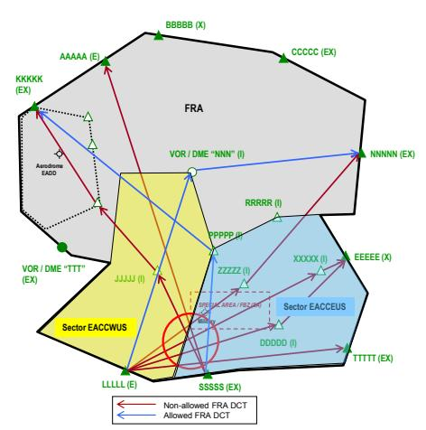

**Figure 6: Example of FRA crossing flows at ATC Sector boundary**

### **6.2.1.2 FRA Horizontal Entry/Exit point - "Directional" use**

(1) The RAD structure allows the description of the direction in which traffic shall cross the FRA boundary considering that in NM system the boundaries are directional.

- (2) States/FABs/ANSPs may define how to enter or leave the FRA area via a certain FRA (EX) point and use it in a unidirectional manner in FRA, whilst keeping its bidirectional use for designated airports in FRA and ATS routes. It can also be used to segregate the traffic flows in relation to changes in FLOS over the FRA significant points.
- (3) The RAD expression example:

| Point or Airspace | Utilisation                         |
| ----------------- | ----------------------------------- |
|                   | ONLY AVBL FOR TFC                   |
| PPPPP             | 1. ABV FL245 XNG FRA 1 - FRA 2 BDRY |
|                   | 2. VIA TMA2                         |

**Table 86: Example of expression in the RAD of FRA "Directional" use**

This is a description of allowed unidirectional traffic crossing a FRA boundary from FRA1 area to FRA2 area only above FL245. Below FL245 the FRA boundary can be crossed bidirectionally via TMA2.

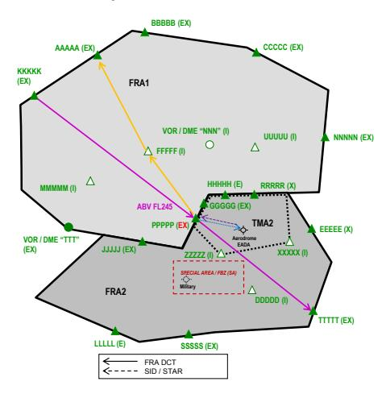

**Figure 7: Example of FRA (EX) point directional use**

#### **6.2.1.3 FRA utilisation expression**

- (1) The RAD structure allows the description of FRA options allowed in a relevant FRA area.
- (2) The RAD expression example 1:

| Point or Airspace | Utilisation                                 |
| ----------------- | ------------------------------------------- |
| KKKKK             | NOT AVBL FOR TFC                            |
|                   | EXC VIA KKKKK AND-THEN PPPPP AND-THEN TTTTT |

**Table 87: Example of expression in the RAD of FRA allowed option 1**

This is a description when only term "and-then" is used and it defines multiple FRA DCTs available between the FRA significant points via any allowed FRA (I) point.

(3) The RAD expression example 2:

| Point or Airspace | Utilisation                                                  |
| ----------------- | ------------------------------------------------------------ |
| KKKKK             | NOT AVBL FOR TFC `<br>`EXC VIA (KKKKK DCT PPPPP DCT TTTTT) |

**Table 88: Example of expression in the RAD of FRA allowed option 2**

This is a description when only term "DCT" is used and it defines the only available FRA DCTs. The FRA DCTs described as the only allowed options will not be misled with RAD DCTs, as there is no requirement to re-define these FRA DCTs as RAD DCTs.

(4) The RAD expression example 3:

| Point or Airspace | Utilisation                            |
| ----------------- | -------------------------------------- |
| KKKKK             | NOT AVBL FOR TFC                       |
|                   | EXC VIA KKKKK AND-THEN PPPPP DCT TTTTT |

**Table 89: Example of expression in the RAD of FRA allowed option 3**

This is a description when both terms "and-then" and "DCT" is used and it defines:

- a) Multiple FRA DCTs available between the first and second FRA significant points via any allowed FRA (I) point; and
- b) The only available FRA DCT between second and third FRA significant points.

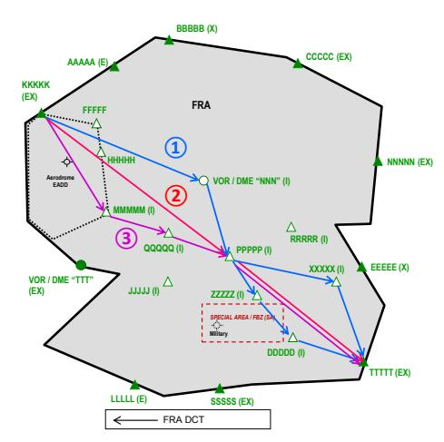

**Figure 8: Examples of FRA available options expression**

### **6.2.1.4 Mandatory FRA Intermediate point**

- (1) The RAD structure allows the description of a mandatory FRA (I) point.
- (2) States/FABs/ANSPs may define specific traffic flows via certain FRA significant point from particular significant point(s) to other significant point(s).
- (3) The RAD expression example:

| Point or Airspace | Utilisation                       |
| ----------------- | --------------------------------- |
| RRRRR             | COMPULSORY FOR TFC                |
|                   | VIA LLLLL AND-THEN (CCCCC, NNNNN) |

**Table 90: Example of expression in the RAD of mandatory FRA (I) point**

This is a description of a mandatory FRA (I) point. All FRA DCTs between FRA significant points LLLLL and CCCCC, LLLLL and NNNNN are forbidden and the only possible FRA DCTs are via RRRRR.

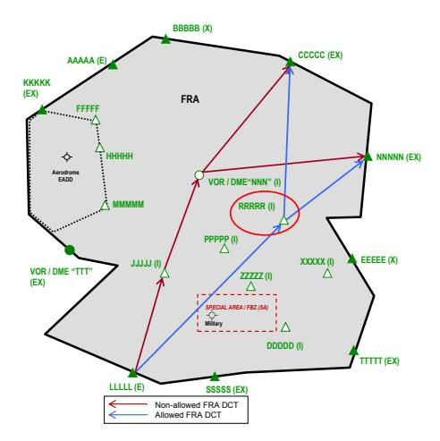

**Figure 9: Example of mandatory FRA Intermediate point**

#### **6.2.1.5 FRA significant point per airspace volume**

#### **6.2.1.5.1 RAD flight planning requirement**

- (1) Inside a single FRA area or in cross-border FRA operations, flight planning requirement for mandatory inclusion of one FRA significant point per airspace volume (FIR, UIR, CTA, AoR or FRA Cell) in FPL ITEM 15 might be require.
- (2) States/FABs/ANSPs may describe such requirement via RAD by defining mandatory FRA significant point(s) at or when crossing the FRA boundary.
- (3) The RAD expression example:

| Point or Airspace | Utilisation            |
| ----------------- | ---------------------- |
| (QQQQQ & VVVVV)   | COMPULSORY FOR TFC     |
|                   | XNG FRA 2 - FRA 3 BDRY |

**Table 91: Example of expression in the RAD of FRA point per airspace volume**

This is a description of mandatory FRA significant points to be filed in a flight plan. As the FRA significant points are in FRA2 normally there is no requirement ATM system of FRA1 State to store in its database all FRA significant points in FRA3.

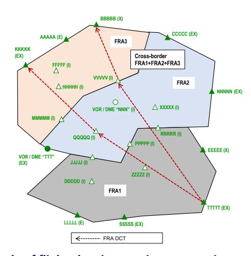

**Figure 10: Example of flight planning requirement - point per airspace volume**

#### 6.2.1.5.2 AIP flight planning requirement

(1) The management of such requirement is not subject to the RAD and is done via an additional airspace utilisation rule and availability - EURO restriction.

#### 6.2.1.6 Closed for Entry DCT

#### 6.2.1.6.1 General Provisions

- The term "Closed for entry DCT" is used to indicate that, in a particular FRA area, DCT to a particular FRA significant point:
  - a) Cannot be flown; or
  - b) Can be flown under certain condition, despite that the DCT ends below the FRA area lower limit.
- (2) At least one FRA significant point must be defined but if several FRA significant points are defined, FRA DCT from any of these FRA significant points is forbidden.
- Despite referencing it to a FRA area the "Closed for entry DCT" can also be applied in any airspace where ATS route network exists and filing of Direct (DCT) option is allowed ("RAD DCT").

#### 6.2.1.6.2 En-route

- (1) States/FABs/ANSPs may define FRA options via FRA DCT to a FRA (X) or FRA (EX) point, to be invalidated.
- (2) The RAD expression example 1:

FRA: FL245 - FL660

| Point or Airspace | Utilisation                                             |
| ----------------- | ------------------------------------------------------- |
| NNNN              | NOT AVBL FOR TFC                                        |
|                   | ABV FL245 VIA * DCT NNNNN EXC VIA (CCCCC, AAAAA, KKKKK) |

Table 92: Example of expression in the RAD of FRA "Closed for entry DCT" - en-route (1)

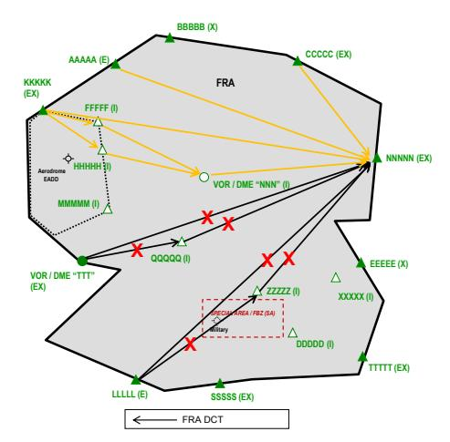

Figure 11: Example 1 of "Closed for entry DCT" - en-route

This is a description, via term "via", of unacceptable/allowed FRA DCTs to a FRA significant point. All possible connections between defined FRA significant points, including those, which might not have a real operational impact, are allowed. All other possible connections between the FRA significant points are forbidden.

(3) The RAD expression example 2:

FRA: FL245 - FL660

| Point or Airspace | Utilisation                    |
| ----------------- | ------------------------------ |
| NNNNN             | NOT AVBL FOR TFC               |
|                   | ABV FL245 VIA * DCT NNNNN EXC: |
|                   | 1. VIA (CCCCC, AAAAA)          |
|                   | 2. VIA (KKKKK DCT NNNNN)       |

Table 93: Example of expression in the RAD of FRA "Closed for entry DCT" - en-route (2)

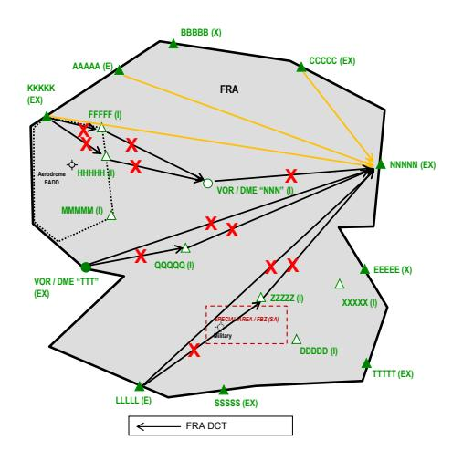

Figure 12: Example 2 of "Closed for entry DCT" - en-route

This is a description, via term "DCT", of unacceptable/allowed FRA DCTs to a FRA significant point. Only relevant "Direct" connections between defined FRA significant points are allowed. All other possible connections between the FRA significant points, including those, between defined FRA significant points, which might not have a real operational impact, are forbidden.

#### 6.2.1.6.3 Arrival

(1) States/FABs/ANSPs may define FRA options via FRA DCT `<u>`to `</u>` a FRA (A) or FRA (AD) point, to be validated based on mandatory condition - an arrival aerodrome.

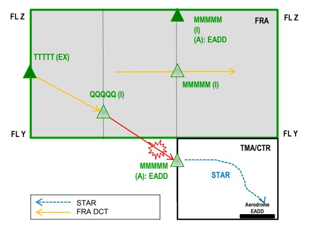

Figure 13: Example 1 of "Closed for entry DCT" - arrival

(2) The RAD expression example, without FRA Connecting Route:

FRA: FL245 - FL660

| Point or Airspace | Utilisation                            |
| ----------------- | -------------------------------------- |
| MMMMM             | NOT AVBL FOR TFC                       |
|                   | BLW FL245 VIA * DCT MMMMM EXC ARR EADD |

**Table 94: Example of expression in the RAD of FRA "Closed for entry DCT" - arrival (1)**

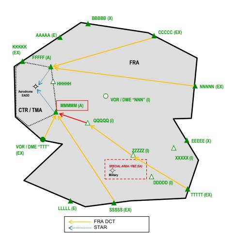

**Figure 14: Example 2 of "Closed for entry DCT" - arrival**

This is a description of allowed FRA DCT to a FRA Arrival Connecting point, where the FRA DCT ends below the FRA area lower limit. The FRA DCT shall not be defined as a fixed en-route DCT (Direct) - "RAD DCT".

(3) The RAD expression example, with FRA Connecting Route:

FRA: FL245 - FL660

| Point or Airspace | Utilisation                            |
| ----------------- | -------------------------------------- |
| RRRRR             | NOT AVBL FOR TFC                       |
|                   | BLW FL245 VIA * DCT RRRRR EXC ARR EADD |

**Table 95: Example of expression in the RAD of FRA "Closed for entry DCT" - arrival (2)**

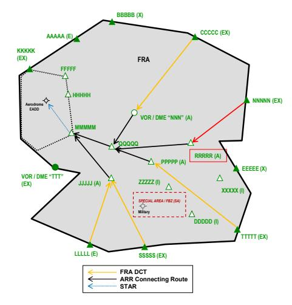

**Figure 15: Example 3 of "Closed for entry DCT" - arrival**

This is a description of allowed FRA DCT `<u>`to `</u>` a FRA Arrival Connecting point, where the FRA DCT ends below the FRA area lower limit allowing connection with relevant FRA Connecting Route. The FRA DCT shall not be defined as a fixed enroute DCT (Direct) - "RAD DCT".

#### 6.2.1.7 Closed for Exit DCT

#### 6.2.1.7.1 General Provisions

- The term "Closed for exit DCT" is used to indicate that, in a particular FRA area, DCT from a particular FRA significant point:
  - a) Cannot be flown; or
  - b) Can be flown under certain condition, despite that the DCT starts below the FRA area lower limit.
- (2) At least one FRA significant point must be defined but if several FRA significant points are defined, FRA DCT from any of these FRA significant points is forbidden.
- (3) Despite referencing it to a FRA area the "Closed for exit DCT" can also be applied in any airspace where ATS route network exists and filing of Direct (DCT) option is allowed ("RAD DCT").

#### 6.2.1.7.2 En-route

- (1) States/FABs/ANSPs may define FRA options via FRA DCT from a FRA (E) or FRA (EX) point, to be invalidated.
- (2) The RAD expression example 1:

FRA: FL245 - FL660

| Point or Airspace | Utilisation                                                              |
| ----------------- | ------------------------------------------------------------------------ |
| NNNN              | NOT AVBL FOR TFC ABV FL245 VIA NNNNN DCT * EXC VIA (CCCCC, BBBBB, KKKKK) |

Table 96: Example of expression in the RAD of FRA "Closed for exit DCT" - en-route (1)

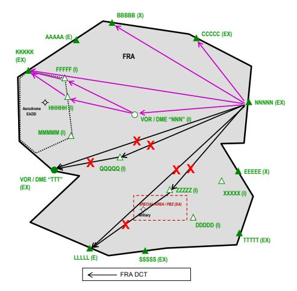

Figure 16: Example 1 of "Closed for exit DCT" - en-route

This is a description, via term "via", of unacceptable/allowed FRA DCTs `<u>`from `</u>` a FRA significant point. All possible connections between defined FRA significant points, including those, which might not have a real operational impact, are allowed. All other possible connections between the FRA significant points are forbidden.

(3) The RAD expression example 2:

FRA: FL245 - FL660

| Point or Airspace | Utilisation                                                   |
| ----------------- | ------------------------------------------------------------- |
| NNNN              | NOT AVBL FOR TFC                                              |
|                   | ABV FL245 VIA NNNNN DCT * EXC NNNNN DCT (CCCCC, BBBBB, KKKKK) |

Table 97: Example of expression in the RAD of FRA "Closed for exit DCT" - en-route (2)

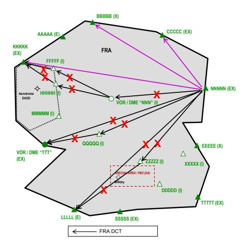

Figure 17: Example 2 of "Closed for exit DCT" - en-route

This is a description, via term "DCT", of unacceptable/allowed FRA DCTs `<u>`from `</u>` a FRA significant point. Only relevant "Direct" connections between defined FRA significant points are allowed. All other possible connections between the FRA significant points, including those, between defined FRA significant points, which might not have a real operational impact, are forbidden.

#### 6.2.1.7.3 **Departure**

(1) States/FABs/ANSPs may define FRA options via FRA DCT `<u>`from `</u>` a FRA (D) or FRA (AD) point, to be validated based on mandatory condition - a departure aerodrome.

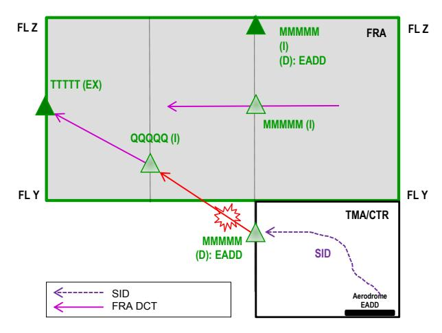

Figure 18: Example 1 of "Closed for exit DCT" - departure

(2) The RAD expression example, without FRA Connecting Route:

FRA: FL245 - FL660

| Point or Airspace | Utilisation                                                     |
| ----------------- | --------------------------------------------------------------- |
| MMMMM             | NOT AVBL FOR TFC `<br>`BLW FL245 VIA MMMMM DCT * EXC DEP EADD |

**Table 98: Example of expression in the RAD of FRA "Closed for exit DCT" - departure (1)**

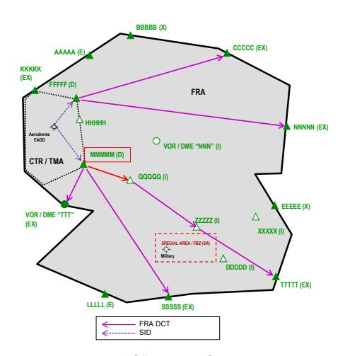

**Figure 19: Example 2 of "Closed for exit DCT" - departure**

This is a description of allowed FRA DCT from a FRA Departure Connecting point, where the FRA DCT starts below the FRA area lower limit. The FRA DCT shall not be defined as a fixed en-route DCT (Direct) - "RAD DCT".

(3) The RAD expression example, with FRA Connecting Route:

FRA: FL245 - FL660

Point RRRRR: Not available for traffic below FL245 via DCT from RRRRR, except DEP EADD.

| Point or Airspace | Utilisation                            |
| ----------------- | -------------------------------------- |
|                   | NOT AVBL FOR TFC                       |
| RRRRR             | BLW FL245 VIA RRRRR DCT * EXC DEP EADD |

**Table 99: Example of expression in the RAD of FRA "Closed for exit DCT" - departure (2)**

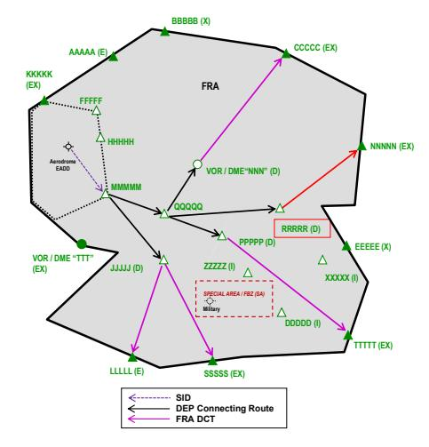

**Figure 20: Example 3 of "Closed for exit DCT" - departure**

This is a description of allowed FRA DCT from a FRA Departure Connecting point, where the FRA DCT starts below the FRA area lower limit allowing connection with relevant FRA Connecting Route. The FRA DCT shall not be defined as a fixed en-route DCT (Direct) - "RAD DCT".

### **Annex 2C**

#### **6.2.2.1 Avoidance of Special Area**

- (1) The RAD structure allows the description how to flight plan in FRA across the active Special Areas.
- (2) In FRA, there is no requirement for dedicated procedures for avoidance of special area. In either FRA or ATS route network environment, when a special area is unavailable during the times and within the vertical limits allocated in the EAUP/EUUP, traffic is either not allowed (full avoidance) or allowed with certain exceptions (partial avoidance).
- (3) States/FABs/ANSPs may describe specific conditions for the utilisation of FRA significant points. The use of FRA (I) points for avoidance of a relevant special area may be included as information. The usage of such FRA (I) points in the flight plan is not mandatory.

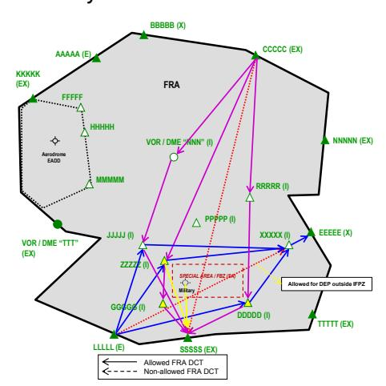

**Figure 21: Example of Special Area avoidance and allowance in FRA**

### **Annex 3A**

### **6.2.3.1 FRA Connecting Routes**

- (1) The RAD structure allows the description of mandatory FRA Arrival and/or Departure Connecting Routes defined in accordance with FRA design provisions.
- (2) The RAD aerodrome connectivity is used as a placeholder for description. The rationale is that FRA Connecting Routes are designed based on established FRA (A) or FRA (D) or FRA (AD) points, which are referenced to a particular aerodrome, regardless of where this aerodrome is located.
- (3) States/FABs/ANSPs may define any organisation of FRA Arrival and/or Departure Connecting Routes, for aerodrome inside/outside the FRA area and with/without designated SIDs/STARs.

**ARR AD First PT STAR / STAR ID ARR FPL Option EADD MMMMM NOT AVBL FOR TFC EXC 1. VIA (PPPPP L1 MMMMM) 2. VIA (NNN (L1, DCT) QQQQQ (L1, DCT) MMMMM)**

(4) The RAD expression example:

**Table 100: Example of expression in the RAD of FRA ARR Connecting Route**

This is a description of a mandatory FRA Arrival Connecting Route referenced to an aerodrome inside the FRA area and a significant point where the STAR begins, or a significant point defined as a connecting point. The first significant point in such expression is a defined FRA (A) or FRA (AD) or FRA (E) or FRA (EX) and DCT is a RAD DCT.

**3. VIA (JJJJJ DCT MMMMM)**

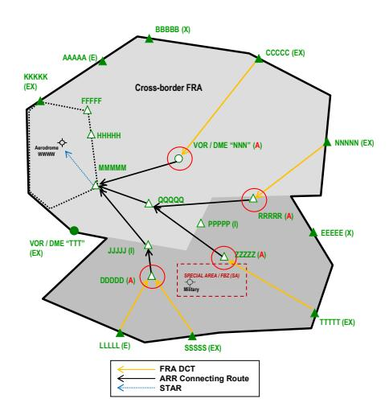

**Figure 22: Example of FRA ARR Connecting Routes for an aerodrome inside a cross-border FRA area**

(5) The description of a FRA Departure Connecting Route is similar. The route expression starts with a significant point where a SID terminates, or a significant point defined as a connecting point and ends on a defined FRA (D) or FRA (AD) or FRA (X) or FRA (EX) point.

#### **6.2.3.2 FRA Connecting Points**

- (1) The RAD structure allows the description of a significant point as a connecting point for an aerodrome:

  - a) Without designated SIDs/STARs; or
  - b) Where SIDs/STARs to/from particular directions are not designed.
- (2) In NM system each connecting point is connected directly (DCT) to the relevant aerodrome where this "system" DCT does not have specific vertical limits and can be used without level limitation.
- (3) In FRA, there are no explicit requirements for defining a connecting point (FRA or non-FRA relevant) for departing and/or arriving flights. In both FRA and ATS route network operations, for an aerodrome without SIDs/STARs such a significant point can be located either on the CTR/TMA boundary or outside the relevant CTR/TMA.
- (4) In FRA, any FRA significant point can be described as a connecting point:

  - a) FRA (A) or FRA (D) or FRA (AD) when defined as such.
  - b) FRA (E) or FRA (X) or FRA (EX) located on a FRA area boundary and not part of a FRA Connecting Route.

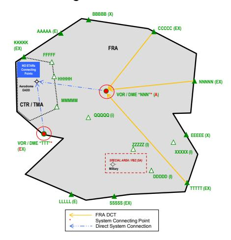

**Figure 23: Example of a FRA Connecting Point inside a non-cross border FRA area**

### **Annex 3B**

## **6.2.4.1 FRA en-route DCT Limitations**

- (1) The RAD structure allows the description of any FRA DCT limit.
- (2) Internal FRA DCT horizontal limit

The FRA DCT horizontal limit inside the ATC Unit AoR respectively, non-crossborder FRA area is described as follows:

- a) FRA DCT horizontal limit defined in RAD as "FRA". This means that FRA operations procedures are applied in the relevant airspace volume.
- b) Cross-border FRA DCT limit defined in RAD as "NOT ALW". This means that FRA operations procedures are applied in the relevant airspace volume only via specifically defined FRA (E), FRA (X) or FRA (EX).

*Note: Such description of internal FRA DCT horizontal limit is required in order NM system to correctly process flight plans within the "local" FRA environment avoiding cross-border FRA operations.*

(3) Cross-border FRA DCT horizontal limit

The FRA DCT horizontal limit between two or more ATC Units AoRs respectively, in a cross-border FRA area is described as follows:

- a) FRA DCT horizontal limit defined in RAD as "FRA". This means that FRA operations procedures are applied in the relevant airspace volume.
- b) Cross-border FRA DCT limit defined in RAD as "ALW … " relevant:
  - i) ATC Unit(s) AoR(s) part of cross-border FRA area; or
  - ii) FRA area(s).

*Note: Such description of cross-border DCT horizontal limit is required in order NM system to correctly process flight plans within the "cross-border" FRA environment allowing crossborder FRA operations.*

(4) Fixed en-route DCT (Direct) - "RAD DCT"

In FRA, the RAD includes only RAD DCTs with availability "No" for the purposes described in the paragraphs below.

In FRA, any RAD DCT with availability "Yes", in theory, is a duplication of FRA procedures. Normally, the RAD DCTs shall not be described in the RAD in parallel with FRA procedures. Its description is possible in exceptional cases (e.g. definition within the vertical limits of the FRA to specifically ensure proper vertical connectivity in flight planning with non-FRA area, system technical limitations, allowance of FRA boundary clipping, etc.) but only following a proper coordination with NM and confirmation at FRA design phase.

#### **6.2.4.2 FRA area boundary - close proximity DCT protection**

- (1) The RAD structure allows the description of a FRA DCT as a RAD DCT to not allow FRA flight planning close, by certain distance, to the FRA area boundary.
- (2) Before using the RAD for that purpose, States/FABs/ANSPs need to verify the FRA area boundary definition. The FRA implementation, with or without allowance of FRA (I) points, has to be considered as well. All this is required in order to avoid undesired and an unnecessary RAD DCTs.
- (3) States/FABs/ANSPs may define RAD DCTs with availability "No", which are not allowed to be filed by the AOs due to the close proximity to the FRA area boundary. Only the relevant FRA DCTs are forbidden, while any other possible FRA DCTs between the FRA significant points is permitted.

In the RAD expression example RRR DCT ZZZZZ is a forbidden FRA DCT and a FRA flight on RRR DCT ZZZZZ DCT TTTTT is not possible, while on RRR DCT PPPPP DCT ZZZZZ DCT TTTTT is allowed.

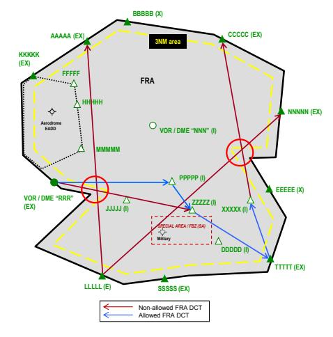

**Figure 24: Example of a non-cross-border FRA area boundary proximity violation by FRA DCTs**

#### **6.2.4.3 FRA area boundary - close proximity or clipping DCT allowance**

- (1) The RAD structure allows the description of a FRA DCT as a RAD DCT to allow FRA flight planning close, by certain distance, to the FRA area boundary or to clip that FRA area boundary.
- (2) Before using the RAD for that purpose, States/FABs/ANSPs need to verify the FRA area boundary definition. The FRA implementation, with or without allowance of FRA (I) points, needs also to be considered. All this is required in order to avoid undesired and unnecessary RAD DCTs.
- (3) States/FABs/ANSPs may define RAD DCTs with availability "Yes", which are allowed to be filed by the AOs regardless of:

  - a) Close proximity to the FRA area boundary.
  - b) Being along the FRA area boundary.
  - c) Being "slightly" out of the FRA area.
- (4) In the RAD expression example, the relevant FRA DCTs are allowed RRR DCT DDDDD and DDDDD DCT NNNNN.

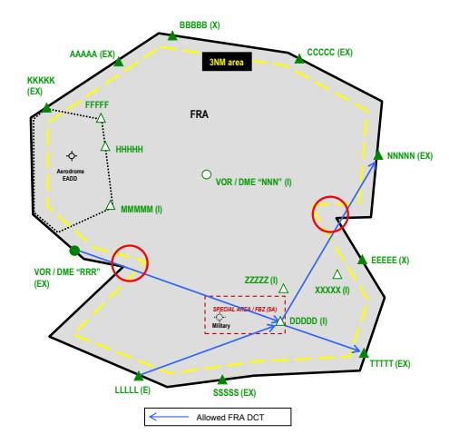

**Figure 25: Example of a non-cross-border FRA area boundary allowance of FRA DCTs**

# **ABBREVIATIONS**

**A**CC Area Control Centre

AD Airspace Data

ADEP Aerodrome of Departure ADES Aerodrome of Destination

AIM Air Traffic Flow Management Information Message/

Aeronautical Information Management

AIP Aeronautical Information Publication

AIRAC Aeronautical Information Regulation and Control

AIS Aeronautical Information Service ANSP Air Navigation Service Provider

AO Aircraft Operator

AOG Airline Operations Group AoR Area of Responsibility

AOWIR Aircraft Operator What if Re-routing (NM Function)

ASM Airspace Management

ATFCM Air Traffic Flow and Capacity Management

ATFM Air Traffic Flow Management

**B**2B Business to Business

BIDI Bidirectional

**C**ACD Central Airspace and Capacity Database

CBA Cross-Border Area

CCAMS Centralised Code Assignment and Management System

CDM Collaborative Decision-Making

CTR Control Zone

**D**B Data Base

DCT Direct

DEL Delete/Deleted

DMR Data Modification Request

**E**AUP European Airspace Use Plan

EDTCB Environment Data Transfer Control Board

ENR En-route

ENV NM Environment Database/Environment Data Processing

ERND European Route Network Design

ERNIP European Route Network Improvement Plan ETFMS Enhanced Tactical Flow Management System

EU European Union

EUUP European Updated Airspace Use Plan

**F**AB Functional Airspace Block FIR Flight Information Region

FL Flight Level

FLAS Flight Level Allocation Scheme FLOS Flight Level Orientation Scheme

FPL Flight Plan

FRA Free Route Airspace

FUA Flexible Use of Airspace

**G**AT General Air Traffic

**I**FPS Integrated Initial Flight Plan Processing System

IFPZ Integrated Initial Flight Plan Processing System Zone

IFR Instrument Flight Rules

I2 Incident type 2

**L**NC (5LNC) - unique Five-Letter pronounceable "Name-Code"

LRC Local RAD Coordinator

**M**IL Military

**N**AT North Atlantic

NATO North Atlantic Treaty Organisation

NAS National Airspace

NEST Network Strategic Tool

NETOPS Network Operations Team

NM Nautical Mile/Network Manager NMD Network Management Directorate

NOP Network Operations Plan

NOS Network Operations

NRC National RAD Coordinator

**O**AT Operational Air Traffic

ODSG Operations and Development Sub-Group

OM Operations Manager OPL Operations Planning

OPS Operations

**P**ANS-AIM Procedures for Air Navigation Services - Aeronautical

Information Management (ICAO Doc 10066)

PANS-ATM Procedures for Air Navigation Services - Air Traffic

Management (ICAO Doc 4444)

PTR Profile Tuning Restriction

**R**AD Route Availability Document

RFL Requested Flight Level

RMG RAD Management Group

RNDSG Route Network Development Sub-Group

RSA Restricted Airspace

**S**AAM System for Assignment and Analysis at a Macroscopic

level

SAT/I System acceptance testing integration

SID Standard Instrument Departure

SCEN Scenario

SSR Secondary Surveillance Radar STAR Standard Instrument Arrival

SUR Surveillance

SUS Suspend/Suspended

**T**FR Traffic Flow Rule

TMA Terminal Control Area

TRA Temporary Reserved Area TSA Temporary Segregated Area

**U**NA Unsuspended Amended

UNS Unsuspended
